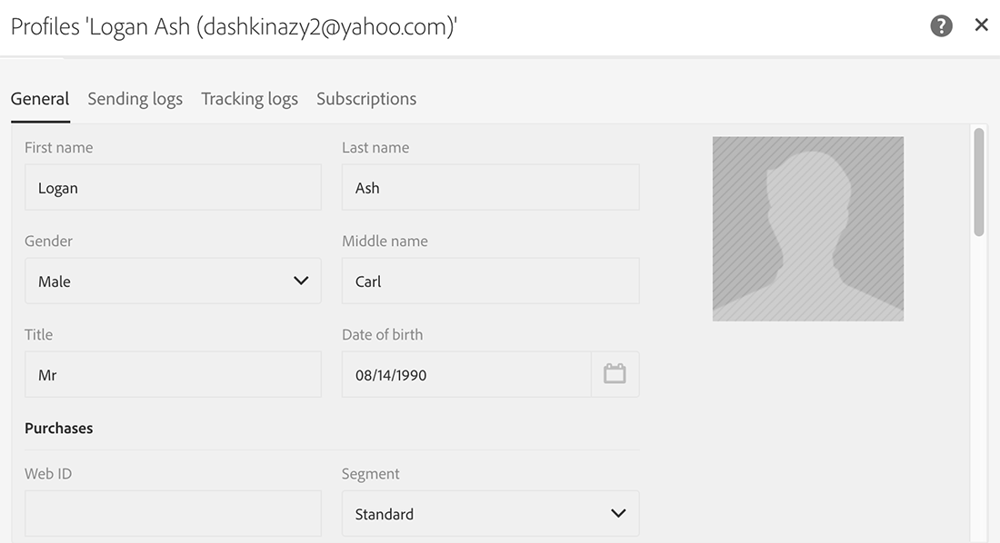
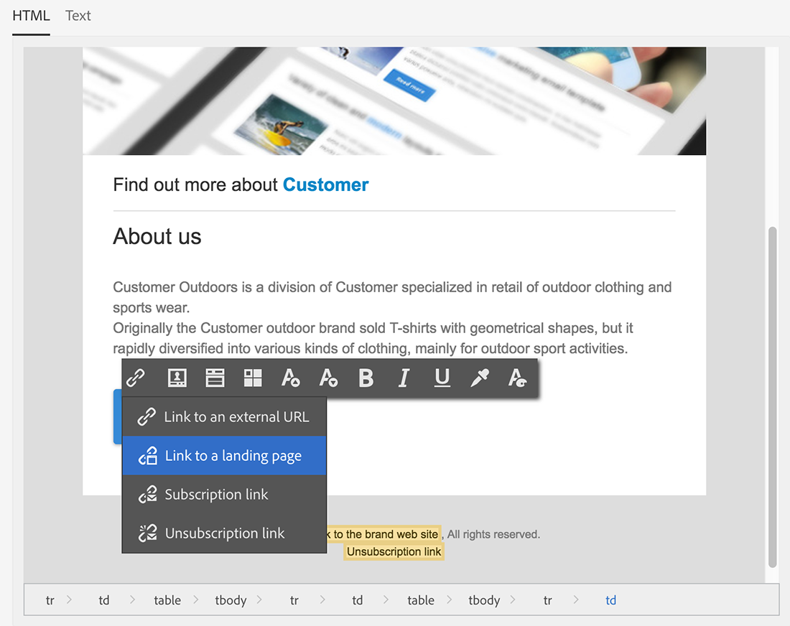
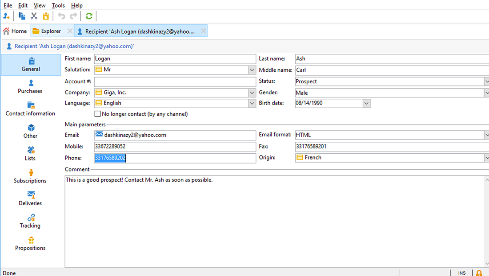
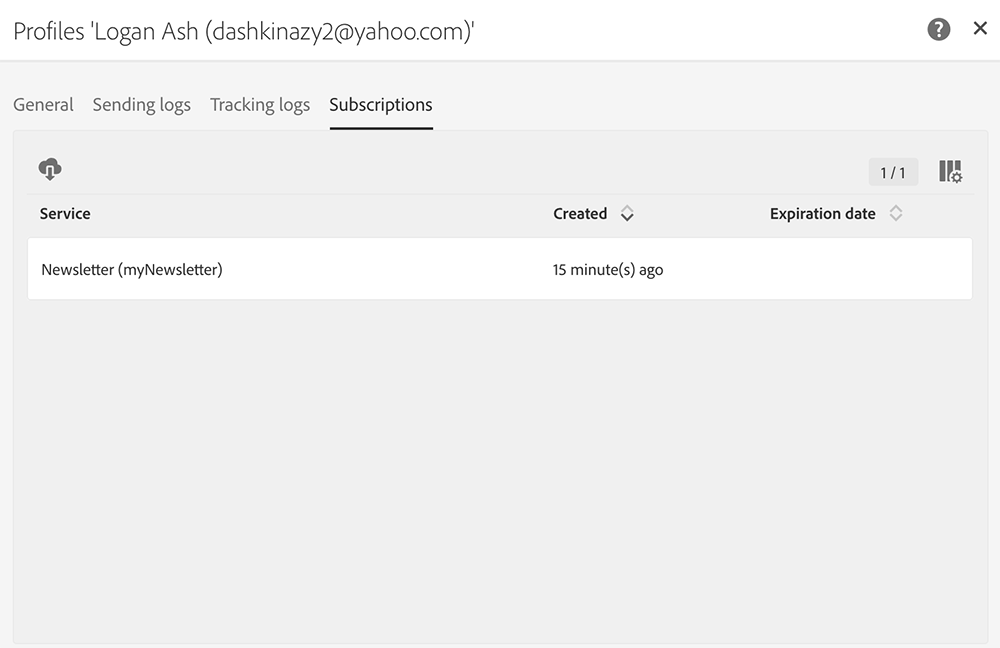

# Sincronização de aplicações Web{#synchronizing-web-applications}

Nesse caso de uso, enviaremos uma comunicação usando o Campaign Standard, que inclui um link para uma aplicação Web do Campaign v7. Quando o recipient clica no link do email, a aplicação Web exibe um formulário contendo vários campos pré-carregados com os dados do recipient, bem como um link de assinatura para um boletim informativo. O recipient pode atualizar seus dados e se inscrever no serviço. Seu perfil será atualizado no Campaign v7 e as informações serão replicadas no Campaign Standard.

Se você tiver muitos serviços e aplicações Web no Campaign v7, talvez opte por não recriá-los no Campaign Standard. O Connector ACS permite usar todas as aplicações Web e serviços existentes no Campaign v7 e vinculá-los a um delivery enviado pelo Campaign Standard.

## Pré-requisitos {#prerequisites}

Para isso, é necessário:

* Os recipients armazenados no banco de dados do Campaign v7 e sincronizados com o Campaign Standard. Consulte a seção [Sincronia de perfis](../../integrations/using/synchronizing-profiles.md).
* um serviço e uma aplicação Web criado e publicado no Campaign v7.
* the web application must contain a **[!UICONTROL Pre-loading]** activity using the **[!UICONTROL Adobe Campaign encryption]** identification method.

## Criação do serviço e aplicação Web {#creating-the-web-application-and-service}

No Campaign v7, você pode criar aplicações Web que permitem aos recipients assinar um serviço. Os serviço e aplicação Web foram projetados e armazenados no Campaign v7 e você pode atualizar esse serviço por uma comunicação no Campaign Standard. Para obter mais informações sobre aplicações Web no Campaign v7, consulte [esta seção](../../web/using/adding-fields-to-a-web-form.md#subscription-checkboxes).

No Campaign v7, os seguintes objetos foram criados:

* um serviço de boletim informativo
* a web application containing a **[!UICONTROL Pre-loading]**, a **[!UICONTROL Page]** and a **[!UICONTROL Storage]** activity.

1. Go to **[!UICONTROL Resources > Online > Web applications]** and select an existing web application.

   

1. Edit the **[!UICONTROL Preloading]** activity. The **[!UICONTROL Auto-load data referenced in the form]** box is checked and the **[!UICONTROL Adobe Campaign encryption]** identification method is selected. Isso permitirá que a aplicação Web pré-carregue os campos do formulário com os dados armazenados no banco de dados do Adobe Campaign. Consulte [este documento](../../web/using/publishing-a-web-form.md#pre-loading-the-form-data).

   

1. Edite o **[!UICONTROL Page]**. Três campos (Name, Email and Phone) foram incluídos, bem como uma caixa de seleção para convidar o recipient para assinar um boletim informativo (serviço de **[!UICONTROL Newsletter]**).

   

1. Vá até **[!UICONTROL Profiles and Target > Services and subscriptions]** e abra o **[!UICONTROL Newsletter]** serviço. Esse é o serviço que será atualizado na comunicação do Campaign Standard. Você pode ver que nenhum recipient assinou esse serviço ainda.

   

1. Go to **[!UICONTROL Profiles and Targets > Recipient]** and select a recipient. Você pode ver que ele não assinou o serviço ainda.

   

## Replicação de dados {#replicating-the-data}

Para replicar os dados necessários entre o Campaign v7 e o Campaign Standard, vários templates de workflow de replicação estão disponíveis. O workflow **[!UICONTROL Profiles replication]** replica automaticamente todos os recipients do Campaign v7 para o Campaign Standard. Consulte [Workflows técnicos e de replicação](../../integrations/using/acs-connector-principles-and-data-cycle.md#technical-and-replication-workflows). O workflow **[!UICONTROL Landing pages replication]** permite a replicação dos aplicativos web que queremos usar no Campaign Standard.

Para verificar se os dados foram replicados corretamente, siga essas etapas no Campaign Standard:

1. From the home screen, click on **[!UICONTROL Customer profiles]**.

   

1. Pesquise o recipient no Campaign v7 e verifique se ele aparece no Campaign Standard.

   

1. Na barra superior, clique em **[!UICONTROL Marketing activities]** e procure pelo aplicativo web do Campaign v7. Ela aparece como uma landing page no Campaign Standard.

   

1. Clique no logotipo do **[!UICONTROL Adobe Campaign]** no canto superior esquerdo e, em seguida, selecione **Profiles and audiences > Services** e verifique se o serviço de boletim informativo está ali também.

   

## Design e envio de email {#designing-and-sending-the-email}

Nessa parte, veremos como incluir um link, em um email do Campaign Standard, na landing page replicada de uma aplicação Web do Campaign v7.

As etapas para criar, projetar e enviar o email são iguais de um email clássico. Consulte a documentação do [Adobe Campaign Standard](https://helpx.adobe.com/br/support/campaign/standard.html) .

1. Crie um novo email e escolha um ou mais perfis replicados como o público.
1. Edit your content and insert a **[!UICONTROL Link to a landing page]**.

   

1. Selecione a landing page que foi replicada da aplicação Web do Campaign v7.

   

1. Prepare seu e-mail, envie suas provas e envie o email final.
1. Um dos recipients abre o email e clica no link para a assinatura do boletim informativo.

   

1. Ele adiciona um número de telefone e marca a caixa de seleção da assinatura do boletim informativo.

   

## Recuperação de informações atualizadas {#retrieving-the-updated-information}

Quando o recipient atualiza seus dados pela aplicação Web, o Adobe Campaign v7 recupera de forma síncrona as informações atualizadas. Ele é replicado do Campaign v7 para o Campaign Standard.

1. In Campaign v7, go to **[!UICONTROL Profiles and Target > Services and subscriptions]** and open the **[!UICONTROL Newsletter]** service. Você pode ver que o recipient agora aparece na lista de assinantes.

   

1. Go to **[!UICONTROL Profiles and Targets > Recipient]** and select the recipient. Você pode ver que o número de telefone agora está registrado.

   

1. Na guia **[!UICONTROL Subscriptions]**, também podemos ver que ele assinou o serviço de boletim informativo.

   

1. Aguarde alguns minutos para que o workflow de replicação de perfil seja executado.
1. No Campaign Standard, acesse o perfil do recipient para verificar se os dados atualizados foram replicados corretamente do Campaign v7.

   

1. Edite o perfil. Você pode ver que o número de telefone foi atualizado.

   

1. Click on the **[!UICONTROL Subscriptions]** tab. O serviço de boletim informativo agora aparece.

   

