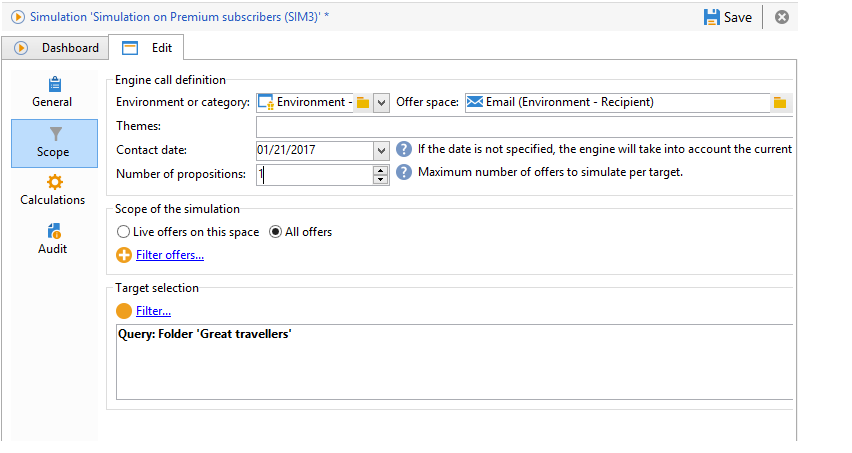

# Sobre a simulação de ofertas{#about-offers-simulation}

O módulo **Simulation** permite testar a distribuição de ofertas pertencentes a uma categoria ou um ambiente antes de enviar sua proposta para os recipients.

Simulation takes into account the contexts and eligibility rules previously applied to offers (refer to [Offer catalog overview](../../interaction/using/offer-catalog-overview.md)), as well as their presentation rules (refer to [Managing offer presentation](../../interaction/using/managing-offer-presentation.md)). Isso permite testar e refinar várias versões da apresentação de oferta sem realmente usar uma oferta ou sobrecarregar ou não um destino, já que a simulação não tem impacto nos recipients de destino.

Para saber como simular uma oferta, leia as etapas abaixo. You can also watch this [video](https://helpx.adobe.com/campaign/classic/how-to/simulate-offer-in-acv6.html?playlist=/ccx/v1/collection/product/campaign/classic/segment/digital-marketers/explevel/intermediate/applaunch/introduction/collection.ccx.js&ref=helpx.adobe.com).

## Etapas principais para a criação de uma simulação {#main-steps-for-creating-a-simulation}

Para criar uma simulação de suas ofertas, aplique as seguintes etapas:

1. No **[!UICONTROL Profiles and Targets]** universo, clique no **[!UICONTROL Simulations]** link e no **[!UICONTROL Create]** botão.

   

1. Salve e edite a simulação que acabou de criar.
1. Go to the **[!UICONTROL Edit]** tab and specify the execution settings.

   For more on this, refer to [Execution settings](../../interaction/using/execution-settings.md).

   

   >[!NOTE]
   >
   >As configurações de execução só estarão disponíveis se estiver usando o Interaction com o Campaign.

1. Especifique o escopo da simulação.

   Para obter mais informações, consulte [Definição do escopo](../../interaction/using/simulation-scope.md#definition-of-the-scope).

   

1. Adicione eixos de relatório para aprimorar o **[!UICONTROL Offer distribution by rank]** relatório (opcional).

   Para obter mais informações, consulte [Adicionar eixos](../../interaction/using/simulation-scope.md#adding-reporting-axes)de relatório.

   

1. Click **[!UICONTROL Save]** to record the simulation settings.
1. Inicie a simulação através do painel.

   

1. Verifique o resultado da simulação e exiba o relatório de análise.

   For more on this, refer to [Simulation tracking](../../interaction/using/simulation-tracking.md).

   
