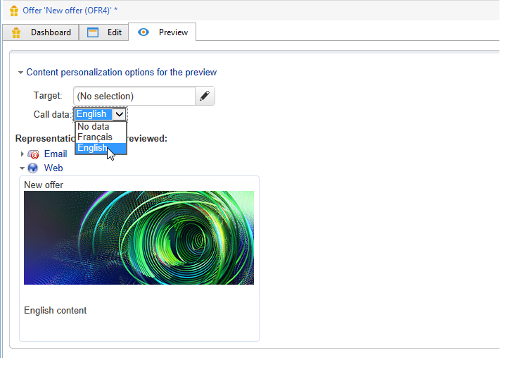

# Dados adicionais{#additional-data}

Durante uma chamada do mecanismo do Interaction, é possível transferir informações contextuais adicionais. Esses dados podem vir dos dados de destino armazenados na tabela de trabalho de um workflow (canal de saída) ou dos dados de chamada enviados pelo site durante a chamada (canal de entrada). É possível usar esses dados adicionais nas regras de qualificação, na personalização da oferta e também pode armazená-lo em uma tabela de propostas.

Para o canal de entrada, pode ser útil recuperar informações como o idioma do navegador da consultoria de pessoas, ou o nome do agente da central de atendimento, por exemplo. Em seguida, é possível usar esses dados de chamada nas regras de qualificação para apresentar uma oferta somente às pessoas que visualizam a página da Web em francês ou inglês.

Em um workflow para criação de target (canal de saída), é possível usar os dados do target durante uma chamada para o mecanismo. Por exemplo, é possível enriquecer o target com dados de uma transação vinculada a um recipient ou um banco de dados externo, por meio do FDA.

## Configurações de dados adicionais {#additional-data-configuration}

É necessário estender o schema **de nms:interação** vinculado ao ambiente e declarar a lista de campos adicionais que serão usados durante uma chamada para o mecanismo do Interaction. Ao criar a regra de elegibilidade ou personalizar uma oferta, esses campos ficarão acessíveis pelo nó **Interaction** (consulte [Uso de dados adicionais](#using-additional-data)).

Para o canal de entrada, é necessário adicionar os campos de dados de chamada no nó **Interação**.

```
<element label="Interactions" labelSingular="Interaction" name="interaction">
  <attribute label="Navigation language" name="navigationLanguage" type="string"/>
</element>
```

>[!NOTE]
>
>Há suporte para coleções XML no canal de entrada, mas os links para outros schemas não possuem.

Para o canal de saída, é necessário adicionar um elemento **targetData** contendo os campos adicionais no nó **Interaction**.

```
<element label="Interactions" labelSingular="Interaction" name="interaction">
  <element name="targetData">
    <attribute label="Date of last transaction" name="lastTransactionDate" type="datetime"/>
  </element>
</element>
```

>[!NOTE]
>
>Não há suporte para coleções no canal de saída. No entanto, é possível criar links para outros schemas.

Se quiser armazenar esses dados na tabela de propostas, também é necessário estender o schema **nms:propositionRcp** e declarar esses campos.

```
<element label="Recipient offer propositions" labelSingular="Recipient offer proposition" name="propositionRcp">
  <attribute label="Last transaction date" name="lastTransactionDate" type="datetime"/>
  <attribute label="Navigation language" name="navigationLanguage" type="string"/>
</element>
```

## Implementação de dados adicionais {#additional-data-implementation}

### Canal de entrada (página da Web) {#input-channel--web-page-}

Para transferir dados adicionais ao chamar o mecanismo, é necessário adicionar a variável **interactionGlobalCtx** no código JavaScript da página da Web. Insira o nó **Interaction** que contém os dados de chamada nesta variável. É preciso respeitar a mesma estrutura xml que está no schema **nms:interaction.** Consulte: [Configuração de dados adicionais](#additional-data-configuration).

```
interactionGlobalCtx = "<interaction navigationLanguage='"+myLanguage+"'/>";
```

### Canal de saída {#output-channel}

É necessário criar um workflow para criação de target para carregar dados adicionais na tabela de trabalho respeitando a mesma estrutura XML e os mesmos nomes internos que no schema **nms:interaction.** Consulte: [Configuração de dados adicionais](#additional-data-configuration).

## Utilização de dados adicionais {#using-additional-data}

### Regras de elegibilidade {#eligibility-rules}

É possível usar os dados adicionais nas regras de qualificação para ofertas, categorias e pesos.

Por exemplo, é possível optar por apresentar a oferta apenas para pessoas que visualizam a página em inglês.


>[!NOTE]
>
>É necessário limitar a regra nos canais para os quais os dados são definidos. In our example, we are limiting the rule on the inbound web channel (**[!UICONTROL Taken into account if]** field).

### Personalização {#personalization}

Também é possível usar esses dados adicionais ao personalizar uma oferta. Por exemplo, é possível adicionar uma condição para o idioma de navegação


>[!NOTE]
>
>É necessário limitar a personalização nos canais para os quais os dados são definidos. No nosso exemplo, estamos limitando a regra no canal da Web de entrada.

Se tiver personalizado uma oferta usando dados adicionais, esses dados não aparecerão na visualização por padrão porque não estão disponíveis no banco de dados. In the environment&#39;s **[!UICONTROL Example of call data]** tab, you must add value samples to use in the preview. Respeite a mesma estrutura xml que está na extensão de schema **de nms:interação.** Para obter mais informações, consulte [Configuração de dados adicionais](#additional-data-configuration).


When previewing, click **[!UICONTROL Content personalization options for the preview]** and select a value in the **[!UICONTROL Call data]** field.



### Armazenamento {#storage}

Durante uma chamada para o mecanismo, é possível armazenar dados adicionais na tabela de propostas para enriquecer o banco de dados. Esses dados podem ser usados, por exemplo, em relatórios de RDI, ou para processos posteriores.

>[!NOTE]
>
>É necessário estender o schema **nms:propositionRcp** e declarar os campos que conterão os dados a serem armazenados. Para obter mais informações: [Configuração de dados adicionais](#additional-data-configuration).

No espaço de ofertas, vá para a guia **[!UICONTROL Storage]** e clique no botão **[!UICONTROL Add]**.

Na coluna **[!UICONTROL Storage path]**, selecione o campo de armazenamento na tabela de propostas. Na coluna **[!UICONTROL Expression]**, selecione o campo adicional no nó **[!UICONTROL Interaction]**.

É possível recuperar dados de chamada quando a proposta for gerada ou quando for aceita (quando a pessoa clicar na oferta).


