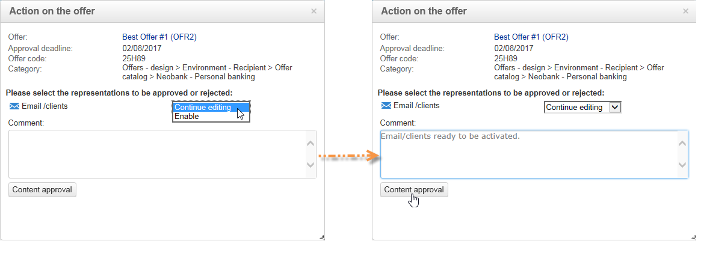
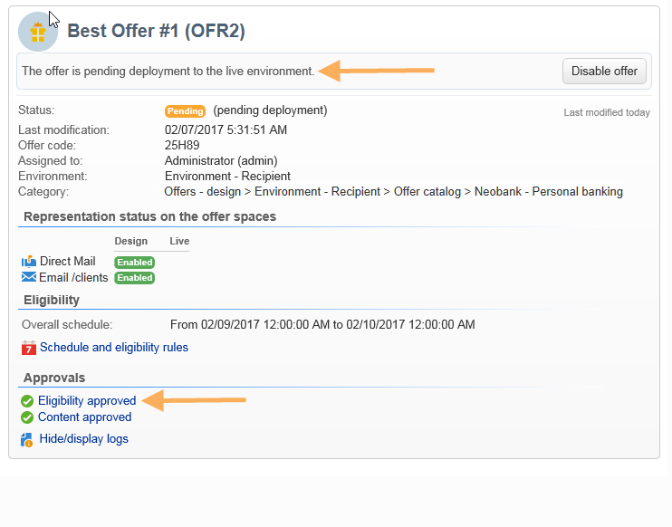

# Aprovação e ativação de uma oferta{#approving-and-activating-an-offer}

Após completar o conteúdo da oferta, é preciso aprová-la para ser duplicada no ambiente live e ser entregue. A aprovação aborda o conteúdo da oferta e sua qualificação.

O banner no painel de oferta informa se a oferta precisa passar pelo ciclo de aprovação ou não.

## Aprovação do conteúdo da oferta {#approving-offer-content}

Aprovar o conteúdo de oferta significa selecionar as representações que deseja disponibilizar no ambiente live.

O conteúdo de uma oferta tem uma representação por espaço. Como cada espaço de oferta tem sua própria estrutura e suas próprias funções de renderização, a representação da oferta pode variar.

É possível optar por aprovar o conteúdo da oferta em determinados espaços disponíveis e reject em outros.

>[!IMPORTANT]
>
>Quando o conteúdo e a qualificação de uma oferta são aprovados, o workflow de publicação (Notificação de oferta) é executado automaticamente e a oferta é ativada e disponibilizada em todos os espaços ativados.

Para aprovar o conteúdo da oferta, aplique as seguintes etapas:

1. Clique no botão **[!UICONTROL Approval]** e selecione **[!UICONTROL Approve content]** na janela pop-up.

   

1. Utilizando a lista suspensa, selecione as representações que deseja continuar editando ou aquelas que deseja publicar no ambiente live, então clique em **[!UICONTROL Content approval]**.

   

   Quando o conteúdo da oferta for aprovado, as informações serão atualizadas na tabela do painel de ofertas.

   

   >[!NOTE]
   >
   >A menção **[!UICONTROL Content approved]** não significa que todas as representações de oferta foram habilitadas e aprovadas. Indica se o processo de aprovação de conteúdo foi atingido, independentemente de todas as ofertas terem sido habilitadas/aprovadas ou não.

## Aprovação de qualificação para a oferta {#approving-offer-eligibility}

Aprovar a qualificação de oferta significa aceitar ou rejeitar pesos de oferta e as regras de qualificação também configuradas na oferta ou herdada das regras criadas na categoria pai.

>[!IMPORTANT]
>
>Quando o conteúdo e a qualificação de uma oferta são aprovados, o workflow de publicação (Notificação de oferta) é executado automaticamente e a oferta é ativada e disponibilizada em todos os espaços ativados.

* A lista completa de regras pode ser visualizada clicando em **[!UICONTROL Schedule and eligibility rules]**.

   

* Para alterar as regras de qualificação, clique em **[!UICONTROL Reject]** e em **[!UICONTROL Eligibility approval]**.

   

   Os vários status são atualizados no painel de ofertas.

   

* Para aceitar a qualificação da oferta, clique em **[!UICONTROL Approve eligibility]**.

   

   Aprove a qualificação, adicione um comentário se necessário e clique em **[!UICONTROL Eligibility approval]**.

   

   Os vários status são atualizados no painel de ofertas.

   

## Rastreamento de aprovação {#approval-tracking}

O rastreamento de aprovação está disponível no painel de ofertas. Clique em **[!UICONTROL Hide/display logs]** para acessá-lo.

>[!NOTE]
>
>O rastreamento também está disponível na guia **[!UICONTROL Audit]** da oferta, com detalhes dos comentários dos revisores.

## Reiniciar a aprovação {#restart-the-approval}

Depois que a aprovação for iniciada, ela poderá ser reiniciada. Para fazer isso, siga estas instruções:

1. Clique em **[!UICONTROL Content approved]** no painel de ofertas.
1. Na janela **[!UICONTROL Edit]** que aparece, selecione a aprovação para reiniciar e clique em **[!UICONTROL Re-initialize approval to submit it again]**.
1. Confirme clicando em **[!UICONTROL Ok]**.

## Publicação da oferta {#publishing-the-offer}

Uma vez que o conteúdo e a qualificação de uma oferta tenham sido aprovados, a oferta é publicada por um fluxo de trabalho que é executado automaticamente para cada oferta cujo ciclo de aprovação foi concluído. O fluxo de trabalho **[!UICONTROL Offer notification]** também é executado a cada hora para sincronizar (se necessário) os espaços e categorias contidos no catálogo de ofertas do ambiente de design para o ambiente live.

O painel de controle disponível no ambiente de design contém informações sobre a publicação, incluindo o nome da oferta correspondente no ambiente live.

Para exibir a oferta disponível no ambiente ativo, clique no rótulo da oferta: a oferta ativa tem um painel que contém todas as informações relevantes.

## Desabilitação de uma oferta {#disabling-an-offer}

Depois que a oferta for aprovada, você poderá desabilitá-la.

Para fazer isso, vá para o painel de controle de uma oferta online ou oferta aguardando para ficar online e clique em **[!UICONTROL Disable offer]**.

Você também pode desabilitar diretamente uma categoria indo até a guia **[!UICONTROL Eligibility]** e marcando a caixa **[!UICONTROL Enabled]**.

>[!NOTE]
>
>Quando uma oferta é excluída em um ambiente de design, ela é automaticamente desativada no ambiente online vinculado. Após um período de retenção de apresentações, as ofertas desativadas são excluídas do ambiente online.

