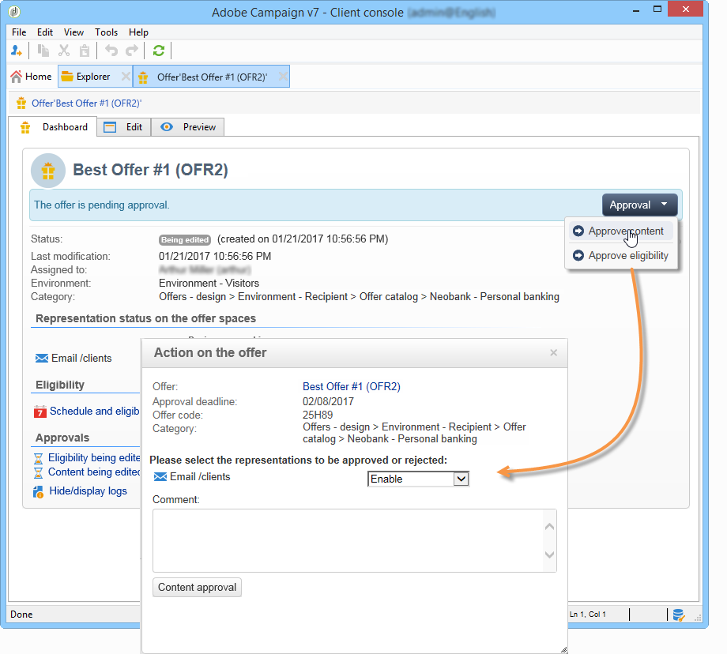

# Aprovação e ativação de uma oferta{#approving-and-activating-an-offer}

Após completar o conteúdo da oferta, é preciso aprová-la para ser duplicada no ambiente live e ser entregue. A aprovação aborda o conteúdo da oferta e sua qualificação.

O banner no painel de oferta informa se a oferta precisa passar pelo ciclo de aprovação ou não.

## Aprovação do conteúdo da oferta {#approving-offer-content}

Aprovar o conteúdo de oferta significa selecionar as representações que deseja disponibilizar no ambiente live.

O conteúdo de uma oferta tem uma representação por espaço. Como cada espaço de oferta tem sua própria estrutura e suas próprias funções de renderização, a representação da oferta pode variar.

É possível optar por aprovar o conteúdo da oferta em determinados espaços disponíveis e reject em outros.

>[!CAUTION]
>
>Quando o conteúdo e a qualificação de uma oferta são aprovados, o workflow de publicação (Notificação de oferta) é executado automaticamente e a oferta é ativada e disponibilizada em todos os espaços ativados.

Para aprovar o conteúdo da oferta, aplique as seguintes etapas:

1. Clique no **[!UICONTROL Approval]** botão e selecione **[!UICONTROL Approve content]** no pop-up.

   

1. Using the drop-down list, select the representations you want to keep editing or those you want to publish to the live environment, then click **[!UICONTROL Content approval]**.

   

   Quando o conteúdo da oferta for aprovado, as informações serão atualizadas na tabela do painel de ofertas.

   

   >[!NOTE]
   >
   >The **[!UICONTROL Content approved]** mention does not mean that all the offer representations have been enabled and approved. Indica que o processo de aprovação de conteúdo foi atingido, seja se todas as ofertas foram habilitadas/aprovadas ou não.

## Aprovação de qualificação para a oferta {#approving-offer-eligibility}

Aprovar a qualificação de oferta significa aceitar ou rejeitar pesos de oferta e as regras de qualificação também configuradas na oferta ou herdada das regras criadas na categoria pai.

>[!CAUTION]
>
>Quando o conteúdo e a qualificação de uma oferta são aprovados, o workflow de publicação (Notificação de oferta) é executado automaticamente e a oferta é ativada e disponibilizada em todos os espaços ativados.

* The full list of rules can be viewed by clicking **[!UICONTROL Schedule and eligibility rules]**.

   

* Para alterar as regras de qualificação, clique em **[!UICONTROL Reject]** e em **[!UICONTROL Eligibility approval]**.

   

   Os vários status são atualizados no painel de ofertas.

   

* To accept the offer eligibility, click **[!UICONTROL Approve eligibility]**.

   

   Approve eligibility, add a comment if necessary, then click **[!UICONTROL Eligibility approval]**.

   

   Os vários status são atualizados no painel de ofertas.

   

## Rastreamento de aprovação {#approval-tracking}

O rastreamento de aprovação está disponível no painel de ofertas. Clique em **[!UICONTROL Hide/display logs]** para acessá-lo.

>[!NOTE]
>
>Tracking is also available in the **[!UICONTROL Audit]** tab of the offer, with details of reviewers&#39; comments.

## Reiniciar a aprovação {#restart-the-approval}

Depois que a aprovação for iniciada, ela poderá ser reiniciada. Para fazer isso, siga estas instruções:

1. Clique **[!UICONTROL Content approved]** no painel de ofertas.
1. Na **[!UICONTROL Edit]** janela que é exibida, selecione a aprovação para reiniciar e clique em **[!UICONTROL Re-initialize approval to submit it again]**.
1. Confirme clicando em **[!UICONTROL Ok]**.

## Publicação da oferta {#publishing-the-offer}

Uma vez que o conteúdo e a qualificação de uma oferta tenham sido aprovados, a oferta é publicada por um workflow que é executado automaticamente para cada oferta cujo ciclo de aprovação foi concluído. The **[!UICONTROL Offer notification]** workflow also runs every hour in order to synchronize (if necessary) the spaces and categories contained in the offer catalog from the design environment to the live environment.

O painel de controle disponível no ambiente de design contém informações sobre a publicação, incluindo o nome da oferta correspondente no ambiente live.

Para exibir a oferta disponível no ambiente ativo, clique no rótulo da oferta: a oferta ativa tem um painel que contém todas as informações relevantes.

## Desabilitação de uma oferta {#disabling-an-offer}

Depois que a oferta for aprovada, você poderá desabilitá-la.

To do this, go to the dashboard for an online offer or an offer waiting to go online, then click **[!UICONTROL Disable offer]**.

You can also directly disable a category by going to the **[!UICONTROL Eligibility]** tab and checking the **[!UICONTROL Enabled]** box.

>[!NOTE]
>
>Quando uma oferta é excluída em um ambiente de design, ela é automaticamente desativada no ambiente online vinculado. Após um período de retenção de apresentações, as ofertas desativadas são excluídas do ambiente online.

