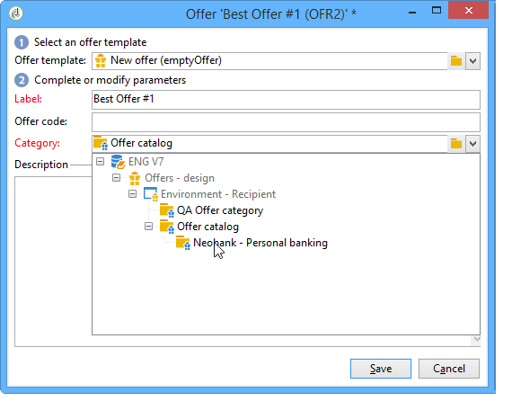
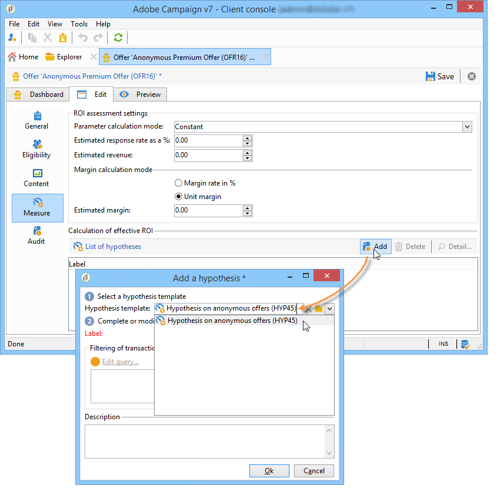

# Criação de uma oferta{#creating-an-offer}

## Criação da oferta {#creating-the-offer}

Para criar uma simulação, aplique as seguintes etapas:

1. Vá para o **[!UICONTROL Campaigns]** universo e clique no **[!UICONTROL Offers]** link.

   

1. Clique no botão **[!UICONTROL Create]**.

   

1. Altere o rótulo e selecione a categoria à qual a oferta deve pertencer.

   

1. Clique em **[!UICONTROL Save]** para criar a oferta.

   

   A oferta está disponível na plataforma e seu conteúdo pode ser configurado.

   

## Configuração da qualificação para a oferta {#configuring-offer-eligibility}

In the **[!UICONTROL Eligibility]** tab, define the period the offer will be valid for and can be presented, the filters to apply to the target and the offer weight.

### Definição do período de qualificação de uma oferta {#defining-the-eligibility-period-of-an-offer}

Para definir o período de qualificação da oferta, use as listas suspensas e selecione uma data inicial e final no calendário.


Fora dessas datas, a oferta não será selecionada pelo mecanismo do Interaction. Se também tiver configurado datas de qualificação para a categoria de oferta, o período mais restritivo será aplicado.

### Filtros no target {#filters-on-the-target}

É possível aplicar filtros ao target da oferta.

To do this, click the **[!UICONTROL Edit query]** link and select the filter you want to apply. (Consulte [esta seção](../../platform/using/steps-to-create-a-query.md#step-4---filter-data)).


Se os filtros predefinidos já tiverem sido criados, é possível selecioná-los na lista de filtros de usuário. Para obter mais informações, consulte [Criação de filtros](../../interaction/using/creating-predefined-filters.md)predefinidos.


### Peso da oferta {#offer-weight}

Para permitir que o mecanismo decida entre várias ofertas que o target está qualificado, é necessário atribuir um ou mais pesos à oferta. Também é possível aplicar filtros ao target se necessário ou restringir o espaço de oferta ao qual o peso será aplicado. Uma oferta com um peso mais significativo será preferível sobre uma oferta com menos peso.

É possível configurar vários pesos para a mesma oferta, por exemplo, para distinguir sub-períodos, alvos específicos ou até mesmo um espaço de oferta.

Por exemplo, uma oferta pode ter um peso de A para contatos com idade entre 18 e 25 e um peso de B para contatos acima desse intervalo. Se uma oferta estiver qualificada para o verão todo, ela também poderá ter um peso de A em julho e um peso de B em agosto.

>[!NOTE]
>
>O peso atribuído pode ser modificado temporariamente de acordo com os parâmetros da categoria à qual a oferta pertence. Para obter mais informações, consulte [Criar categorias](../../interaction/using/creating-offer-categories.md)de ofertas.

Para criar uma simulação, aplique as seguintes etapas:

1. Clique em **[!UICONTROL Add]**.

   

1. Altere o rótulo e atribua um peso. Por padrão, é definido como 1.

   

   >[!CAUTION]
   >
   >Se nenhum peso for inserido (0), o target não será considerado qualificado para a oferta.

1. Se desejar que o peso seja aplicado por um determinado período, defina datas de qualificação.

   

1. Se necessário, restrinja o peso a um espaço de oferta específico.

   

1. Aplique um filtro a um target.

   

1. Clique em **[!UICONTROL OK]** para salvar o peso.

   

   >[!NOTE]
   >
   >Se um target for elegível para vários pesos de uma oferta selecionada, o mecanismo manterá o melhor (mais alto) peso. Ao ligar para o mecanismo de oferta, uma oferta é selecionada no máximo uma vez por contato.

### Um resumo das regras de qualificação de oferta {#a-summary-of-offer-eligibility-rules}

Quando a configuração for concluída, um resumo das regras de eligibilidade estará disponível no painel de ofertas.

Para exibi-la, clique no **[!UICONTROL Schedule and eligibility rules]** link.


## Criação do conteúdo da oferta {#creating-the-offer-content}

1. Clique na **[!UICONTROL Edit]** guia e, em seguida, clique na **[!UICONTROL Content]** guia.

   

1. Preencha os vários campos do conteúdo da oferta.

   * **[!UICONTROL Title]** : Especifique o título que deseja fazer aparecer em sua oferta. Warning: this is not referring to the offer&#39;s label, which is defined in the **[!UICONTROL General]** tab.
   * **[!UICONTROL Destination URL]** : especifique o URL da oferta. Para ser processado corretamente, ele deve começar com &quot;http://&quot; ou &quot;https://&quot;.
   * **[!UICONTROL Image URL]** : especifique um URL ou um caminho de acesso para a imagem de sua oferta.
   * **[!UICONTROL HTML content]** / **[!UICONTROL Text content]** : digite o corpo da sua oferta na guia desejada. To generate tracking, the **[!UICONTROL HTML content]** must be composed of HTML elements that can be enclosed in a `<div>` type element. For example, the result of a `<table>` element in the HTML page will be as followed:

   ```
      <div> 
       <table>
        <tr>
         <th>Month</th>
         <th>Savings</th>   
        </tr>   
        <tr>    
         <td>January</td>
         <td>$100</td>   
        </tr> 
       </table> 
      </div>
   ```

   A definição do URL de aceitação é apresentada na seção [Configuração do status quando a proposta é aceita](../../interaction/using/creating-offer-spaces.md#configuring-the-status-when-the-proposition-is-accepted) .

   

   To find the required fields as they were defined during offer space configuration, click the **[!UICONTROL Content definitions]** link to display the list. Para obter mais informações, consulte [Criação de espaços](../../interaction/using/creating-offer-spaces.md)de oferta.

   

   Neste exemplo, a oferta deve incluir um título, uma imagem, conteúdo HTML e uma URL de destino.

## Pré-visualização da oferta {#previewing-the-offer}

Assim que o conteúdo da oferta for configurado, é possível pré-visualizar a oferta como ela aparecerá para o recipient. Para fazer isso:

1.  Clique na **[!UICONTROL Preview]** guia.

   

1. Selecione a representação da oferta que deseja visualizar.

   

1. Se tiver personalizado o conteúdo da oferta, selecione o target da oferta para visualizar a personalização.

   

## Criação de uma hipótese em uma oferta {#creating-a-hypothesis-on-an-offer}

É possível criar hipóteses nas propostas de ofertas. Isso permite determinar o impacto das ofertas nas compras realizadas do produto em questão.

>[!NOTE]
>
>Essas hipóteses são executadas via Gestor de resposta. Verifique o contrato de licença.

Hypotheses carried out on an offer proposition are referenced in their **[!UICONTROL Measure]** tab.

A criação de hipóteses é detalhada [nesta página](../../campaign/using/about-response-manager.md).



