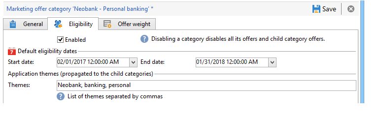

# Criação de categorias de ofertas{#creating-offer-categories}

A criação de categorias de oferta só pode ocorrer no ambiente **[!UICONTROL Design]**. Eles são implantados automaticamente no ambiente **[!UICONTROL Live]**, ou seja, são disponibilizados quando as ofertas criadas/modificadas que eles contêm são aprovadas. Por padrão, o ambiente **[!UICONTROL Design]** contém uma categoria para receber todas as ofertas. Subcategorias pode ser criado para adicionar hierarquia às ofertas de catálogo.

Para cada categoria, é possível definir datas de qualificação, ou seja, um ponto além do qual as ofertas contidas na categoria podem não ser mais apresentadas ao target. Se desejar que as ofertas de uma categoria específica sejam selecionadas como uma prioridade pelo mecanismo de oferta, para melhor expor um produto, por exemplo, é possível aumentar seus pesos por um determinado período adicionando um peso multiplicando na categoria.

Para criar uma categoria adicional, siga as etapas abaixo:

1. Vá para a pasta de **[!UICONTROL Offer catalog]**.

   

1. Clique com o botão direito e selecione **[!UICONTROL Create a new "Offer category" folder]** na lista suspensa.

   

1. Renomeie a categoria. É possível editar o rótulo posteriormente usando a guia **[!UICONTROL General]**.

   

   >[!NOTE]
   >
   >Repita essas etapas para criar quantas categorias forem necessárias.

   Logo, conforme necessário:

   * Atribuir datas de qualificação pela guia **[!UICONTROL Eligibility]**.

      

   * Insira as palavras-chave que podem ser usadas para selecionar ofertas dentro desta categoria, usando o campo **[!UICONTROL Themes]**.

      

      >[!NOTE]
      >
      >Ao chamar o mecanismo de oferta, somente a parte do catálogo no qual os temas ou categorias correspondem aos parâmetros é selecionada.

   * “Impulsione” temporariamente o peso da oferta de uma categoria por um determinado período por meio do campo **[!UICONTROL Multiplier weight]**.

      

Um resumo das regras de qualificação está disponível no painel das ofertas incluídas na categoria. Para visualizá-las, clique no link **[!UICONTROL Schedule and eligibility rules of the offer]**.

