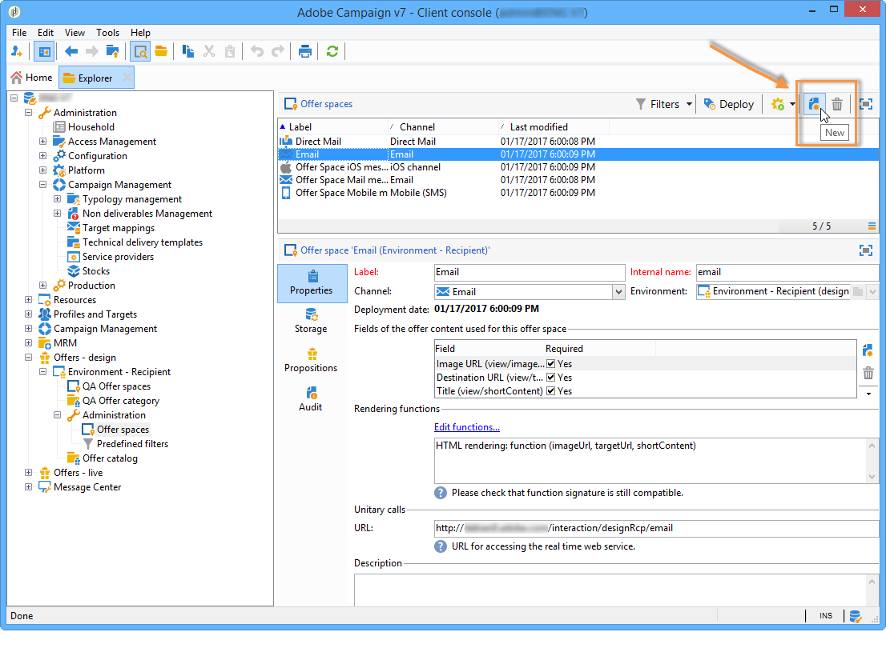
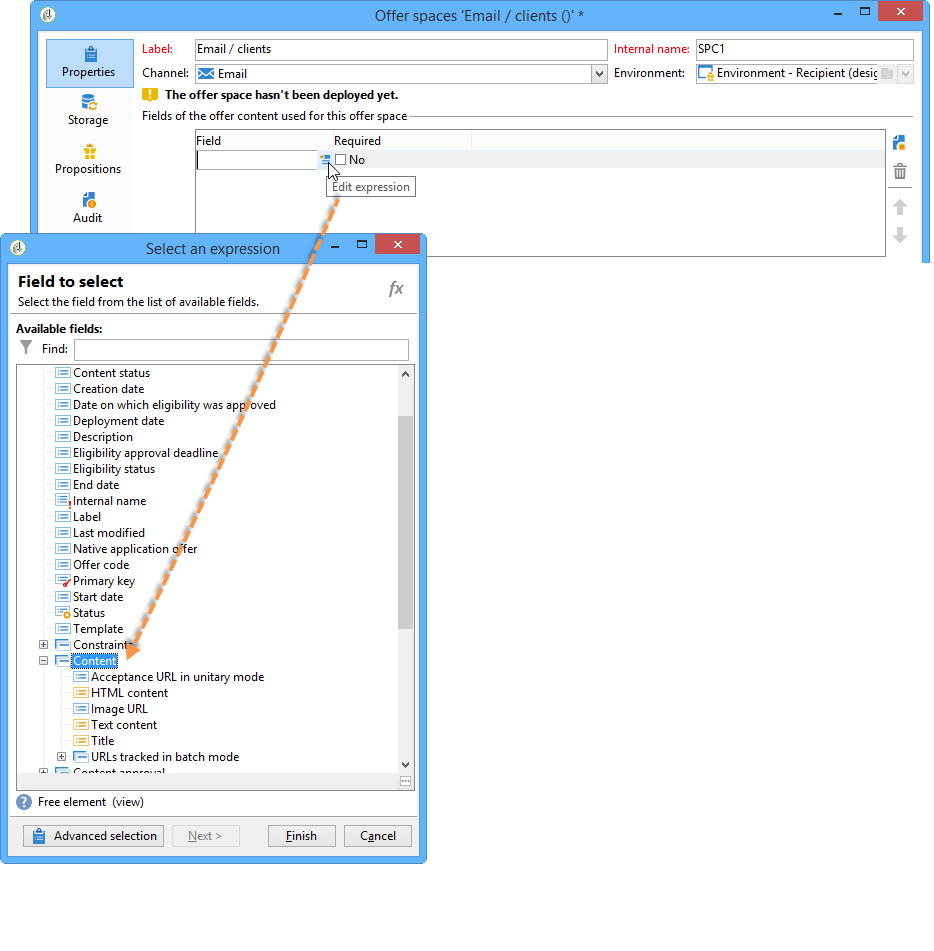
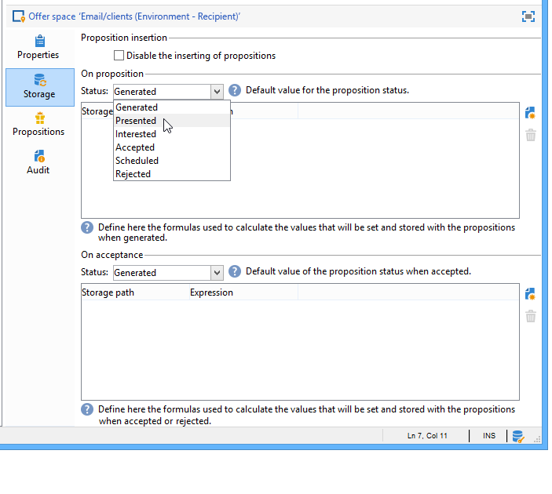

# Criação de espaços de oferta{#creating-offer-spaces}


A criação de espaço de oferta só pode ser realizada por um **administrador técnico** com acesso às subpastas de espaço de oferta. Os espaços de oferta só podem ser criados no ambiente de design e são automaticamente duplicados no ambiente live durante a aprovação da oferta.

O conteúdo do catálogo de ofertas está configurado nos espaços de oferta. Por padrão, o conteúdo pode incluir os seguintes campos: **[!UICONTROL Title]**, **[!UICONTROL Destination URL]**, **[!UICONTROL Image URL]**, **[!UICONTROL HTML content]** e **[!UICONTROL Text content]**. A sequência de campos é configurada no espaço de oferta.

Parâmetros avançados permitem especificar uma chave de identificação de contato (que pode ser feita de vários elementos, o nome e o campo de e-mail ao mesmo tempo, por exemplo). Para obter mais informações, consulte a seção [Apresentação de uma oferta identificada](../../interaction/using/integration-via-javascript--client-side-.md#presenting-an-identified-offer).

A renderização HTML ou XML é criada por meio de uma função de renderização. A seqüência dos campos definidos na função de renderização deve ser idêntica à sequência configurada no conteúdo.


Para criar um novo espaço de oferta, siga as etapas abaixo:

1. Vá para a lista de espaços de oferta e clique em **[!UICONTROL New]**.

   

1. Selecione o canal que deseja usar e altere o rótulo do espaço de oferta.

   

1. Marque a caixa **[!UICONTROL Enable unitary mode]** se um dos seguintes casos se aplicar:

   * Está usando o Interaction com o Message Center
   * Está usando o modo unitário do Interaction (interações de entrada)

1. Vá para a janela **[!UICONTROL Content field]** e clique em **[!UICONTROL Add]**.

   

1. Vá para o nó **[!UICONTROL Content]** e selecione os campos na seguinte ordem: **[!UICONTROL Title]**, **[!UICONTROL Image URL]**, **[!UICONTROL HTML content]** e **[!UICONTROL Destination URL]**.

   

1. Marque a caixa **[!UICONTROL Required]** para tornar cada campo obrigatório.

   >[!NOTE]
   >
   >Essa configuração é usada na pré-visualização e oferece espaços de oferta inválidos ao publicar se um dos elementos obrigatórios não estiver presente na oferta. No entanto, se uma oferta já estiver disponível em um espaço de oferta, esses critérios não serão levados em consideração.

   

1. Clique em **[!UICONTROL Edit functions]** para criar uma função de renderização.

   Essas funções são usadas para gerar representações de ofertas em um espaço de oferta. Há vários formatos possíveis: HTML ou texto para interações de saída e XML para interações de entrada.

   

1. Acesse a guia **[!UICONTROL HTML rendering]** e selecione **[!UICONTROL Overload the HTML rendering function]**.
1. Insira a função de renderização.

   

Se necessário, é possível sobrecarregar as funções de renderização XML para interações de entrada. Também é possível sobrecarregar as funções de renderização de texto e HTML para interações de saída. Para obter mais informações, consulte [Sobre canais de entrada](../../interaction/using/about-inbound-channels.md).

## Status da apresentação de oferta {#offer-proposition-statuses}

Uma apresentação de oferta pode ter vários status dependendo das interações com a população direcionada. O Interaction vem com um conjunto de valores que podem ser aplicados à apresentação de oferta durante todo o ciclo de vida. No entanto, é preciso configurar a plataforma para que o status seja alterado quando a apresentação de oferta for criada e aceita.

>[!NOTE]
>
>O status da apresentação de oferta não é atualizado imediatamente. Ele é realizado pelo workflow de rastreamento que é acionado a cada hora.

### Lista de status {#status-list}

O Interaction vem com os seguintes valores que podem ser usados para qualificar o status de uma apresentação de oferta:

* **[!UICONTROL Accepted]**.
* **[!UICONTROL Scheduled]**.
* **[!UICONTROL Generated]**.
* **[!UICONTROL Interested]**.
* **[!UICONTROL Presented]**.
* **[!UICONTROL Rejected]**.

Esses valores não são aplicados por padrão: eles precisam ser configurados.

>[!NOTE]
>
>O status de uma apresentação de oferta será alterado automaticamente para &quot;Presented&quot; se a oferta estiver vinculada a uma delivery com o status &quot;Sent&quot;.

### Configuração do status quando a proposta é criada {#configuring-the-status-when-the-proposition-is-created}

Quando uma apresentação de oferta é criada pelo mecanismo do Interaction seu status é alterado, seja uma interação de entrada ou de saída. A escolha entre esses dois valores depende da maneira como os espaços de oferta foram configurados no ambiente **[!UICONTROL Design]**.

Para cada espaço, é possível configurar o status que deseja aplicar quando uma proposta é criada, dependendo das informações que deseja exibir nos relatórios de ofertas.

Para fazer isso, realize o seguinte processo:

1. Vá para a guia **[!UICONTROL Storage]** do espaço desejado.
1. Selecione o status que deseja aplicar à proposta quando ela for criada.

   

### Configuração do status quando a proposta for aceita {#configuring-the-status-when-the-proposition-is-accepted}

Depois que uma apresentação de oferta for aceita, é possível usar um dos valores fornecidos por padrão para configurar o novo status da proposta. A atualização é efetiva quando um recipient clica em um link na oferta, que chama o mecanismo do Interaction.

Para fazer isso, realize o seguinte processo:

1. Vá para a guia **[!UICONTROL Storage]** do espaço desejado.
1. Selecione o status que deseja aplicar à proposta quando for aceita.

   

**Interação de entrada**

A guia **[!UICONTROL Storage]** permite definir os status somente para propostas de ofertas **proposed** e **accepted**. Para interação de entrada, o status das propostas de oferta deve ser especificado diretamente na URL para chamar o mecanismo de oferta, em vez da interface. Dessa forma, é possível especificar qual status aplicar em outros casos, por exemplo, se uma apresentação de oferta for rejeitada.

```
<BASE_URL>?a=UpdateStatus&p=<PRIMARY_KEY_OF_THE_PROPOSITION>&st=<NEW_STATUS_OF_THE_PROPOSITION>&r=<REDIRECT_URL>
```

Por exemplo, a proposta (identificador **40004**) que corresponde à oferta **seguro residencial** exibida no site **Neobank** contém a seguinte URL:

```
<BASE_URL>?a=UpdateStatus&p=<40004>&st=<3>&r=<"http://www.neobank.com/insurance/subscribe.html">
```

Assim que um visitante clica na oferta, e portanto na URL, o status **[!UICONTROL Accepted]** (valor **3**) é aplicado à proposta e o visitante é redirecionado para uma nova página do site **Neobank** para apresentar o contrato de seguro.

>[!NOTE]
>
>Se desejar especificar outro status na url (por exemplo, se uma apresentação de oferta for rejeitada), use o valor correspondente ao status desejado. Exemplo: **[!UICONTROL Rejected]** = &quot;5&quot;, **[!UICONTROL Presented]** = &quot;1&quot; e assim por diante.
>
>Os status e seus valores podem ser recuperados no esquema de dados **[!UICONTROL Offer propositions (nms)]**. Para obter mais informações, consulte [esta página](../../configuration/using/data-schemas.md).

**Interação de saída**

No caso de uma interação de saída, é possível aplicar automaticamente o status **[!UICONTROL Interested]** a uma apresentação de oferta quando o delivery contiver um link. Basta adicionar o valor **_urlType=&quot;11&quot;** ao link:

```
<a _urlType="11" href="<DEST_URL>">Link inserted into the delivery</a>
```

## Visualização de oferta por espaço {#offer-preview-per-space}

Nesta guia, é possível exibir as ofertas para as quais o recipient está qualificado por meio de um método escolhido. No exemplo abaixo, o recipient está qualificado para três propostas de ofertas por e-mail.


Se um recipient não estiver qualificado para ofertas, isso será mostrado na visualização.


A visualização pode ignorar contextos quando eles são restritos a um espaço. Este é o caso quando o schema de interação foi estendido para adicionar campos referenciados em um espaço usando um canal de entrada (para saber mais sobre isso, consulte [Exemplo de extensão](../../interaction/using/extension-example.md)).
