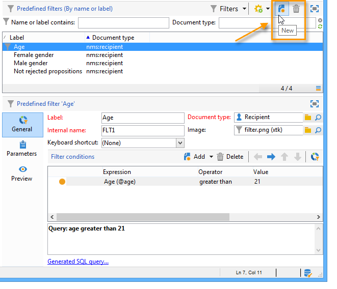
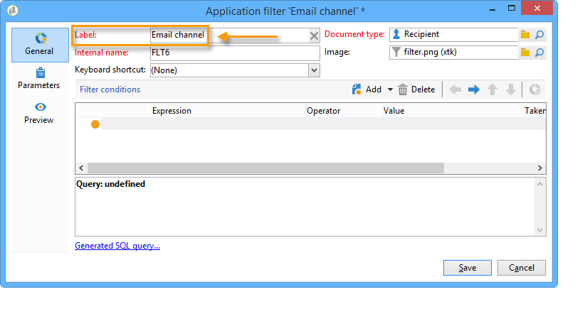

# Criação de filtros predefinidos{#creating-predefined-filters}

Filtros predefinidos permitem criar regras de qualificação para a população de destino que podem ser facilmente reutilizados durante a criação da oferta. Eles são específicos para cada ambiente e consideram os parâmetros de oferta.

Para criar um filtro, siga as seguintes etapas:

1. Acesse a pasta **[!UICONTROL Administration]** e selecione **[!UICONTROL Pre-defined offer filters]**.

   

1. Clique em **[!UICONTROL New]**.

   

1. Altere o rótulo para poder identificar o filtro mais tarde.

   

1. Selecione o campo que a condição do filtro abordará.

   

1. Selecione um operador e um valor se necessário, então salve a query.

   

1. Clique em **[!UICONTROL Preview]** para visualizar o resultado do filtro.

   
