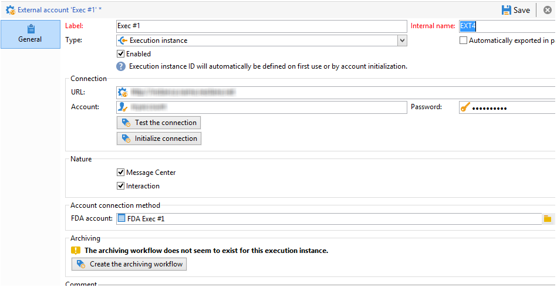

# Arquiteturas distribuídas{#distributed-architectures}

## Princípio {#principle}

Para oferecer suporte a escalabilidade e fornecer serviço 24 horas por dia, 7 dias por semana no canal de entrada, é possível usar o Interaction com uma arquitetura distribuída. Esse tipo de arquitetura já é usado com o Message Center e é composto por várias instâncias:

* uma ou várias instâncias de controle dedicadas ao canal de saída e contendo a base de design de marketing e ambiente.
* uma ou várias instâncias de execução dedicadas ao canal de entrada.


>[!NOTE]
>
>As instâncias de controle são dedicadas ao canal de entrada e contêm a versão online do catálogo. Cada instância de execução é independente e dedicada a um segmento de contato (por exemplo, uma instância de execução por país). As chamadas do mecanismo de oferta devem ser executados diretamente na execução (uma URL específica por instância de execução). Como a sincronização entre instâncias não é automática, as interações do mesmo contato devem ser enviadas pela mesma instância.

## Sincronização de propostas {#proposition-synchronization}

A sincronização de oferta é realizada por meio de pacotes. Em instâncias de execução, todos os objetos de catálogo são prefixados pelo nome da conta externa. Isso significa que várias instâncias de controle (instâncias de desenvolvimento e produção por exemplo) podem ser suportadas em uma mesma instância de execução.

>[!IMPORTANT]
>
>Recomendamos utilizar nomes internos curtos e explícitos.

As ofertas são automaticamente implantadas e publicadas em instâncias de execução e controle.

Ofertas excluídas no ambiente de design são desabilitadas em todas as instâncias online. As propostas e ofertas obsoletas são excluídas automaticamente em todas as instâncias após o período de purga (especificado no assistente de implantação de cada instância) e o período de deslizamento (especificado nas regras de tipologia de propostas de entrada).


Um workflow é criado para cada ambiente e conta externa para a sincronização de propostas. A frequência de sincronização pode ser ajustada para cada ambiente e conta externa.

## Limitações {#limitations}

* Se usar a função de fallback de um ambiente anônimo para um ambiente identificado, esses dois ambientes deverão estar na mesma instância de execução.
* A sincronização entre várias instâncias de execução não é executada em tempo real. As interações do mesmo contato devem ser enviadas para a mesma instância. A instância de controle deve ser dedicada ao canal de saída (sem tempo real).
* O banco de dados de marketing não é sincronizado automaticamente. Os dados de marketing usados nos pesos e regras de qualificação devem ser duplicados em instâncias de execução. Esse processo não é fornecido como padrão, é necessário desenvolvê-lo durante o período de integração.
* A sincronização de propostas é realizada exclusivamente pela conexão FDA.
* Se usar o Interaction e o Message Center na mesma instância, a sincronização ocorrerá por meio do protocolo FDA nos dois casos.

## Configuração de pacotes {#packages-configuration}

Quaisquer extensões de schema diretamente vinculadas à **Interação** (ofertas, propostas, recipients, etc.) devem ser implantadas nas instâncias de execução.

O pacote de Interação deve ser instalado em todas as instâncias (controle e execução). Dois pacotes adicionais estão disponíveis: um pacote a ser instalado nas instâncias de controle e outro para ser instalado em cada instância de execução.

>[!NOTE]
>
>Ao instalar o pacote, os campos do tipo **longo** da tabela **nms:proposition**, como ID da proposta, tornam-se campos de tipo **int64.** Esse tipo de dado é detalhado [nesta seção](../../configuration/using/schema-structure.md#mapping-the-types-of-adobe-campaign-dbms-data).

A duração da retenção de dados deve ser configurada em cada instância (por meio da janela **[!UICONTROL Data purge]** no assistente de implantação). Em instâncias de execução, esse período deve corresponder à profundidade histórica necessária para as regras de tipologia (período de deslizamento) e as regras de qualificação serem calculadas.

Nas instâncias de controle:

1. Criar uma conta externa por instância de execução:

   

   * Complete o rótulo e adicione um nome interno curto e explícito.
   * Selecione o **[!UICONTROL Execution instance]**.
   * Marque a opção **[!UICONTROL Enabled]**.
   * Conclua os parâmetros de conexão da instância de execução.
   * Cada instância de execução deve ser vinculada a um ID. Esse ID é atribuído ao clicar no botão **[!UICONTROL Initialize connection]**.
   * Verifique o tipo de aplicativo usado:**[!UICONTROL Message Center]**, **[!UICONTROL Interaction]** ou ambos.
   * Insira a conta da FDA utilizada. Um operador deve ser criado nas instâncias de execução e deve ter os seguintes direitos de leitura e gravação no banco de dados da instância em questão:

      ```
      grant SELECT ON nmspropositionrcp, nmsoffer, nmsofferspace, xtkoption, xtkfolder TO user;
      grant DELETE, INSERT, UPDATE ON nmspropositionrcp TO user;
      ```
   >[!NOTE]
   >
   >O endereço IP da instância de controle deve ser autorizado nas instâncias de execução.

1. Configure o ambiente:

   

   * Adicione a lista de instâncias de execução.
   * Para cada um, especifique o período de sincronização e os critérios do filtro (por exemplo, por país).

      >[!NOTE]
      >
      >Se encontrar um erro, poderá consultar os workflows de sincronização e oferecer notificações. Eles podem ser encontrados nos workflows técnicos do aplicativo.

Se, por motivos de otimização, apenas parte do banco de dados de marketing for duplicado nas instâncias de execução, é possível especificar um schema restrito vinculado ao ambiente para permitir que os usuários usem apenas dados que estejam disponíveis nas instâncias de execução. É possível criar uma oferta usando dados que não estão disponíveis em instâncias de execução. Para fazer isso, é necessário desativar a regra nos outros canais limitando essa regra no canal de saída (campo **[!UICONTROL Taken into account if]**).


## Opções de manutenção {#maintenance-options}

Aqui está uma lista de opções de manutenção disponíveis na instância de controle:

>[!IMPORTANT]
>
>Essas opções só devem ser usadas para casos de manutenção específicos.

* **`NmsInteraction_LastOfferEnvSynch_<offerEnvId>_<executionInstanceId>`**: última data em que um ambiente foi sincronizado em uma determinada instância.
* **`NmsInteraction_LastPropositionSynch_<propositionSchema>_<executionInstanceIdSource>_<executionInstanceIdTarget>`**: última data em que as propostas de um determinado schema foram sincronizadas de uma instância para outra.
* **`NmsInteraction_MapWorkflowId`**: uma opção contendo a lista de todos os workflows de sincronização gerados.

A seguinte opção está disponível nas instâncias de execução:

**NmsExecutionInstanceId**: opção contendo o ID da instância.

## Instalação de pacotes {#packages-installation}

Se a instância não tiver o pacote do Interaction anteriormente, nenhuma migração será necessária. Por padrão, a tabela de propostas estará em 64 bits após a instalação dos pacotes.

>[!IMPORTANT]
>
>Dependendo do volume de propostas existentes na instância, essa operação pode demorar algum tempo.

* Se a instância tiver pouca ou nenhuma proposta, nenhuma modificação manual da tabela de propostas será necessária. A modificação será feita quando os pacotes estiverem instalados.
* Se a instância tiver muitas propostas, é melhor alterar a estrutura da tabela de propostas antes de instalar os pacotes de controle e executá-las. Recomendamos executar as queries durante um período de baixa atividade.

>[!NOTE]
>
>Se as configurações específicas na tabela de propostas foram executadas, adapte as queries de acordo.

### PostgreSQL {#postgresql}

Há dois métodos. O primeiro (usando uma tabela de trabalho) é ligeiramente mais rápido.

**Tabela de trabalho**

```
CREATE TABLE NmsPropositionRcp_tmp AS SELECT * FROM nmspropositionrcp WHERE 0=1;
ALTER TABLE nmspropositionrcp_tmp
  ALTER COLUMN ipropositionid TYPE bigint,
  ALTER COLUMN iinteractionid TYPE bigint;
INSERT INTO nmspropositionrcp_tmp SELECT * FROM nmspropositionrcp;
DROP TABLE nmspropositionrcp;
CREATE INDEX proposition_id ON NmsPropositionRcp (ipropositionid);
CREATE INDEX nmspropositionrcp_deliveryid ON NmsPropositionRcp (ideliveryid);
CREATE INDEX nmspropositionrcp_lastmodified ON NmsPropositionRcp (tslastmodified);
CREATE INDEX nmspropositionrcp_offerid ON NmsPropositionRcp (iofferid);
CREATE INDEX nmspropositionrcp_offerspaceid ON NmsPropositionRcp (iofferspaceid);
CREATE INDEX nmspropositionrcp_recipientidid ON NmsPropositionRcp (irecipientid);
ALTER TABLE nmspropositionrcp_tmp RENAME TO nmspropositionrcp;
```

**Alterar Tabela**

```
ALTER TABLE nmspropositionrcp
  ALTER COLUMN ipropositionid TYPE bigint,
  ALTER COLUMN iinteractionid TYPE bigint;
```

### Oracle {#oracle}

A edição do tamanho de um tipo **Number** não resulta na alteração dos valores ou do índice. Portanto, é imediato.

A query a ser executada é a seguinte:

```
ALTER TABLE nmspropositionrcp MODIFY (
ipropositionid NUMBER(19, 0),
iinteractionid NUMBER(19, 0)
);
```

### MSSQL {#mssql}

As queries a serem executadas são:

```
SELECT * INTO NmsPropositionRcp_tmp FROM NmsPropositionRcp WHERE 1 = 0;
GO
ALTER TABLE NmsPropositionRcp_tmp ALTER COLUMN ipropositionid BIGINT;
GO
ALTER TABLE NmsPropositionRcp_tmp ALTER COLUMN iinteractionid BIGINT;
GO
INSERT INTO NmsPropositionRcp_tmp SELECT * FROM NmsPropositionRcp;
GO
DROP TABLE NmsPropositionRcp;
GO
sp_rename 'NmsPropositionRcp_tmp', NmsPropositionRcp
GO
ALTER TABLE NmsPropositionRcp ADD DEFAULT ((0)) FOR dWeight
GO
ALTER TABLE NmsPropositionRcp ADD DEFAULT ((0)) FOR iDeliveryId
GO
ALTER TABLE NmsPropositionRcp ADD DEFAULT ((0)) FOR iEngineType
GO
ALTER TABLE NmsPropositionRcp ADD DEFAULT ((0)) FOR iInteractionId
GO
ALTER TABLE NmsPropositionRcp ADD DEFAULT ((0)) FOR iOfferId
GO
ALTER TABLE NmsPropositionRcp ADD DEFAULT ((0)) FOR iOfferSpaceId
GO
ALTER TABLE NmsPropositionRcp ADD DEFAULT ((0)) FOR iPropositionId
GO
ALTER TABLE NmsPropositionRcp ADD DEFAULT ((0)) FOR iRank
GO
ALTER TABLE NmsPropositionRcp ADD DEFAULT ((0)) FOR iRecipientId
GO
ALTER TABLE NmsPropositionRcp ADD DEFAULT ((0)) FOR iStatus
GO
CREATE NONCLUSTERED INDEX NmsPropositionRcp_deliveryId ON NmsPropositionRcp (iDeliveryId)
GO
CREATE NONCLUSTERED INDEX NmsPropositionRcp_eventDate ON NmsPropositionRcp (tsEvent)
GO
CREATE UNIQUE NONCLUSTERED INDEX NmsPropositionRcp_id ON NmsPropositionRcp (iPropositionId)
GO
CREATE NONCLUSTERED INDEX NmsPropositionRcp_lastModified ON NmsPropositionRcp (tsLastModified)
GO
CREATE NONCLUSTERED INDEX NmsPropositionRcp_offerId ON NmsPropositionRcp (iOfferId)
GO
CREATE NONCLUSTERED INDEX NmsPropositionRcp_offerSpaceI ON NmsPropositionRcp (iOfferSpaceId)
GO
CREATE NONCLUSTERED INDEX NmsPropositionRcp_recipientId ON NmsPropositionRcp (iRecipientId)
GO
```

