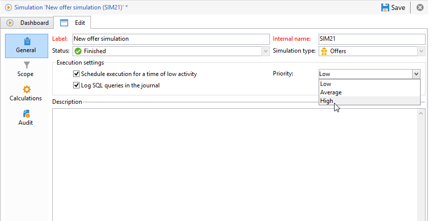

# Configurações de execução{#execution-settings}

Ao criar uma simulação, é possível especificar as configurações de execução, se necessário. Essas configurações permitem executar a simulação durante um período de pouca atividade, dependendo da prioridade, ou registrar queries SQL no log. Esta etapa é opcional.

Essas configurações podem ser alteradas posteriormente na guia **[!UICONTROL General]** da janela de simulação.

* **[!UICONTROL Schedule execution for a time of low activity]**: permite agendar a simulação com base na prioridade escolhida (baixa, média ou alta) para otimizar os desempenhos do Adobe Campaign.
* **[!UICONTROL Priority]**: este é o nível aplicado à simulação para o agendá-la. Quando a opção **[!UICONTROL Schedule execution for a time of low activity]** é marcada, o fluxo de trabalho de processamento de campanha seleciona um momento de baixa atividade para iniciar a campanha.
* **[!UICONTROL Log SQL queries in the journal]**: essa funcionalidade destina-se somente a usuários especializados. Ela permite adicionar uma guia ao log exibindo queries SQL para detectar possíveis defeitos se a simulação terminar com erros.
