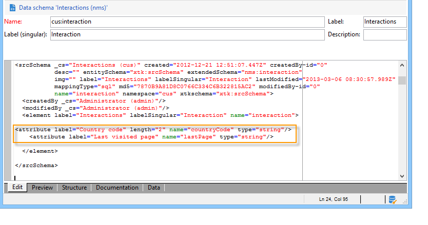
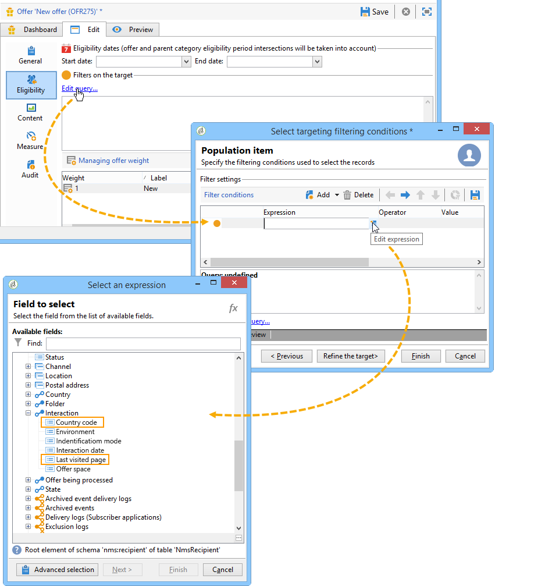

# Exemplo de extensão{#extension-example}

No caso de um contato de entrada (call center ou site da Web), as ofertas mais relevantes são sugeridas para um determinado contato usando um conjunto de regras de elegibilidade. Para enriquecer os critérios de elegibilidade de suas ofertas, estenda o esquema **nms:interaction**.

* Para adicionar um novo contexto de interação, estenda o esquema **nms:interaction** e crie quantos elementos de **atributo** forem necessários no esquema.

  No exemplo a seguir, os critérios adicionados são o código do país e a última página visitada.

  

* Em seguida, é possível usar os atributos criados anteriormente ao definir a definição dos critérios de elegibilidade.

  No exemplo a seguir, podemos criar critérios de elegibilidade para exibir uma oferta com base no país do usuário ou na última página da Web que eles visualizaram.

  

* Ao configurar chamadas SOAP, insira o elemento XML do **contexto** para fazer referência às informações de contexto adicionadas no esquema de interação. Para obter mais informações, consulte [Integração via SOAP (lado do servidor)](../../interaction/using/integration-via-soap-server-side.md).
