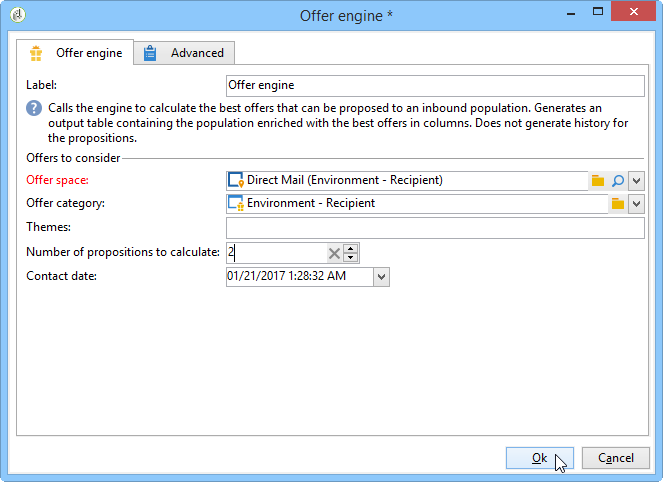

# Integração de uma oferta via workflow{#integrating-an-offer-via-a-workflow}

Fora da atividade de delivery, várias atividades de workflows permitem definir a forma como as ofertas são apresentadas:

* Delivery outline
* Enriquecimento
* Mecanismo de oferta
* Ofertas por célula

## Delivery outline {#delivery-outline}

A atividade delivery outline, disponível nos workflows da campanha, permite apresentar ofertas mencionadas em um delivery outline na campanha atual em andamento.

1. Em um workflow, adicione uma atividade de delivery outline antes de adicionar uma atividade de delivery.
1. Na atividade de delivery outline, especifique o outline que deseja usar.

   Para obter mais informações sobre especificação de delivery outlines, consulte o guia [Campaign - MRM](../../campaign/using/marketing-campaign-deliveries.md#associating-and-structuring-resources-linked-via-a-delivery-outline).

1. Preencha os campos disponíveis de acordo com seu delivery.
1. Há dois casos possíveis:

   * If you would like to call the offer engine, check the **[!UICONTROL Restrict the number of propositions selected]** box. Especifique o espaço de oferta e o número de propostas que serão apresentadas no delivery.

      Os pesos da oferta e as regras de qualificação serão considerados pelo mecanismo de oferta.

   * Se não marcar a caixa, todas as ofertas no delivery outline serão apresentadas sem chamar o mecanismo de oferta.
   >[!NOTE]
   >
   >A pré-visualização leva em conta o número de ofertas especificadas no delivery. Ao executar um workflow, é o número especificado no delivery outline que é levado em conta.

   

## Enriquecimento {#enrichment}

A atividade de enriquecimento permite adicionar ofertas ou links para ofertas de recipients de delivery.

>[!NOTE]
>
>Para obter mais informações sobre a atividade de enriquecimento, consulte a documentação dedicada no [Guia de workflows](../../workflow/using/enrichment.md).

Por exemplo, é possível enriquecer os dados de uma query de recipient antes de um delivery.

Há dois métodos para especificar apresentações de oferta.

* Especificação de oferta ou de chamada de motor de oferta.
* Fazendo referência a um link para uma oferta.

### Especificação de oferta ou de chamada para o motor de oferta {#specifying-an-offer-or-a-call-to-the-offer-engine}

Após configurar seu query (consulte o [Guia de workflows](../../workflow/using/query.md)):

1. Adicione e abra uma atividade de enriquecimento.
1. Na **[!UICONTROL Enrichment]** guia, selecione **[!UICONTROL Add data]**.
1. Select **[!UICONTROL An offer proposition]** in the types of data to add.

   

1. Especifique um identificador e um rótulo para a proposta que será adicionada.
1. Especifique a seleção da oferta. Há duas opções possíveis para isso:

   * **[!UICONTROL Search for the best offer in a category]** : verifique essa opção e especifique os parâmetros de chamada do mecanismo de oferta (espaço de oferta, categoria ou tema(s), data de contato, número de ofertas a serem mantidas). O mecanismo calculará automaticamente as ofertas para adicionar de acordo com esses parâmetros. We recommend completing either the **[!UICONTROL Category]** or the **[!UICONTROL Theme]** field, rather than both at the same time.

      

   * **[!UICONTROL A predefined offer]** : marque esta opção e especifique um espaço de oferta, uma oferta específica e uma data de contato para configurar diretamente a oferta que deseja adicionar, sem chamar o mecanismo de oferta.

      

1. Em seguida, configure uma atividade de delivery que corresponda ao canal escolhido. Para obter mais informações, consulte a seção [Inserção de uma proposta em uma entrega](../../interaction/using/integrating-an-offer-via-the-wizard.md#inserting-an-offer-proposition-into-a-delivery) .

   >[!NOTE]
   >
   >O número de propostas disponíveis para pré-visualizar depende da configuração executada na atividade de enriquecimento, ao invés de qualquer configuração possível executada diretamente no delivery.

### Referência a um link para uma oferta {#referencing-a-link-to-an-offer}

Também é possível referenciar um link para uma oferta em uma atividade de enriquecimento.

Para fazer isso, realize o seguinte processo:

1. Selecione **[!UICONTROL Add data]** na **[!UICONTROL Enrichment]** guia da atividade.
1. In the window where you choose the type of data to add, select **[!UICONTROL A link]**.
1. Selecione o tipo de link que deseja estabelecer, assim como seu target. Nesse caso, o target é o schema de oferta.

   

1. Especifique a ligação entre os dados da tabela de entrada na atividade de enriquecimento (aqui a tabela de recipients) e a tabela de ofertas. Por exemplo, é possível vincular um código de oferta a um recipient.

   

1. Em seguida, configure uma atividade de delivery que corresponda ao canal escolhido. Para obter mais informações, consulte a seção [Inserção de uma proposta em uma entrega](../../interaction/using/integrating-an-offer-via-the-wizard.md#inserting-an-offer-proposition-into-a-delivery) .

   >[!NOTE]
   >
   >O número de propostas disponíveis para a pré-visualização depende da configuração realizada no delivery.

### Armazenamento de classificações e pesos de ofertas {#storing-offer-rankings-and-weights}

Por padrão, quando uma atividade de **enriquecimento** é usada para delivery de ofertas, suas classificações e seus pesos não são armazenados na tabela de propostas.

>[!NOTE]
>
>Lembre-se:A **[!UICONTROL Offer engine]** atividade armazena essas informações por padrão.

No entanto, é possível armazenar essas informações da seguinte maneira:

1. Crie uma chamada para o mecanismo de oferta em uma atividade de enriquecimento feita após uma query e antes de uma atividade de delivery. Consulte a seção [Especificando uma oferta ou uma chamada para o mecanismo](../../interaction/using/integrating-an-offer-via-a-workflow.md#specifying-an-offer-or-a-call-to-the-offer-engine) de oferta.
1. Na janela principal da atividade, selecione **[!UICONTROL Edit additional data...]**.

   

1. Add the **[!UICONTROL @rank]** columns for the ranking and **[!UICONTROL @weight]** for the offer weight.

   

1. Confirme sua adição e salve seu workflow.

O delivery armazena automaticamente a classificação e o peso das ofertas. This information is visible in the delivery&#39;s **[!UICONTROL Offers]** tab.

## Mecanismo de oferta {#offer-engine}

The **[!UICONTROL Offer engine]** activity also lets you specify a call to the offer engine prior to the delivery.

Essa atividade funciona de acordo com o mesmo princípio que a atividade de enriquecimento com uma chamada de mecanismo, enriquecendo os dados da população de entrada com uma oferta calculada pelo mecanismo, antes de um delivery.

Após configurar seu query (consulte o [Guia de workflows](../../workflow/using/query.md)):

1. Add and open an **[!UICONTROL Offer engine]** activity.
1. Preencha os vários campos disponíveis para especificar a chamada para oferecer parâmetros de mecanismo (espaço de oferta, categoria ou tema(s), data de contato, número de ofertas a serem mantidas). O mecanismo calculará automaticamente as ofertas para adicionar de acordo com esses parâmetros.

   >[!NOTE]
   >
   >Aviso: se você usar essa atividade, somente as apresentações de oferta usadas no delivery serão armazenadas.

   

1. Em seguida, configure uma atividade de delivery que corresponda ao canal escolhido. Para obter mais informações, consulte a seção [Inserção de uma proposta em uma entrega](../../interaction/using/integrating-an-offer-via-the-wizard.md#inserting-an-offer-proposition-into-a-delivery) .

## Ofertas por célula {#offers-by-cell}

The **[!UICONTROL Offers by cell]** activity lets you distribute the inbound population (from a query for example) into several segments and to specify an offer to present for each of these segments.

Para fazer isso, realize o seguinte processo:

1. Add the **[!UICONTROL Offers by cell]** activity once you have specified the target population, then open it.
1. In the **[!UICONTROL General]** tab, select the offer space on which you want to present the offers.
1. Na **[!UICONTROL Cells]** guia, especifique os diferentes subconjuntos usando o **[!UICONTROL Add]** botão:

   * Especifique a população de subconjunto usando o filtro disponível e as regras de limitação.
   * Em seguida, selecione a oferta que deseja apresentar ao subconjunto. As ofertas disponíveis são aquelas elegíveis no ambiente de oferta que foi selecionado na etapa anterior.

      

1. Em seguida, configure uma atividade de delivery que corresponda ao canal escolhido. Para obter mais informações, consulte a seção [Inserção de uma proposta em uma entrega](../../interaction/using/integrating-an-offer-via-the-wizard.md#inserting-an-offer-proposition-into-a-delivery) .

