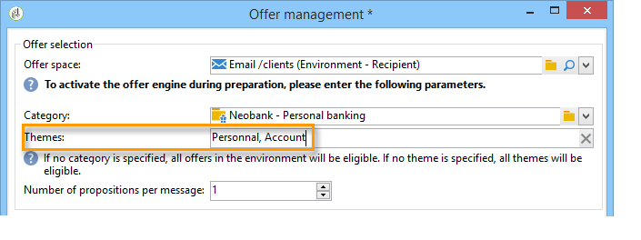
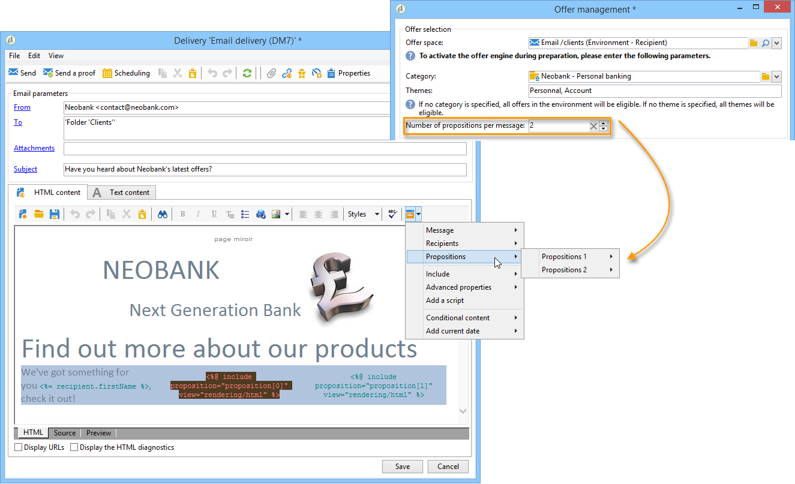

# Integração de uma oferta ao assistente{#integrating-an-offer-via-the-assistant}

Ao criar uma entrega, há dois métodos possíveis para integrar ofertas:

* Chamar o mecanismo de oferta no corpo de uma entrega.
* Fazer referência às ofertas por meio da entrega outline de uma campanha. Esse método geralmente é usado para campanhas em papel.

## Fazer uma entrega com uma chamada para o mecanismo de oferta {#delivering-with-a-call-to-the-offer-engine}

Para apresentar uma oferta durante uma campanha de marketing, basta criar uma ação de entrega clássica com base no canal escolhido. O mecanismo de oferta é chamado quando o conteúdo de entrega é definido, clicando no ícone **[!UICONTROL Offers]** disponível na barra de ferramentas.

Saiba mais sobre entregas de correspondência direta [nesta seção](../../delivery/using/about-direct-mail-channel.md). Saiba mais sobre campanhas de marketing [nesta seção](../../campaign/using/setting-up-marketing-campaigns.md).

### Etapas principais para inserir uma oferta em uma entrega {#main-steps-for-inserting-an-offer-into-a-delivery}

Para inserir apresentações de oferta em uma entrega, siga o seguinte processo:

1. Na janela da entrega, clique no ícone Ofertas.

   

1. Selecione o espaço que corresponde ao seu ambiente de oferta.

   

1. Para refinar a opção de ofertas do motor, selecione a categoria da qual a(s) oferta(s) a ser apresentada é uma parte, ou um/vários temas. Recomendamos usar apenas um desses campos de cada vez para evitar sobrecarga de restrições.

   

   

1. Especifique o número de ofertas que deseja inserir no corpo da entrega.

   

1. Selecione a opção **[!UICONTROL Exclude non-eligible recipients]** se necessário. Para obter mais informações, consulte [Parâmetros para chamar o mecanismo de oferta](#parameters-for-calling-offer-engine).

   

1. Se necessário, selecione a opção **[!UICONTROL Do not display anything if no offers are selected]**. Para obter mais informações, consulte [Parâmetros para chamar o mecanismo de oferta](#parameters-for-calling-offer-engine).

   

1. Insira as propriedades no conteúdo da entrega usando os campos de mesclagem. O número de apresentações disponíveis depende da forma como a chamada do motor é configurada e sua ordem depende da prioridade das ofertas.

   

1. Finalize o conteúdo e envie sua entrega da forma habitual.

   

### Parâmetros para chamada do mecanismo de oferta {#parameters-for-calling-offer-engine}

* **[!UICONTROL Space]**: espaço do ambiente de oferta que deve ser selecionado para ativar o mecanismo de oferta.
* **[!UICONTROL Category]**: pasta específica na qual as ofertas são classificadas. Se nenhuma categoria for especificada, todas as ofertas contidas no ambiente serão consideradas pelo motor de oferta, a menos que um tema seja selecionado.
* **[!UICONTROL Themes]**: palavras-chave definidas upstream nas categorias. Isso funciona como um filtro e permite refinar o número de ofertas que serão apresentadas ao selecioná-las em um conjunto de categorias.
* **[!UICONTROL Number of propositions]**: número de ofertas retornadas pelo mecanismo que podem ser inseridas no corpo da entrega. Se não forem inseridas na mensagem, as ofertas ainda serão geradas, mas não serão apresentadas.
* **[!UICONTROL Exclude non-eligible recipients]**: essa opção permite ativar ou desativar a exclusão de destinatários para os quais não há ofertas elegíveis suficientes. O número de propostas elegíveis pode ser menor do que o número solicitado de apresentações. Se esta caixa estiver marcada, os destinatários que não têm apresentações suficientes serão excluídos da entrega. Se você não selecionar essa opção, esses destinatários não serão excluídos, mas não terão o número solicitado de apresentações.
* **[!UICONTROL Do not display anything if no offer is selected]**: essa opção permite escolher como a mensagem será processada caso uma das proposições não exista. Quando esta caixa é marcada, a representação da proposta ausente não é exibida e nenhum conteúdo aparecerá na mensagem para essa apresentação. Se a caixa não estiver marcada, a mensagem propriamente dita será cancelada durante o envio e os destinatários não receberão mais mensagens.

### Inserção de uma proposta de oferta em uma entrega {#inserting-an-offer-proposition-into-a-delivery}

A representação de ofertas a serem apresentadas é inserida no corpo da entrega através dos campos de mesclagem. O número de apresentações é definido nos parâmetros da chamada do motor de oferta.

A entrega pode ser personalizada usando os campos da oferta ou, no caso de um email, as funções de renderização.

## Entrega descrição da entrega {#delivering-with-delivery-outlines}

Também é possível apresentar ofertas em uma entrega usando descrições da entrega.

Para obter mais informações sobre descrição da entrega, consulte o guia [Campaign - MRM](../../campaign/using/marketing-campaign-deliveries.md#associating-and-structuring-resources-linked-via-a-delivery-outline).

1. Crie uma nova campanha ou acesse uma campanha existente.
1. Acesse as descrições das entregas por meio das guias da campanha **[!UICONTROL Edit]** > **[!UICONTROL Documents]**.
1. Adicione uma outline e depois insira quantas ofertas desejar, clicando com o botão direito do mouse na outline e selecionando **[!UICONTROL New]** > **[!UICONTROL Offer]**. Depois salve a campanha.

   

1. Crie uma entrega cujas descrição você pode acessar (por exemplo, uma entrega de mala direta).
1. Ao editar a entrega, clique em **[!UICONTROL Select a delivery outline]**.

   >[!NOTE]
   >
   >Dependendo do tipo de entrega, essa opção pode ser encontrada no menu **[!UICONTROL Properties]** > **[!UICONTROL Advanced]** (para entregas de email, por exemplo).

   

1. Usando o botão **[!UICONTROL Offers]**, você pode configurar o espaço de ofertas, bem como o número de ofertas a serem apresentadas na entrega.

   

1. Adicione as apresentações ao corpo da entrega usando os campos de personalização (para obter mais informações, consulte a seção [Inserção de uma apresentação de oferta em uma entrega](#inserting-an-offer-proposition-into-a-delivery)) ou, no caso de uma entrega de correspondência direta, editando o formato de extração de arquivo.

   As apresentações serão selecionadas nas ofertas referenciadas na descrição da entrega.

   >[!NOTE]
   >
   >As informações sobre a classificação e pesos de oferta são salvas somente na tabela de apresentações se as ofertas forem geradas diretamente na entrega.
