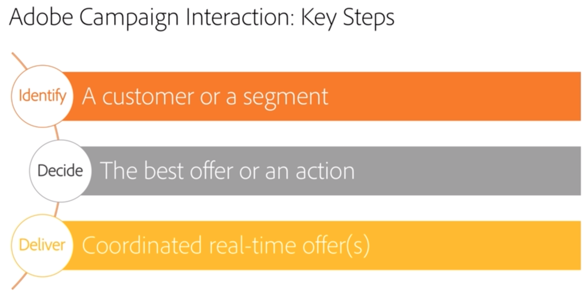

# Interação e gerenciamento de ofertas{#interaction-and-offer-management}

A interação permite responder em tempo real durante uma interação com um determinado contato (um cliente ou target) uma única ou várias ofertas adaptadas. Por exemplo, essas podem ser mensagens de comunicação simples, ofertas especiais de um ou vários produtos ou um serviço.

As ofertas são enviadas para contatos por meio de um contato de entrada (site ou call center) ou de saída (entrega de email, correspondência direta ou SMS dentro de uma campanha de marketing).

Você pode criar um catálogo de ofertas com os canais de entrada e saída para selecionar a melhor oferta para enviar a um contato em um certo contexto. A relevância da oferta para um destinatário é definida com base nas regras de elegibilidade. A seleção de uma oferta de um conjunto de ofertas relevantes é determinada usando regras de prioridade. As regras de apresentação de ofertas oferecem o histórico de troca do contato e ajudam a evitar que elas recebam a mesma oferta várias vezes.

A interação permite criar e gerenciar um catálogo de ofertas e configurar as regras de elegibilidade e os temas de aplicações vinculados a elas. Dependendo do canal escolhido, o conteúdo da oferta pode ser personalizado graças a várias funções de renderização. Por fim, você pode usar o módulo de simulação para calcular o impacto de uma apresentação de ofertas.

 Para se familiarizar com o recurso de interação e terminologias usadas na Interação do Campaign, assista a [este vídeo](https://helpx.adobe.com/campaign/classic/how-to/acs-overview.html?playlist=/ccx/v1/collection/product/campaign/classic/segment/digital-marketers/explevel/intermediate/applaunch/get-started/collection.ccx.js&ref=helpx.adobe.com).

## Tópicos relacionados

| Páginas úteis | Recursos adicionais |
|---|---|
| [Etapas de implementação da interação](../../interaction/using/implementation-steps.md) | [Teste de distribuição da oferta](../../interaction/using/about-offers-simulation.md) |
| [Ambientes Live/Design](../../interaction/using/live-design-environments.md) | [Adicionar uma oferta em um email](../../interaction/using/integrating-an-offer-via-the-wizard.md) |
| [Criação de espaços de oferta](../../interaction/using/creating-offer-spaces.md) | [Caso de uso: adicionar uma oferta em um site](../../interaction/using/offers-on-an-inbound-channel.md) |
