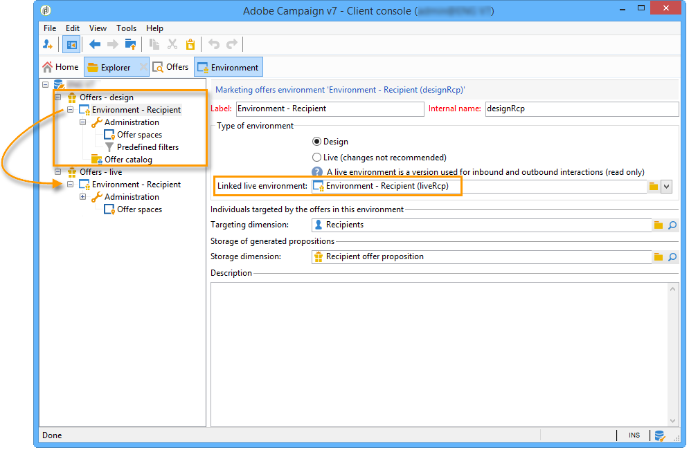
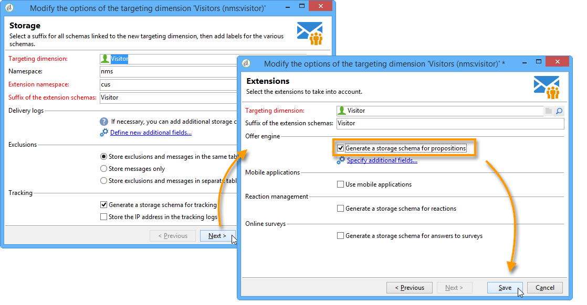

# Ambientes Live/Design{#live-design-environments}

## Princípio operacional {#operating-principle}

O Interaction opera com dois tipos de ambientes de oferta:

* Os ambientes de oferta **[!UICONTROL Design]** que incluem ofertas que estão sendo editadas e podem ser alteradas. Essas ofertas não foram feitas pelo ciclo de aprovação e não são entregues aos contatos.
* Os ambientes de oferta **[!UICONTROL Live]** que incluem ofertas aprovadas conforme são apresentadas aos contatos. As ofertas neste ambiente são somente leitura.

Each **[!UICONTROL Design]** environment is linked to a **[!UICONTROL Live]** environment. Quando uma oferta é concluída, suas regras de conteúdo e qualificação estão sujeitas a um ciclo de aprovação. Depois que este ciclo for concluído, a oferta relacionada será implantada automaticamente no ambiente **[!UICONTROL Live]**. A partir deste momento, ele estará disponível para delivery.

Por padrão, o Interaction vem com um ambiente **[!UICONTROL Design]** e um ambiente **[!UICONTROL Live]** vinculado a ele. Ambos os ambientes são pré-configurados para direcionar a tabela de recipients integrada.

>[!NOTE]
>
>Para direcionar outra tabela (tabela de visitantes para ofertas anônimas ou uma tabela de recipients específica), é necessário usar o assistente de target mapping para criar os ambientes. Para obter mais informações, consulte [Criação de um ambiente de ofertas](#creating-an-offer-environment).

Os gerentes de oferta e os gerentes de delivery têm acesso a diferentes modos de exibição do ambiente. Os gerentes de delivery só podem visualizar o ambiente **[!UICONTROL Live]** de oferta e usar ofertas para entregá-los. Os gerentes de oferta podem visualizar e alterar o ambiente **[!UICONTROL Design]** e visualizar o ambiente **[!UICONTROL Live]**. Para obter mais informações, consulte [Perfis de operador](../../interaction/using/operator-profiles.md).

## Criação de um ambiente de oferta {#creating-an-offer-environment}

Por padrão, o Interaction vem com um ambiente pré-configurado para direcionar à tabela de recipients (ofertas identificadas). Se quiser direcionar outra tabela (tabela de visitantes para ofertas anônimas ou uma tabela de recipients específica), será necessário aplicar as seguintes configurações:

1. Place your cursor on the **[!UICONTROL Administration]** > **[!UICONTROL Campaign management]** > **[!UICONTROL Delivery mappings]** node. Right-click the delivery mapping you want to use (**[!UICONTROL Visitors]** if you want to use anonymous offers) and select **[!UICONTROL Actions]** > **[!UICONTROL Modify the options of the targeting dimension]**.

   

1. Click **[!UICONTROL Next]** to proceed to the next screen in the wizard, check the **[!UICONTROL Generate a storage schema for propositions]** box and click **[!UICONTROL Save]**.

   

   >[!NOTE]
   >
   >Se a caixa já estiver marcada, a desmarque e então, a marque novamente.

1. O Adobe Campaign cria dois ambientes (**[!UICONTROL Design]** e **[!UICONTROL Live]**) com informações de direcionamento do target mapping habilitado anteriormente. O ambiente é pré-configurado com as informações de definição de metas.

   If you have activated **[!UICONTROL Visitor]** mapping, the **[!UICONTROL Environment dedicated to incoming anonymous interactions]** box is automatically checked in the environment&#39;s **[!UICONTROL General]** tab.

   Essa opção permite ativar funções específicas de interação anônima, especialmente quando configurar espaços de oferta de ambiente. Também é possível configurar opções que permitem alternar de um ambiente &quot;identificado&quot; para um ambiente &quot;anônimo&quot;.

   Por exemplo, é possível vincular um espaço de oferta de ambiente de recipient (contato identificado) com um espaço de oferta que corresponda a um ambiente de visitante (contato não identificado). Dessa forma, as diferentes ofertas serão disponibilizadas para o contato, dependendo de é identificado ou não. Para obter mais informações, consulte [Criação de espaços de oferta](../../interaction/using/creating-offer-spaces.md).

   

>[!NOTE]
>
>Para obter mais informações sobre interações anônimas em um canal de entrada, consulte [Interações anônimas](../../interaction/using/anonymous-interactions.md).

