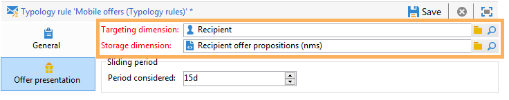

# Gestão de apresentação de ofertas{#managing-offer-presentation}

## Visão geral das regras de apresentação {#presentation-rules-overview}

A interação permite controlar o fluxo de apresentações de oferta usando regras de apresentação. Essas regras, que são específicas à Interação, são regras de tipologia. Elas permitem excluir ofertas com base no histórico de apresentações já feitas a um recipient. Eles são referenciados no ambiente

## Criação e referência a uma regra de apresentação de oferta {#creating-and-referencing-an-offer-presentation-rule}

1. Vá para o nó **[!UICONTROL Administration]** > **[!UICONTROL Campaign management]** > **[!UICONTROL Typology management]** > **[!UICONTROL Typology rules]** .
1. Create a typology rule and choose the **[!UICONTROL Offer presentation]** type.

   

1. Especifique o canal no qual a regra será aplicada:

   

1. Configure os critérios de aplicação da regra. Para obter mais informações, consulte as configurações [da regra](#presentation-rule-settings)Apresentação.
1. Vá para o nó **[!UICONTROL Administration]** > **[!UICONTROL Campaign execution]** > **[!UICONTROL Typology management]** > **[!UICONTROL Typologies]** e crie uma tipologia que agrupe todas as regras de **[!UICONTROL Offer presentation]** tipo.

   

1. Depois da criação da tipologia, coloque o cursor nas regras de tipologia e as agrupe na tipologia recém-criada.

   

1. No seu ambiente de oferta, faça referência à tipologia usando a lista suspensa.

   

## Configurações da regra de apresentação {#presentation-rule-settings}

### Critérios de aplicação {#application-criteria-}

The application criteria available in the **[!UICONTROL General]** tab lets you specify the offers which the presentation rule will apply to. Para fazer isso, é necessário criar um query e escolher as ofertas relacionadas, conforme descrito abaixo.

1. In your typology rule, click the **[!UICONTROL Edit the rule application conditions...]** link to create your query.

   

1. Na janela de query, é possível aplicar um filtro nas ofertas às quais deseja aplicar uma regra de tipologia.

   Por exemplo, você pode selecionar uma categoria de oferta.

   

### Dimensões da oferta {#offer-dimensions}

In the **[!UICONTROL Offer presentation]** tab, you must specify the same dimensions for the presentation rule as those configured in the environment.

The **[!UICONTROL Targeting dimension]** coincides with the table of recipients (by default: nms:recipients) who will receive the offer propositions. The **[!UICONTROL Storage dimension]** coincides with the table which contains the proposition history linked to the targeting dimension (by default:nms:propositionRcp).

>[!NOTE]
>
>Você também pode usar tabelas não padrão. Se quiser usar um targeting dimension específico, é necessário criar tabelas e um ambiente dedicado usando o targeting mapping. Para obter mais informações, consulte [Criação de um ambiente](../../interaction/using/live-design-environments.md#creating-an-offer-environment)de ofertas.

### Período {#period}

Este é um período de deslizamento que começa na data de apresentação da oferta. Ele define um limite temporal para a validade de apresentações de oferta. A regra não se aplica às apresentações de oferta feitas fora deste período.

The period starts **n** days before the proposition date and ends **n** days afterwards, where **n** corresponds to the number entered in the **[!UICONTROL Period considered]** field:

* Para espaços de entrada, a data da apresentação é a data de apresentação da oferta.
* Para espaços de saída, a data da proposta é a data de contato do delivery (por exemplo, a data de delivery inserida em um workflow para construção do target).

Use as setas para alterar o número de dias ou insira um período diretamente (&quot;2d 6h&quot;, por exemplo).

### Número de apresentações {#number-of-propositions}

É possível definir o número mais alto de apresentações que podem ser feitas antes que a(s) oferta(s) relacionada(s) seja/sejam excluída(s).

Use as setas para modificar o número de apresentações de ofertas:

## Definição de apresentações e recipients {#defining-propositions-and-recipients}

The **[!UICONTROL Propositions to count]** section lets you specify both the recipients and the propositions which will lead to the exclusion of the offers defined in the **[!UICONTROL General]** tab if they appear a certain number of times in the propositions history.

### Filtragem de apresentações {#filtering-propositions}

Você pode selecionar critérios de filtragem para excluir apresentações com base no canal, as ofertas relacionadas ou o status das apresentações atribuídas anteriormente.

Esses critérios representam as aplicações mais frequentes das regras de apresentação. To use other criteria, you can create a query using the **[!UICONTROL Limit propositions...]** link. Para obter mais informações, consulte a seção [Criação de uma consulta sobre proposições](#creating-a-query-on-propositions) .

* **Filtro no canal**

   **[!UICONTROL On the same channel only]** : permite excluir propostas de oferta no canal especificado na **[!UICONTROL General]** guia.

   For instance, the channel specified for the rule in the **[!UICONTROL General]** tab is email. Se as ofertas que a regra se aplica até agora forem oferecidas apenas no canal da Web, o motor de interação pode apresentar as ofertas em um delivery de email. No entanto, uma vez que as ofertas tenham sido apresentadas por email, o motor de interação escolherá um canal diferente para apresentar as ofertas.

   >[!NOTE]
   >
   >Estamos falando sobre o canal e não o espaço. Se a regra precisar excluir uma oferta no canal da Web, a oferta destinada a ser apresentada em um site em dois espaços (em um banner e no corpo da página, por exemplo), não será exibida no site se já tiver sido apresentada antes.
   >
   >For a workflow involving offer presentation, the rules are only correctly taken into account if they are configured on **[!UICONTROL All channels]**.

* **Filtro na oferta**

   Esse filtro permite restringir as apresentações de oferta a serem contadas para conjuntos específicos de ofertas.

   **[!UICONTROL All offers]** : valor padrão. Nenhum filtro é aplicado às ofertas.

   **[!UICONTROL Offer being presented]** : a oferta especificada na guia **[!UICONTROL General]** será excluída se já tiver sido apresentada.

   **[!UICONTROL Offers from the same category]** : uma oferta será excluída se uma oferta da mesma categoria já tiver sido apresentada.

   **[!UICONTROL The offers which the rule applies to]** : quando várias ofertas são definidas na **[!UICONTROL General]** guia, cada proposta de oferta desse conjunto de ofertas é considerada e termina com a exclusão de todas as ofertas se o limite da proposta for atingido.

   For instance, offers 2, 3 and 5 are defined in the **[!UICONTROL General]** tab. O número máximo de apresentações é definido como 2. Se as ofertas 2 e 5 forem apresentadas uma vez, o número de apresentações será 2. Como resultado, a oferta 3 nunca será apresentada.

* **Filtro no status da apresentação**

   Esse filtro permite escolher os status mais frequentes para que as apresentações de oferta sejam consideradas no histórico de apresentações.

   **[!UICONTROL Regardless of the proposition status]** : valor padrão. Nenhum filtro é aplicado ao status da apresentação.

   **[!UICONTROL Accepted or rejected propositions]** : permite que você exclua ofertas apresentadas anteriormente que foram aceitas ou rejeitadas.

   **[!UICONTROL Accepted propositions]** : permite que você exclua ofertas apresentadas anteriormente que foram aceitas.

   **[!UICONTROL Rejected propositions]** : permite que você exclua ofertas apresentadas anteriormente que foram rejeitadas.

### Definição de recipients {#defining-recipients}

To specify the recipients, click the **[!UICONTROL Edit the query from the targeting dimension...]** link and select the recipients concerned by the rule.

### Criação de um query em apresentações {#creating-a-query-on-propositions}

To specify the propositions to be counted via a query, click the **[!UICONTROL Limit propositions...]** link and specify the criteria to be taken into account.

No exemplo a seguir, as apresentações a serem contadas após duas apresentações são aquelas na categoria **Ofertas especiais**, para o espaço **Call center**, com um peso abaixo de **20**.

