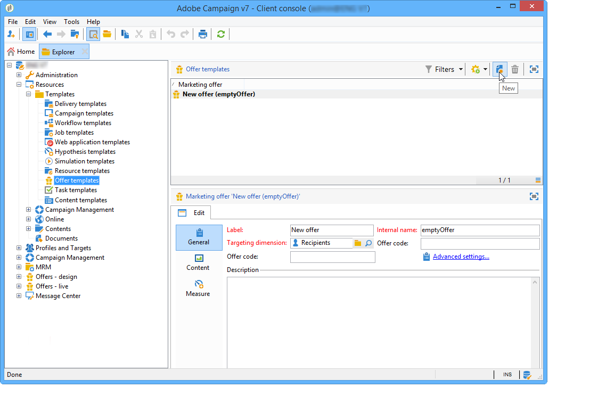
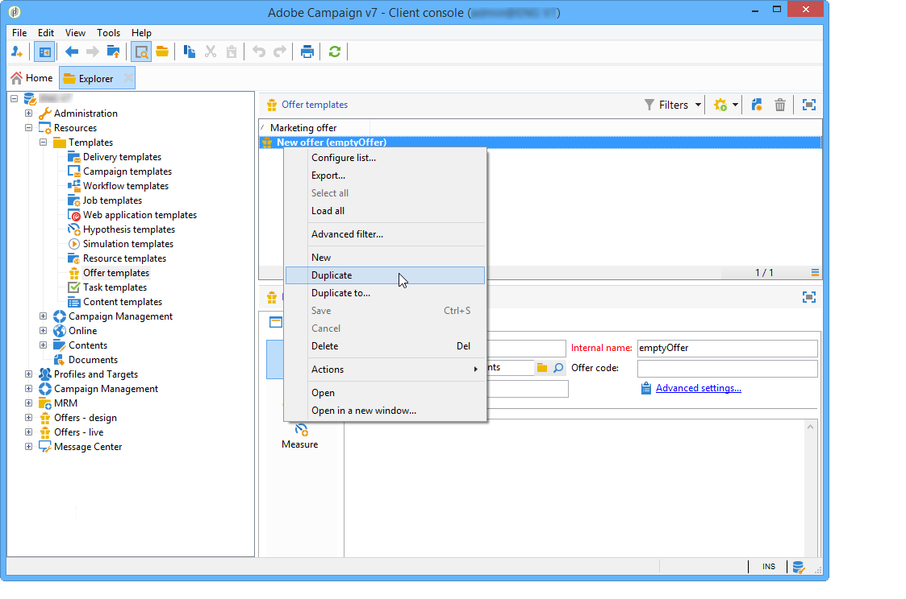

# Gestão de templates de ofertas{#managing-offer-templates}

Os templates de oferta são disponibilizados no Adobe Campaign prontos para uso. Você pode usá-los após criar suas ofertas, duplicar ou adaptar sua configuração às suas necessidades. Você também pode criar seus próprios templates. As ofertas de templates são armazenadas na pasta **Recursos** > **Templates** > **Templates de Oferta**.

## Criação de um template de oferta {#creating-an-offer-template}

Para criar um template oferta, siga estas etapas:

1. Vá para **Resources** > **Templates** > **Offer templates**.
1. Clique no ícone **Novo**.

   

1. Configure seu template seguindo o mesmo processo que de uma oferta normal e, em seguida, salve-o clicando em **Salvar**.

## Duplicação de um template existente {#duplicate-an-existing-template}

Para duplicar um template de oferta (pronto ou não), siga estas etapas:

1. Vá para **Resources > Templates > Offer templates**.
1. Clique com o botão direito do mouse no template a ser duplicado e selecione **Duplicar** no menu suspenso.

   

1. Se necessário, defina as configurações que deseja ver no template e depois o salve clicando em **Salvar**.

Esse template será oferecido ao criar em uma oferta.

