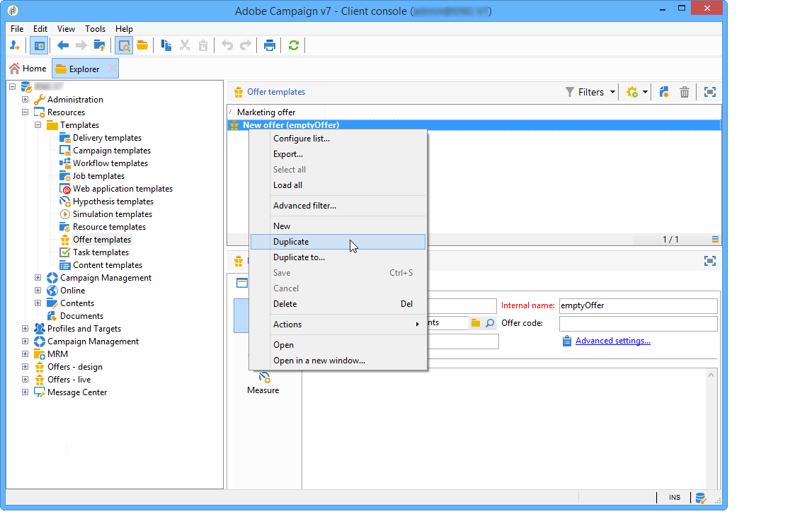

# Gestão de modelos de ofertas{#managing-offer-templates}

Os modelos de oferta são disponibilizados no Adobe Campaign prontos para uso. Você pode usá-los após criar suas ofertas, duplicar ou adaptar sua configuração às suas necessidades. Você também pode criar seus próprios modelos. As ofertas de modelos são armazenadas na pasta **Resources** > **Templates** > **Offer templates**.

## Criação de um modelo de oferta {#creating-an-offer-template}

Para criar um modelo oferta, siga estas etapas:

1. Vá para **Resources** > **Templates** > **Offer templates**.
1. Clique no ícone **Novo**.

   

1. Configure seu modelo seguindo o mesmo processo que de uma oferta normal e, em seguida, salve-o clicando em **Salvar**.

## Duplicação de um modelo existente {#duplicate-an-existing-template}

Para duplicar um modelo de oferta (pronto ou não), siga estas etapas:

1. Vá para **Resources > Templates > Offer templates**.
1. Clique com o botão direito do mouse no modelo a ser duplicado e selecione **Duplicar** no menu suspenso.

   

1. Se necessário, defina as configurações que deseja ver no modelo e depois o salve clicando em **Salvar**.

Esse modelo será oferecido ao criar em uma oferta.

