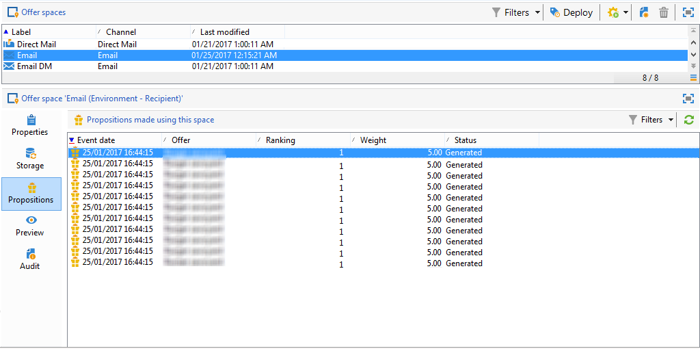

# Histórico da apresentação da oferta{#offer-proposition-history}

Depois que as apresentações da oferta são feitas, é possível visualizar o histórico.

>[!NOTE]
>
>Essa funcionalidade só é visível online e somente no gerenciador de delivery.

* No nível da oferta, clique em **[!UICONTROL Edit]** na guia **[!UICONTROL Propositions]**.

   

* A partir do perfil de um destinatário, clique na guia **[!UICONTROL Propositions]**.

   

* No nível de espaço de oferta, clique na guia **[!UICONTROL Propositions]**.

   

