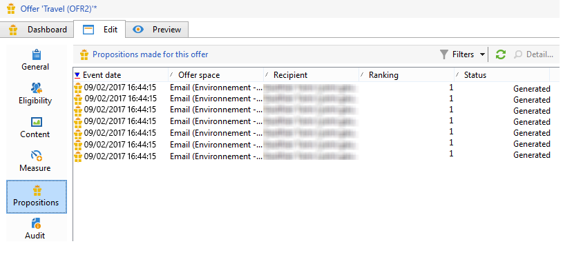

# Histórico da apresentação da oferta{#offer-proposition-history}

Depois que as apresentações da oferta são feitas, é possível visualizar o histórico.

>[!NOTE]
>
>Essa funcionalidade só é visível online e somente no gerenciador de delivery.

* No nível da oferta, na **[!UICONTROL Edit]** guia, clique em **[!UICONTROL Propositions]**.

   

* From a recipient&#39;s profile, click the **[!UICONTROL Propositions]** tab.

   

* At the offer space level, click the **[!UICONTROL Propositions]** tab.

   

