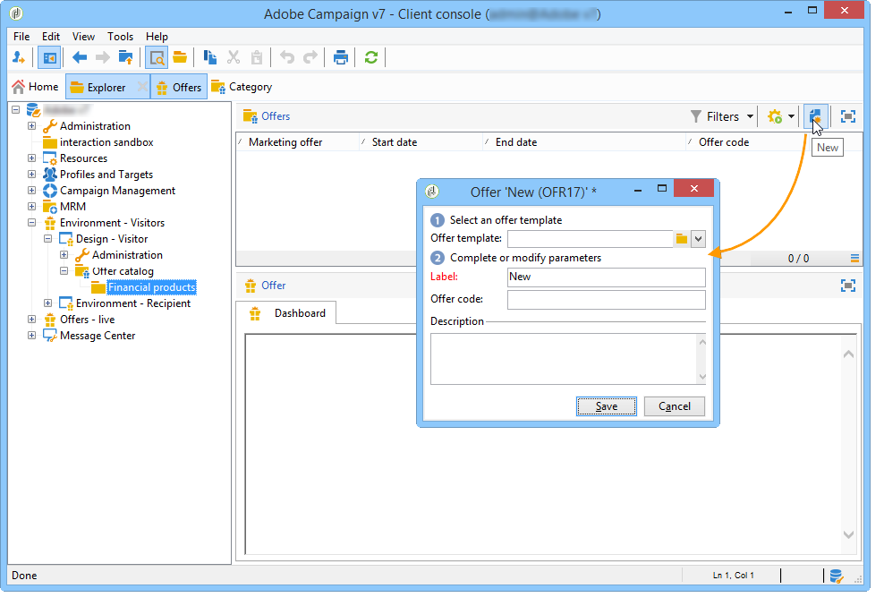
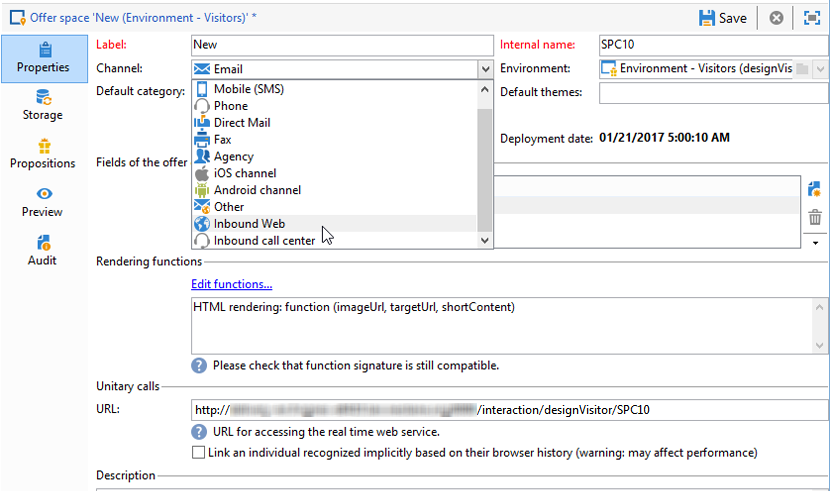

# Ofertas em um canal de entrada{#offers-on-an-inbound-channel}

## Apresentação de uma oferta a um visitante anônimo {#presenting-an-offer-to-an-anonymous-visitor}

O site Neobank deseja exibir uma oferta destinada aos visitantes não identificados que navegam na página.

Para configurar essa interação, nós vamos:

1. [Create an anonymous environement](#creating-an-anonymous-environment).
1. [Create anonymous offer spaces](#creating-anonymous-offer-spaces).
1. [Create an offer category and a theme.](#creating-an-offer-category-and-a-theme).
1. [Create anonymous offers.](#creating-anonymous-offers).
1. [Configure the web offer spaces on the website](#configure-the-web-offer-space-on-the-website).

### Criação de um ambiente anônimo {#creating-an-anonymous-environment}

Follow the procedure detailed in [Creating an offer environment](../../interaction/using/live-design-environments.md#creating-an-offer-environment) to create your anonymous environment based on the **Visitors**&#39; dimensions.

É possível obter uma estrutura de árvore contendo o novo ambiente:


### Criação de espaços de oferta anônimos {#creating-anonymous-offer-spaces}

1. Em seu ambiente anônimo (**Visitantes**), vá para o nó **[!UICONTROL Administration]** > **[!UICONTROL Spaces]** .
1. Clique em **[!UICONTROL New]** para criar canais de chamada.

   

   >[!NOTE]
   >
   >O espaço é automaticamente vinculado ao ambiente anônimo.

1. Change the label and select the **[!UICONTROL Inbound Web]** channel. Você também tem que marcar a **[!UICONTROL Enable unitary mode]** caixa.

   

1. Selecione os campos de conteúdo da oferta usados para o espaço e especifique-os através da marcação da caixa relevante.

   Dessa forma, qualquer oferta que não tenha um dos seguintes elementos não será elegível para este espaço:

   * Título
   * Conteúdo HTML
   * URL da imagem,
   * URL de destino.
   

1. Edite a função de renderização HTML, por exemplo:

   ```
   function (imageUrl, targetUrl, shortContent, htmlSource){
         var html = "<p><b>" + shortContent + "</b></p>";
         html += "<p>" + htmlSource + "</p>";
         html += "<a _urlType='11' href='" + targetUrl + "'></a>";
         return html;
       }   
   ```

   >[!CAUTION]
   >
   >A função de renderização deve nomear os campos usados para o espaço na ordem em que foram selecionados anteriormente, assim as ofertas são exibidas corretamente.

   

1. Salve o espaço de oferta.

### Criação de uma categoria de oferta e um tema {#creating-an-offer-category-and-a-theme}

1. Go to the **[!UICONTROL Offer catalog]** node within the environment you have just created.
1. Clique com o botão direito do mouse no **[!UICONTROL Offer catalog]** nó e selecione **[!UICONTROL Create a new 'Offer category' folder]**.

   Nomeie a nova categoria, **Financial products** por exemplo.

1. Go to the category&#39;s **[!UICONTROL Eligibility]** tab and enter **financing** as a theme, then save changes.

   

### Criação de ofertas anônimas {#creating-anonymous-offers}

1. Acesse a categoria recém-criada.
1. Clique em **[!UICONTROL New]**.

   

1. Selecione o template de oferta anônimo pronto para uso ou um template criado anteriormente.

   

1. Altere o rótulo e salve a oferta.

   

1. Go to the **[!UICONTROL Eligibility]** tab and specify the weight of the offers according to its application contexts.

   Neste exemplo, a oferta é configurada para ser exibida na home page do site como prioridade até o fim do ano.

   

1. Go to the **[!UICONTROL Content]** tab and define the content of the offer.

   >[!NOTE]
   >
   >You can select **[!UICONTROL Content definitions]** to display the list of elements required for the web space.

   

1. Crie uma segunda oferta.

   

1. Go to the **[!UICONTROL Eligibility]** tab and apply the same weight as for the first offer.
1. Execute o ciclo de aprovação de cada oferta para criá-las, bem como seus espaços de ofertas aprovados, disponíveis no ambiente online.

### Configuração do o espaço de ofertas Web no site {#configure-the-web-offer-space-on-the-website}

To make the offers you have just configured visible on the website, insert a JavaScript code into the HTML page of your site to call up the Interaction engine (for more on this, refer to [About inbound channels](../../interaction/using/about-inbound-channels.md)).

1. Go to the HTML page and insert an @id attribute with a value matching the internal name of the anonymous offer space created previously (refer to [Creating anonymous offer spaces](#creating-anonymous-offer-spaces)), preceded by **i_**.

   

1. Insira a URL de chamada.

   

   As caixas azuis de URL acima correspondem ao nome da instância, ao nome interno do ambiente (consulte [Criação de um ambiente](#creating-an-anonymous-environment)anônimo) e ao tema vinculado à categoria ([Criação de uma categoria de oferta e um tema](#creating-an-offer-category-and-a-theme)). O último é opcional.

Quando um visitante acessa a home page do site, as ofertas com o tema de **financiamento** são exibidas como configuradas na página HTML.


Um usuário que visita a página várias vezes verá uma ou as outras ofertas na categoria desde que ambas tenham sido atribuídas a ele.

## Alternância para um ambiente anônimo no caso de contatos não identificados {#switching-to-an-anonymous-environment-in-case-of-unidentified-contacts}

A empresa Neobank gostaria de criar ofertas de marketing para dois targets diferentes. Ela quer exibir ofertas genéricas para navegadores anônimos de sites. Se um desses usuários for um cliente com identificadores fornecidos pela Neobank, a empresa gostaria de receber ofertas personalizadas assim que efetuarem logon.

Esse estudo de caso se baseia no seguinte cenário:

1. Um visitante navega no site da Neobank sem fazer logon.

   

   Três ofertas anônimas são exibidas na página: duas **Melhores Ofertas** de produtos Neobank e uma oferta de um parceiro Neobank.

   

1. O usuário, um cliente Neobank, faz logon com suas credenciais.

   

   São exibidas três ofertas personalizadas.

   

Para implementar esse estudo de caso, você precisa ter dois ambientes de ofertas: um para interações anônimas e um com ofertas configuradas especialmente para contatos identificados. O ambiente de oferta identificado será configurado para alternar para o ambiente de oferta anônima automaticamente se o contato não estiver conectado e, portanto, não for identificado.

Siga as etapas abaixo:

* Crie um catálogo de ofertas específico para interações de entrada anônimas ao seguir as etapas:

   1. [Criação de um ambiente para contatos anônimos](#creating-an-environment-for-anonymous-contacts)
   1. [Configuração de espaços de ofertas para o ambiente anônimo](#configuring-offer-spaces-for-the-anonymous-environment)
   1. [Criação de categorias de ofertas em um ambiente anônimo](#creating-offer-categories-in-an-anonymous-environment)
   1. [Criação de ofertas para visitantes anônimos](#creating-offers-for-anonymous-visitors)

* Crie um catálogo de ofertas específico para interações de entrada identificadas ao seguir as etapas:

   1. [Configuração dos espaços de oferta no ambiente identificado](#configure-the-offer-spaces-in-the-identified-environment)
   1. [Criação de categorias de ofertas em um ambiente identificado](#creating-offer-categories-in-an-identified-environment)
   1. [Criação de ofertas personalizadas](#creating-personalized-offers)

* Configure a chamada para o motor de oferta:

   1. [Configuração de espaços de ofertas na página da Web](#configuring-offer-spaces-on-the-web-page)
   1. [Especificação das configurações avançadas dos espaços de ofertas identificados](#specifying-the-advanced-settings-of-the-identified-offer-spaces)

### Criação de um ambiente para contatos anônimos {#creating-an-environment-for-anonymous-contacts}

1. Crie um ambiente de oferta para interações de entrada anônimas por meio do assistente de mapeamento de delivery (mapeamento de **Visitantes** ). Para obter mais informações, consulte [Criação de um ambiente](../../interaction/using/live-design-environments.md#creating-an-offer-environment)de ofertas.

   

### Configuração de espaços de ofertas para o ambiente anônimo {#configuring-offer-spaces-for-the-anonymous-environment}

The offers which must be presented on the web site belong to two different categories: **Best Offer** and **Partner**. Nesse exemplo, vamos criar um espaço de ofertas específico para cada categoria.

Para criar o espaço de ofertas para corresponder à categoria **Melhor Oferta** , realize o seguinte processo:

1. Na árvore do Adobe Campaign, vá para o ambiente anônimo recém-criado e adicione um espaço de ofertas.

   

1. Crie um novo espaço de **[!UICONTROL Inbound web]** tipo.

   

1. Digite um rótulo para ele: A melhor oferta **anônima da** Web, por exemplo.
1. Adicione os campos de conteúdo de oferta usados para esse espaço de ofertas e configure as funções de renderização.

   

   >[!CAUTION]
   >
   >A função de renderização deve nomear os campos usados para o espaço na ordem em que foram selecionados anteriormente, assim as ofertas são exibidas corretamente.

1. Use o mesmo processo para criar um espaço de oferta de canal Web de entrada para corresponder à categoria **Parceiro** .

   

### Criação de categorias de ofertas em um ambiente anônimo {#creating-offer-categories-in-an-anonymous-environment}

Comece criando duas categorias de ofertas: categoria **Melhor Oferta** e categoria **Parceiro.** Cada categoria terá duas ofertas para contatos anônimos.

1. Go to the **[!UICONTROL Offer catalog]** in the anonymous environment that you have just created.
1. Add an **[!UICONTROL Offer category]** folder with **Best Offer** as a label.

   

1. Crie uma segunda categoria com **Parceiro** como um rótulo.

   

### Criação de ofertas para visitantes anônimos {#creating-offers-for-anonymous-visitors}

Agora vamos criar duas ofertas em cada uma das categorias criadas acima.

1. Vá para a categoria **Melhor Oferta** e crie uma oferta anônima.

   

1. Go to the **[!UICONTROL Eligibility]** tab and specify the weight of the offers according to its application contexts.

   

1. Go to the **[!UICONTROL Content]** tab and define the content of the offer.

   

1. Crie uma segunda oferta na categoria **Melhor Oferta**.

   

1. Vá para a categoria **Parceiro** e crie uma oferta anônima.
1. Go to the **[!UICONTROL Content]** tab and define the content of the offer.

   

1. Go to the **[!UICONTROL Eligibility]** tab and specify the weight of the offers according to its application contexts.

   

1. Crie uma segunda oferta para a categoria **Parceiro**.

   

1. Go to the **[!UICONTROL Eligibility]** tab and apply the same weight that you applied to the first offer in this category so that the offers are displayed successively on the website.

   

1. Execute o ciclo de aprovação em cada oferta para ativá-las. Ao aprovar o conteúdo, ative o espaço de ofertas **Parceiro** ou **Melhor Oferta**, de acordo com a oferta.

### Configuração dos espaços de oferta no ambiente identificado {#configure-the-offer-spaces-in-the-identified-environment}

The offers which you are going to present on the website are taken from two different categories: **Best Offer** and **Partner**. Neste exemplo, queremos criar um espaço específico para cada delivery.

Para criar os dois espaços de oferta, realize o mesmo procedimento dos espaços de oferta anônimos. Refer to [Configuring offer spaces for the anonymous environment](#configuring-offer-spaces-for-the-anonymous-environment).

1. Na árvore do Adobe Campaign, vá para o ambiente recém-criado e adicione os espaços de ofertas **Melhor Oferta** e **Parceiro**.
1. Aplique o processo detalhado em [Configurar espaços de oferta para o ambiente](#configuring-offer-spaces-for-the-anonymous-environment)anônimo.

   

1. Selecione a **[!UICONTROL Fall back on an anonymous environment if no individuals were identified]** opção.

   

1. Usando a lista suspensa, selecione o espaço de oferta da Web anônimo criado anteriormente (consulte [Configuração de espaços de oferta para o ambiente](#configuring-offer-spaces-for-the-anonymous-environment)anônimo).

   

### Especificação das configurações avançadas dos espaços de ofertas identificados {#specifying-the-advanced-settings-of-the-identified-offer-spaces}

Neste exemplo, a identificação de contato ocorre graças ao endereço de email no banco de dados do Adobe Campaign. Para adicionar o email do recipient ao espaço, siga o seguinte processo:

1. No ambiente identificado, vá para a pasta de espaço de ofertas.
1. Select the **Best Offer** offer space and click **[!UICONTROL Advanced parameters]**.

   

1. Na **[!UICONTROL Target identification]** guia, clique em **[!UICONTROL Add]**.

   

1. Clique em **[!UICONTROL Edit expression]**, vá para a tabela de destinatários e selecione o **[!UICONTROL Email]** campo.

   

1. Click **[!UICONTROL OK]** to close the **[!UICONTROL Advanced parameters]** window and finish configuring the **Best Offer** offer space.
1. Siga o mesmo processo para o espaço de ofertas do **Parceiro**.

   

### Criação de categorias de ofertas em um ambiente identificado {#creating-offer-categories-in-an-identified-environment}

Vamos criar duas categorias separadas: a categoria **Melhor Oferta** e a categoria **Parceiro**, cada uma com duas ofertas personalizadas.

1. Go to the **[!UICONTROL Offer catalogs]** node in the identified environment.
1. As in the anonymous environment, add two **[!UICONTROL Offer category]** folders with **Best Offer** and **Partner** as a labels.

   

### Criação de ofertas personalizadas {#creating-personalized-offers}

Queremos criar duas ofertas personalizadas para cada categoria, ou seja, quatro ofertas.

1. Vá para a categoria **Melhor Oferta** e crie a primeira oferta personalizada.

   

1. Go to the **[!UICONTROL Eligibility]** tab and specify the weight of the offers according to its application contexts.

   

1. Go to the **[!UICONTROL Content]** tab and define the content of the offer.

   

1. Crie uma segunda oferta na categoria **Melhor Oferta**.

   

1. Vá para a categoria **Parceiro** e crie uma oferta personalizada.

   

1. Go to the **[!UICONTROL Eligibility]** tab and specify the weight of the offers according to its application contexts.

   

1. Crie uma segunda oferta para a categoria **Parceiro**.

   

1. Go to the **[!UICONTROL Eligibility]** tab and apply the same weight that you applied to the first offer in this category so that the offers are displayed successively on the website.
1. Execute o ciclo de aprovação para cada oferta para começar a atualizá-las. Durante a aprovação do conteúdo, ative os espaços de ofertas **Parceiro** ou **Melhor Oferta**.

### Configuração de espaços de ofertas na página da Web {#configuring-offer-spaces-on-the-web-page}

O site da empresa Neobank tem três espaços para ofertas: dois para ofertas relacionadas ao banco da categoria **Melhor Oferta** e um para ofertas da categoria **Parceiro**.


Para configurar esses espaços de ofertas na página HTML do site, siga o seguinte processo:

1. No conteúdo da página HTML, insira três

   elementos com um atributo @id cujo valor permitirá que chamemos as ofertas nos vários espaços de oferta do site.

   

1. Em seguida, insira o script para definir valores de atributo.

   

   Neste exemplo, **ContBO1** e **ContBO2** recebem o valor **OsWebBestOfferIdentified**, ou seja, o nome interno do espaço de ofertas **Melhor Oferta** criado anteriormente no ambiente identificado. Os valores **CatBestOffer** e **CatBestOfferAnonym** correspondem ao nome interno das categorias **Best Offer** para ambientes anônimos e identificados.

   

   Da mesma forma, **ContPtn** recebe o valor **OSWebPartnerIdentified**, que corresponde ao nome interno do espaço de oferta do **Partner** criado no ambiente identificado. **CatPartner** e **CatPartnerAnonym** correspondem ao nome interno das categorias **Partner** para ambientes anônimos e identificados.

   

1. Atribua as informações que permitirão identificar a pessoa que faz logon no site Neobank na variável **interactionTarget**.

   

   A identificação da pessoa pode ser baseada em um cookie de navegador, um parâmetro de leitura na URL, e-mail ou identificador da pessoa. If a field of the recipient table other than the primary key is used, it needs to be defined in the advanced parameters of the space (refer to [Specifying the advanced settings of the identified offer spaces](#specifying-the-advanced-settings-of-the-identified-offer-spaces)).

1. Insira a URL de chamada.

   

   A URL contém **EnvNeobankRecip**, o nome interno do ambiente identificado.

Ao abrir a página da Web, o script permite chamar o mecanismo do Interaction para exibir o conteúdo de ofertas nos espaços relevantes da página da Web. Em uma única chamada ao servidor do Adobe Campaign, o mecanismo determina o ambiente, o espaço de oferta e as categorias a serem selecionadas.

Neste exemplo, o mecanismo reconhece o ambiente identificado (**EnvNeobankIdnRecip**). Identifica o espaço de oferta (**OSWebBestOfferIdentified**) e a categoria **Best Offer** (**CatBestOffer**) para os primeiros e segundo espaços de oferta na página da Web, bem como o espaço de oferta (**OSWebPartnerIdentified**) e a categoria **Partner** (**CatPartner**) para o terceiro espaço de oferta do site.

Se o mecanismo não puder identificar o recipient, ele alternará para os espaços de oferta anônimos referenciados nos espaços de oferta identificados e em direção às categorias anônimas (**CatPartner** e **CatPartnerAnonym**) conforme especificado no script.
