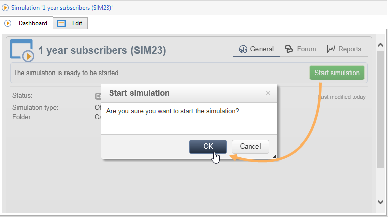

# Ofertas em um canal de saída{#offers-on-an-outbound-channel}

## Entrega da oferta de e-mail {#email-offer-delivery}

Em nosso banco de dados, há uma categoria de ofertas de viagem para a África. A qualificação, os contextos e as representações de cada oferta foram configurados. Agora, queremos criar uma campanha para apresentar nossas ofertas por e-mail.

1. Crie uma campanha de marketing e o workflow para construção do target.

   

1. Edit the email delivery and click the **[!UICONTROL Offers]** icon.

   

1. Escolha o espaço de e-mail do ambiente de oferta que corresponda aos feriados.

   

1. Escolha a categoria que contém as ofertas de viagem da África.

   

1. Defina o número de ofertas na delivery para dois.

   

1. Feche a janela de gerenciamento de ofertas e crie o conteúdo de sua delivery.

   

1. Use os menus para inserir uma apresentação de oferta e escolha a função de renderização HTML.

   

1. Insira a segunda apresentação de oferta.

   

1. Click **[!UICONTROL Preview]** to preview your offers in the delivery then select a recipient to preview the offers as they will receive them.

   

1. Salve a delivery e inicie o workflow para construção do target.
1. Open your delivery and click the **[!UICONTROL Audit]** tab of your delivery: you can see that the offer engine has selected the propositions to be made from the various offers in the catalog.

   

## Executar uma simulação de oferta {#perform-an-offer-simulation}

1. No **[!UICONTROL Profiles and Targets]** universo, clique no **[!UICONTROL Simulations]** link e no **[!UICONTROL Create]** botão.

   

1. Escolha um rótulo e especifique as configurações de execução, se necessário.

   

1. Salve a simulação. Isso abrirá em uma nova guia.

   

1. Clique na **[!UICONTROL Edit]** guia e, em seguida, **[!UICONTROL Scope]**.

   

1. Escolha a categoria que deseja simular ofertas.

   

1. Escolha o espaço de oferta a ser usado para a simulação.

   

1. Insira as datas de validade. É necessário inserir pelo menos uma data de início. Isso permite que o mecanismo de oferta ofereça e escolha aqueles que são válidos em uma determinada data.
1. Se necessário, especifique um ou vários temas para restringir o número de ofertas que contêm essa palavra-chave em suas configurações.

   No nosso exemplo, a categoria **Viagem** contém duas subcategorias com dois temas separados. Queremos executar uma simulação para ofertas com o tema **Customers>1 ano** .

   

1. Escolha os recipients que deseja direcionar.

   

1. Configure o número de ofertas a serem enviadas para cada recipient.

   No nosso exemplo, o mecanismo de oferta escolherá as 3 ofertas com o peso mais alto para cada recipient.

   

1. Save your settings, then click **[!UICONTROL Start]** in the **[!UICONTROL Dashboard]** tab to run the simulation.

   

1. Once the simulation is finished, consult the **[!UICONTROL Results]** for a detailed breakdown of propositions per offer.

   No nosso exemplo, o mecanismo de oferta baseou o detalhamento da oferta em 3 propostas.

   

1. Display the **[!UICONTROL Breakdown of offers by rank]** to view the list of offers selected by the offer engine.

   

1. If necessary, you can change the scope settings and run the simulation again by clicking **[!UICONTROL Start simulation]**.

   

1. Para salvar os dados da simulação, use o histórico ou as funções de exportação disponíveis no relatório.

   

