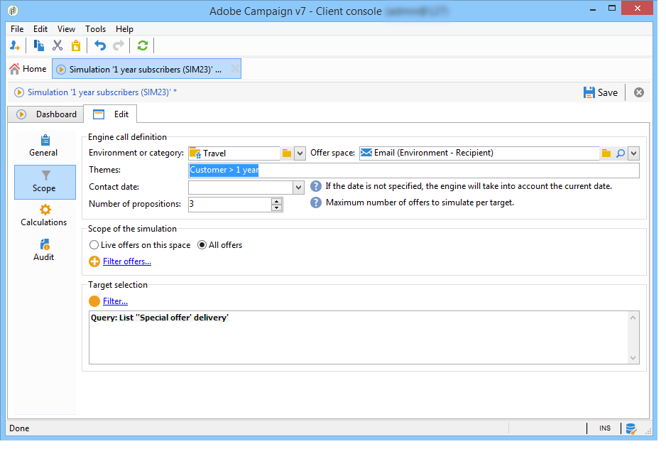

# Ofertas em um canal de saída{#offers-on-an-outbound-channel}

## Entrega da oferta de e-mail {#email-offer-delivery}

Em nosso banco de dados, há uma categoria de ofertas de viagem para a África. A qualificação, os contextos e as representações de cada oferta foram configurados. Agora, queremos criar uma campanha para apresentar nossas ofertas por e-mail.

1. Crie uma campanha de marketing e o workflow para construção do target.

   

1. Edite o delivery do email e clique no ícone **[!UICONTROL Offers]**.

   

1. Escolha o espaço de e-mail do ambiente de oferta que corresponda aos feriados.

   

1. Escolha a categoria que contém as ofertas de viagem da África.

   

1. Defina o número de ofertas na delivery para dois.

   

1. Feche a janela de gerenciamento de ofertas e crie o conteúdo de sua delivery.

   

1. Use os menus para inserir uma apresentação de oferta e escolha a função de renderização HTML.

   

1. Insira a segunda apresentação de oferta.

   

1. Clique em **[!UICONTROL Preview]** para visualizar as ofertas no delivery e, em seguida, selecione um recipient para visualizar as ofertas que eles receberão.

   

1. Salve a delivery e inicie o workflow para construção do target.
1. Abra o delivery e clique na guia **[!UICONTROL Audit]** dele: é possível ver que o mecanismo de oferta selecionou as propostas a serem feitas dentre as várias ofertas do catálogo.

   

## Executar uma simulação de oferta {#perform-an-offer-simulation}

1. Na guia **[!UICONTROL Profiles and Targets]**, clique no link **[!UICONTROL Simulations]** e depois clique no botão **[!UICONTROL Create]**.

   

1. Escolha um rótulo e especifique as configurações de execução, se necessário.

   

1. Salve a simulação. Isso abrirá em uma nova guia.

   

1. Clique na guia **[!UICONTROL Edit]** e depois em **[!UICONTROL Scope]**.

   

1. Escolha a categoria que deseja simular ofertas.

   

1. Escolha o espaço de oferta a ser usado para a simulação.

   

1. Insira as datas de validade. É necessário inserir pelo menos uma data de início. Isso permite que o mecanismo de oferta ofereça e escolha aqueles que são válidos em uma determinada data.
1. Se necessário, especifique um ou vários temas para restringir o número de ofertas que contêm essa palavra-chave em suas configurações.

   No nosso exemplo, a categoria **Viagem** contém duas subcategorias com dois temas separados. Queremos executar uma simulação para ofertas com o tema **Customers>1 ano** .

   

1. Escolha os recipients que deseja direcionar.

   

1. Configure o número de ofertas a serem enviadas para cada recipient.

   No nosso exemplo, o mecanismo de oferta escolherá as 3 ofertas com o peso mais alto para cada recipient.

   

1. Salve as configurações e clique em **[!UICONTROL Start]**, na guia **[!UICONTROL Dashboard]**, para executar a simulação.

   

1. Uma vez concluída a simulação, consulte os **[!UICONTROL Results]** para obter uma análise detalhada das propostas por oferta.

   No nosso exemplo, o mecanismo de oferta baseou o detalhamento da oferta em 3 propostas.

   

1. Exiba **[!UICONTROL Breakdown of offers by rank]** para visualizar a lista de ofertas selecionadas pelo mecanismo de oferta.

   

1. Se necessário, é possível alterar as configurações do escopo e executar a simulação novamente clicando em **[!UICONTROL Start simulation]**.

   

1. Para salvar os dados da simulação, use o histórico ou as funções de exportação disponíveis no relatório.

   
