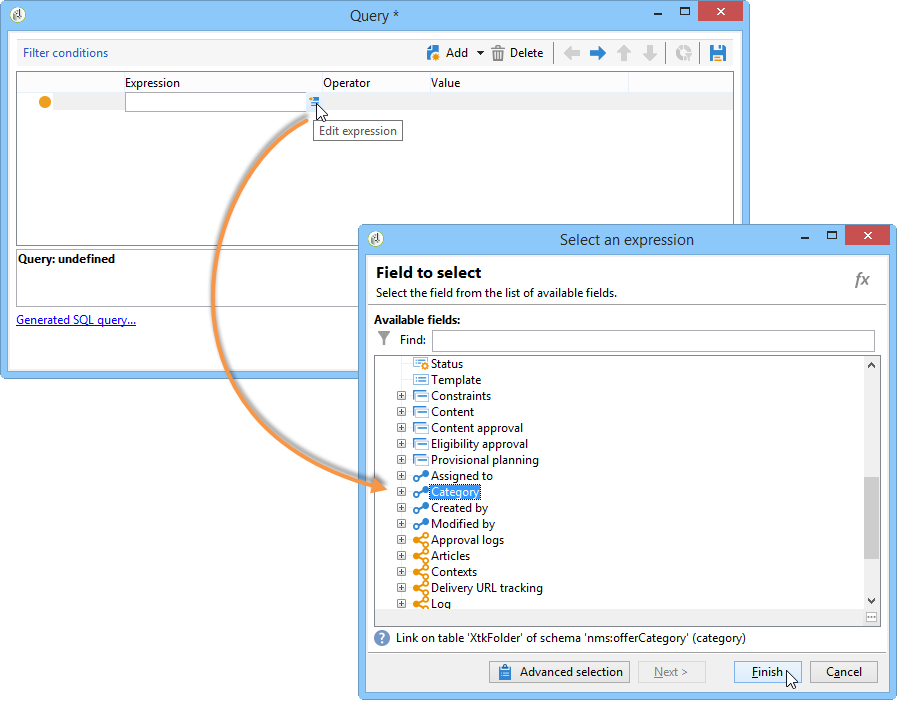
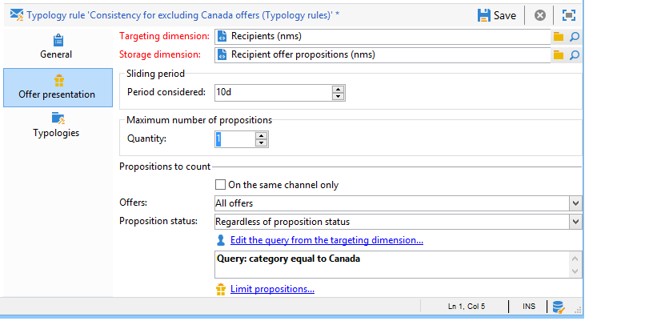

# Regras de apresentação{#presentation-rules}

## Criação de uma regra de apresentação {#creating-a-presentation-rule}

Em nosso banco de dados, existem várias ofertas de viagens para Europa, África, Estados Unidos e Canadá. Queremos enviar ofertas para uma viagem ao Canadá, mas se o recipient recusar esse tipo de envio, então não queremos enviá-lo novamente

Vamos configurar nossa regra para que a viagem ao Canadá seja oferecida apenas uma vez por recipient e, caso seja rejeitada, não será oferecida novamente.

1. Na árvore do Adobe Campaign, acesse o nó **[!UICONTROL Administration]** > **[!UICONTROL Campaign management]** > **[!UICONTROL Typology management]** > **[!UICONTROL Typology rules]**.
1. Crie um novo tipo de regra **[!UICONTROL Offer presentation]**.

   

1. Se necessário, altere o rótulo e a descrição.

   

1. Escolha a opção **[!UICONTROL All channels]** para estender a regra para todos os canais.

   

1. Clique no link **[!UICONTROL Edit expression]** e escolha o nó **[!UICONTROL Category]** como uma expressão.

   

1. Escolha a categoria que corresponde à oferta de viagem para o Canadá e clique em **[!UICONTROL OK]** para fechar a janela de consulta.

   

1. Na guia **[!UICONTROL Offer presentation]**, escolha as mesmas dimensões que foram configuradas no ambiente.

   

1. Indique o período que a regra deve ser aplicada.

   

1. Limite a apresentação para um, assim os recipients que já rejeitaram uma viagem ao Canadá não receberão outra oferta semelhante.

   

1. Selecione o filtro **[!UICONTROL Offers for the same category]** para excluir todas as ofertas da categoria **Canada**.

   

1. Selecione o filtro **[!UICONTROL Rejected propositions]** para considerar apenas as apresentações rejeitadas pelo recipient.

   

1. Indique os recipients que a regra deve ser aplicada.

   Em nosso exemplo, nós indicaremos os recipients do **Frequent travelers**.

   

1. Referencie a regra em uma tipologia de oferta.

   

1. Acesse o ambiente de oferta, (**Environment - Recipient**, neste caso) e consulte a nova tipologia criada através da lista suspensa na guia **[!UICONTROL Eligibility]**.

   

## Aplicação da regra de apresentação {#applying-the-presentation-rule}

Aqui está um exemplo de aplicação da regra de tipologia criada anteriormente.

Queremos enviar uma apresentação de oferta que pertence à categoria Canadá. Se a oferta é rejeitada uma vez por qualquer um dos recipients, então ela não será oferecida novamente.

1. Na pasta de recipients **Frequent travelers**, escolha um dos perfis para verificar as ofertas para as quais estão qualificados: clique na guia **[!UICONTROL Propositions]** e, em seguida, na guia **[!UICONTROL Preview]**.

   Em nosso exemplo, **Tim Ramsey** está qualificado para uma oferta que faz parte da categoria **Americas** .

   

1. Comece criando uma delivery de email que seguimentará os seus representantes de **Frequent travelers** com ofertas.
1. Selecione os parâmetros de chamada do mecanismo de oferta.

   No nosso exemplo, a categoria **Travel in America** é escolhida, onde contém as subcategorias **Canada** e **United States**.

   

1. Insira as ofertas no corpo da mensagem e envie a delivery. Para obter mais informações, consulte [Sobre canais de saída](../../interaction/using/about-outbound-channels.md).

   O recipient recebeu a oferta para a qual está qualificado.

1. O recipient rejeitou a oferta do Canadá, conforme mostrado no histórico de apresentações.

   

1. Verifique as ofertas para as quais ele está qualificado agora.

   Podemos ver que nenhuma oferta para o Canadá é escolhida.

   

**Tópicos relacionados**

* [Gerencie ofertas e controle a redundância em canais](https://helpx.adobe.com/br/campaign/kb/simplifying-campaign-management-acc.html#Manageoffersandcontrolredundancyacrosschannels)
