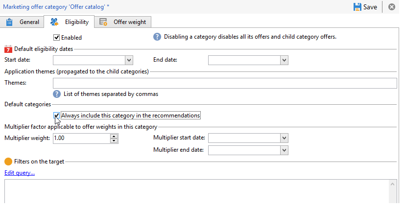

# Recomendando uma categoria{#recommending-a-category}

Pode ser o caso que um recipient não seja considerado elegível para todas as ofertas. Para garantir que todos os recipients recebam uma apresentação de oferta, é possível adicionar sistematicamente uma ou várias categorias de ofertas nas recomendações. Diferentemente das principais ofertas, essas ofertas de &quot;backup&quot; devem ter um peso baixo (mas não zero), para que sejam levados apenas em consideração se não houver ofertas de alto peso qualificadas. Além disso, não deve haver uma regra de apresentação aplicada a essas ofertas para garantir que elas estejam sempre incluídas nas recomendações. Isso significa que, durante uma proposta, se nenhuma oferta de alto peso estiver disponível, o receberá pelo menos uma oferta dessa categoria.

Para incluir sempre uma categoria nas recomendações, aplique as seguintes etapas:

1. Abra o explorador e clique em um catálogo de ofertas na estrutura de árvore.
1. Clique na guia **[!UICONTROL Eligibility]** e marque a caixa **[!UICONTROL Always include this category in the recommendations]**.
1. Termine e aprove clicando em **[!UICONTROL Save]**.

   
