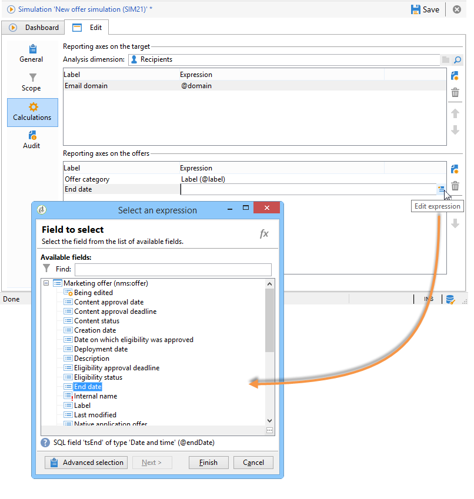

# Escopo de simulação{#simulation-scope}

## Definição do escopo {#definition-of-the-scope}

Abra a guia **[!UICONTROL Scope]** para escolher as configurações.

Os seguintes itens são obrigatórios:

* Categoria de ambiente ou oferta.
* Espaço de oferta.
* Data de contato. Ofertas não qualificadas na data de contato não são consideradas.
* População do target.

  Se não configurar um filtro no target, toda a tabela de destinatários será levada em conta.

* Número de propostas a serem simuladas por target.

  O destinatário receberá muitas propostas. Por exemplo, se inserir 5, cada destinatário receberá no máximo 5 propostas de oferta.

  

Para refinar as ofertas a serem consideradas para a simulação, é possível adicionar um ou vários temas (especificados anteriormente nas categorias).

Também é possível optar por realizar a simulação em todas as ofertas ou apenas aquelas que estão online. Alguns filtros permitem alterar sua seleção se desejar.

>[!NOTE]
>
>É necessário especificar uma data de contato. Isso permite que o mecanismo do Interaction classifique as ofertas no ambiente ou categoria selecionada. Se nenhuma data estiver configurada, a simulação levantará um erro.

## Adição de eixos de relatórios {#adding-reporting-axes}

É possível aprimorar a análise da simulação adicionando eixos de relatórios no target ou nas próprias ofertas por meio da guia **[!UICONTROL Calculations]**.

Para fazer isso, clique no botão **[!UICONTROL Add]** e selecione os campos apropriados. Os eixos serão usados para calcular a simulação e são exibidos no relatório de análise. Para obter mais informações, consulte [Rastreamento de simulação](../../interaction/using/simulation-tracking.md).

