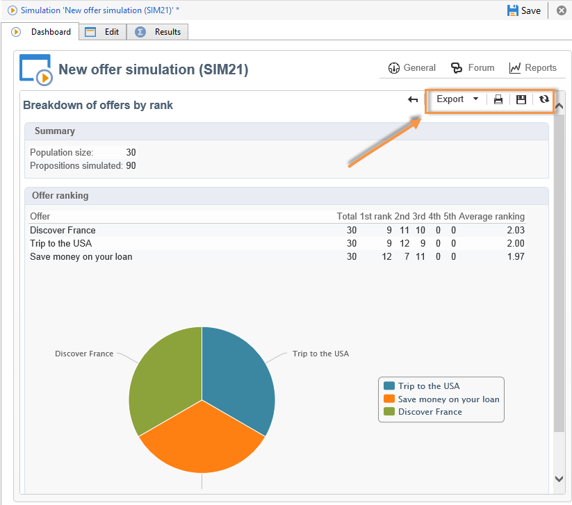

# Rastreamento de simulação{#simulation-tracking}

Quando a simulação for concluída, é possível analisar seu resultado usando a guia **[!UICONTROL Results]** que é adicionada à janela de simulação e o relatório **[!UICONTROL Breakdown of offers by rank]**, disponível no painel de simulação.

Os resultados da simulação contêm um detalhamento de propostas por classificação e por destinatário. Os eixos de relatório também são levados em conta e mostrados nesta guia.

É possível salvar estes resultados e exportá-los se necessário, criando uma análise descritiva dos resultados. Para fazer isso, clique no link apropriado na janela de resultados.

Consulte [esta seção](../../reporting/using/about-descriptive-analysis.md) para mais informações sobre o assistente de análise descritiva.

Uma tabela dinâmica fornece uma visão rápida dos detalhamentos de oferta por classificação. Como todos os relatórios do Adobe Campaign, é possível exportar, imprimir, arquivar ou exibir os relatórios em um navegador da Web.

Para obter mais informações, consulte [esta seção](../../reporting/using/actions-on-reports.md).

