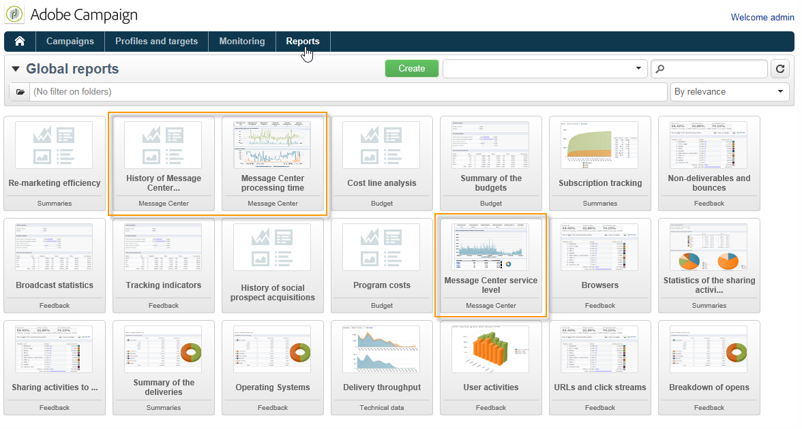

# Sobre relatórios de mensagens transacionais{#about-transactional-messaging-reports}

O Adobe Campaign oferece vários relatórios que permitem controlar a atividade e suavizar a execução das instâncias de execução These Message Center reports can be accessed from the **[!UICONTROL Reports]** tab of the control instance.

