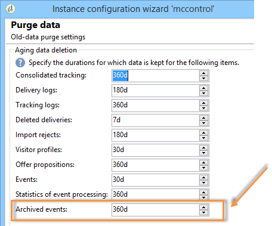

# Configurações adicionais {#mc-additional-configurations}


## Monitorar limites {#monitoring-thresholds}

Você pode configurar os limites de aviso (laranja) e os limites de alerta (vermelho) dos indicadores que aparecem nos relatórios de **nível de serviço do Centro de mensagens** e **tempo de processamento do Centro de mensagens** (consulte [Acesso a mensagens transacionais](../../message-center/using/about-transactional-messaging-reports.md)).

Para fazer isso, siga as etapas abaixo:

1. Abra o assistente de implantação na **instância de execução**.

1. Acesse a página **[!UICONTROL Message Center]**.

1. Use as setas para modificar os limites.

   

>[!NOTE]
>
>O número de eventos pendentes na fila é exibido na seção [Indicadores do sistema](../../production/using/monitoring-processes.md#system-indicators) da página de monitoramento do processo do Adobe Campaign. Para obter mais informações sobre o assistente de implantação, consulte [esta seção](../../installation/using/deploying-an-instance.md#deployment-wizard).

## Limpar eventos {#purging-events}

Você pode usar o [assistente de implantação](../../production/using/database-cleanup-workflow.md#deployment-wizard) para definir por quanto tempo os dados devem ser armazenados no banco de dados

A limpeza de eventos é executada automaticamente pelo [Fluxo de trabalho de limpeza de banco de dados](../../production/using/database-cleanup-workflow.md). Esse workflow limpa os eventos recebidos e armazenados nas instâncias de execução e eventos arquivados em uma instância de controle.

Use as setas conforme o caso para alterar as configurações de limpeza:

Configurações de limpeza de eventos em uma instância de controle:



Configurações de limpeza de eventos em uma instância de execução:


Para obter mais informações sobre o fluxo de trabalho de limpeza de banco de dados, consulte [esta seção](../../production/using/database-cleanup-workflow.md).


## Workflows técnicos {#technical-workflows}

Você deve garantir que os workflows técnicos na instância de controle e as diferentes instâncias de execução tenham sido criados e iniciados realmente antes de implantar qualquer template de mensagem transacional.

Os vários workflows técnicos relacionados a mensagens transacionais (Centro de Mensagens) são divididos entre a instância de controle e a(s) instância(s) de execução.

### Workflows da instância de controle {#control-instance-workflows}

Na instância de controle, caso tenha uma ou várias instâncias de execução registradas, é necessário criar um fluxo de trabalho de arquivamento para cada conta externa **[!UICONTROL Message Center execution instance]**. Clique no botão **[!UICONTROL Create the archiving workflow]** para criar e iniciar o workflow.


Os workflows de arquivamento podem ser acessados na pasta **Administration > Production > Message Center**. Depois de criados, os workflows de arquivamento são iniciados automaticamente.

<!--**Minimal architecture**

Once the control and execution modules are installed on the same instance, you must create the archiving workflow using the deployment wizard. Click the **[!UICONTROL Create the archiving workflow]** button to create and start the workflow.

-->

### Workflows da instância de execução {#execution-instance-workflows}

Na(s) instância(s) de execução, os workflows técnicos de mensagens transacionais podem ser acessados na pasta **Administration > Production > Message Center.** Você só precisa iniciá-los. Os workflows na lista são:

* **[!UICONTROL Processing batch events]** (internal name: **[!UICONTROL batchEventsProcessing]** ): esse fluxo de trabalho permite dividir eventos em lote em uma fila antes que eles sejam vinculados a um template de mensagem.
* **[!UICONTROL Processing real time events]** (internal name: **[!UICONTROL rtEventsProcessing]** ): esse workflow permite dividir eventos em tempo real em uma fila antes que eles sejam vinculados a um template de mensagem.
* **[!UICONTROL Update event status]** (internal name: **[!UICONTROL updateEventStatus]** ): esse workflow permite que você atribua um status ao evento.

   Os seguintes status de evento estão disponíveis:

   * **[!UICONTROL Pending]**: o evento está na fila. Nenhum template de mensagem foi atribuído a ele.
   * **[!UICONTROL Pending delivery]**: o evento está na fila, um template de mensagem foi atribuído a ele e está sendo processado pelo delivery.
   * **[!UICONTROL Sent]**: esse status é copiado dos logs do delivery. Significa que o delivery foi enviado.
   * **[!UICONTROL Ignored by the delivery]**: esse status é copiado dos logs do delivery. Ele significa que o delivery foi ignorado.
   * **[!UICONTROL Delivery failed]**: esse status é copiado dos logs do delivery. Ele significa que o delivery falhou.
   * **[!UICONTROL Event not taken into account]**: o evento não pôde ser vinculado a um template de mensagem. O evento não será processado.

## Configurar multimarcas {#configuring-multibranding}

Esta seção descreve uma solução para configurar URLs de página de rastreamento e mirror page por marca, para mensagens transacionais no Adobe Campaign.

### Pré-requisitos {#prerequisites}

* Todos os hosts devem ser adicionados ao arquivo de configuração da instância (`config-<instance>.xml`).
* Cada marca deve ser atribuída a um subdomínio.
* Você deve ter um certificado HTTPS para todas as marcas se o rastreamento Web for feito em páginas HTTPS.

Para configurar multimarcas, você precisa configurar ambas as instâncias de execução e a instância de controle.

### Instância de execução {#execution-instance}

Na(s) instância(s) de execução, siga as etapas abaixo:

1. Crie uma conta externa por marca.

   >[!NOTE]
   >
   >Saiba como criar uma conta externa do tipo instância de execução [nesta seção](../../message-center/using/configuring-instances.md#control-instance).

1. Estenda o esquema nms:extAccount para adicionar o URL de rastreamento:

   ```
   <attribute advanced="true" desc="URL of the tracking servers" label="Tracking server URL"
   length="100" name="trackingURL" type="string"/>
   ```

   >[!NOTE]
   >
   >Saiba como estender um esquema existente na seção [Extensão de um esquema](../../configuration/using/extending-a-schema.md).

1. Modifique o formulário nms:extAccount:

   ```
   <container label="Message domain branding" type="frame">
        <static type="help"> These parameters are used to override the DNS alias and addresses used during message delivery. When not populated, the values of the 'NmsServer_MirrorPageUrl' and 'NmsEmail_DefaultErrorAddr' options are used.</static>
        <input xpath="@mirrorURL"/>
        <input xpath="@trackingURL"/>
        <input img="nms:sendemail.png" menuId="deliveryMenuBuilder" type="scriptEdit">
               xpath="errorAddress"/>
      </container>
   ```

1. Modifique as opções NmsTracking_OpenFormula e NmsTracking_ClickFormula para usar a conta externa em vez de uma opção global.

   Para fazer isso, substitua:

   ```
   <%@ include option='NmsTracking_ServerUrl' %>
   ```

   com:

   ```
   <%@ value object="provider" xpath="@trackingURL" %>
   ```

   >[!IMPORTANT]
   >
   >Essas alterações podem gerar conflitos ao atualizar. Talvez seja necessário mesclar essas fórmulas manualmente com a nova versão.

### Instância de controle {#control-instance}

Na instância de controle, é preciso vincular modelos de entrega e contas externas.

Para fazer isso, siga as etapas abaixo:

1. Crie uma conta externa por marca com o mesmo nome interno, conforme definido na [instância de execução](#execution-instance) (etapa 1).

1. Criar um modelo de entrega padrão por marca.

   >[!NOTE]
   >
   >    Saiba como criar um modelo de entrega [nesta seção](../../delivery/using/creating-a-delivery-template.md#creating-a-new-template).

1. Em **[!UICONTROL Properties]** do modelo de entrega, defina o roteamento para a conta externa da marca.
