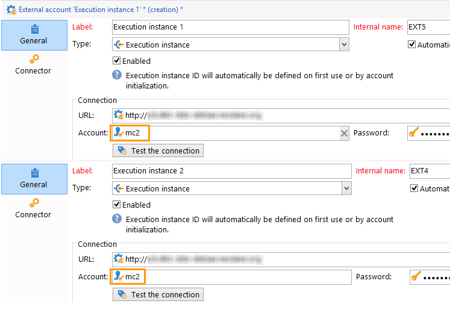

# Criação de uma conexão compartilhada{#creating-a-shared-connection}

>[!CAUTION]
>
>* Extensões de schema feitas nos schemas usados pelos [workflows técnicos do Centro de Mensagens](../../message-center/using/technical-workflows.md) em instâncias de controle ou de execução precisam ser duplicadas nas outras instâncias usadas pelo módulo de mensagens transacionais do Adobe Campaign.
>* A instância de controle e a instância de execução devem ser instaladas em máquinas diferentes. Elas não podem compartilhar a mesma instância do Campaign.
>

## Instância de controle {#control-instance}

Se você tiver uma arquitetura dividida, precisará
                especificar as instâncias de execução vinculadas à instância de controle e conectá-las. Os templates de mensagem transacional são implantados nas instâncias de execução. The connection between the control instance and the execution instances is created by configuring the **[!UICONTROL Execution instance]** type external accounts. A quantidade de contas externas precisa ser igual à quantidade de instâncias de execução.

>[!NOTE]
>
>Quando as instâncias de execução são usadas por várias instâncias de controle, os dados podem ser divididos por pasta e por operador. Para obter mais informações, consulte [Uso de várias instâncias](#using-several-control-instances)de controle.

Para criar uma conta externa do tipo instância de execução, siga as etapas abaixo:

1. Vá para a **[!UICONTROL Administration > Platform > External accounts]** pasta.
1. Select one of the execution instance type external accounts provided out-of-the-box with Adobe Campaign, right-click and choose **[!UICONTROL Duplicate]** .

   

1. Altere o rótulo de acordo com suas necessidades.

   

1. Select the **[!UICONTROL Enabled]** option to make the external account operational.

   

1. Especifique o endereço do servidor no qual a instância de execução está instalada.

   

1. A conta deve corresponder ao Agente do Centro de Mensagens conforme definido na pasta do operador. By default, the out-of-the-box account provided by Adobe Campaign is **[!UICONTROL mc]** .

   

1. Digite a senha da conta conforme definido na pasta do operador.

   >[!NOTE]
   >
   >Para evitar digitar a senha sempre que fizer logon na instância, especifique o endereço IP da instância de controle na instância de execução For more on this, refer to [Execution instance](#execution-instance).

1. Especifique o método de recuperação a ser usado pela instância de execução.

   Os dados a serem recuperados são encaminhados à instância de controle pela instância de execução para adicionar a uma mensagem transacional e a arquivamentos de eventos.

   

   A coleta de dados ocorre por meio de um serviço Web que usa o acesso HTTP/HTTPS ou através do módulo Federated Data Access (FDA).

   O segundo método é recomendado se a instância de controle tiver acesso direto ao banco de dados das instâncias de execução. Caso contrário, escolha o acesso do serviço Web. A conta FDA para especificar coincide com a conexão com os bancos de dados das várias instâncias de execução criadas na instância de controle.

   

   Para obter mais informações sobre o Federated Data Access (FDA), consulte [Acesso a um banco de dados externo](../../platform/using/accessing-an-external-database.md).

1. Click **[!UICONTROL Test the connection]** to make sure the control instance and the execution instance are linked up.

   

1. Cada instância de execução deve ser associada a um identificador. This identifier can be attributed on each execution instance either manually, by using the deployment wizard (refer to [Identifying execution instances](../../message-center/using/identifying-execution-instances.md)), or automatically, by clicking the **Initialize connection** button from the control instance.

   

## Instância de execução {#execution-instance}

Para que a instância de controle possa se conectar à instância de execução sem ter que fornecer uma senha, basta digitar o endereço IP da instância de controle na seção direitos de acesso do **Centro de Mensagens** . No entanto, senhas vazias são proibidas por padrão.

Para usar uma senha vazia, vá para as instâncias de execução e defina uma zona de segurança limitada ao endereço IP do sistema de informações que entrega os eventos. This security zone must allow empty passwords and accept `<identifier> / <password>` type connections. Para obter mais informações, consulte [esta seção](../../installation/using/configuring-campaign-server.md#defining-security-zones).

>[!NOTE]
>
>Quando as instâncias de execução são usadas por várias instâncias de controle, os dados podem ser divididos por pasta e por operador. Para obter mais informações, consulte [Uso de várias instâncias](#using-several-control-instances)de controle.

1. Go to the operator folder in the execution instance ( **[!UICONTROL Administration > Access management > Operators]** ).
1. Selecione o agente do Centro de **mensagens** .

   

1. Selecione a **[!UICONTROL Edit]** guia, clique em **[!UICONTROL Access rights]** e, em seguida, clique no **[!UICONTROL Edit the access parameters...]** link.

   

1. Na **[!UICONTROL Access settings]** janela, clique no **[!UICONTROL Add a trusted IP mask]** link e adicione o endereço IP da instância de controle.

   

## Uso de várias instâncias de controle {#using-several-control-instances}

Você pode compartilhar um cluster de execução com várias instâncias de controle. Esse tipo de arquitetura requer a seguinte configuração.

For example if your company manages two brands, each with its own control instance: **Control 1** and **Control 2**. Duas instâncias de execução também são usadas. É necessário inserir um operador diferente do Centro de Mensagens para cada instância de controle: um operador **mc1** para a instância de **Controle 1** e um operador **mc2** para a instância de **Controle 2** .

Na árvore de todas as instâncias de execução, crie uma pasta por operador (**Pasta 1** e **Pasta 2**) e restrinja os dados de cada operador à sua pasta.

### Configuração de instâncias de controle {#configuring-control-instances}

1. Na instância de controle do **Controle 1**, crie uma conta externa por instância de execução e insira o operador **mc1** em cada conta externa. The **mc1** operator will thereafter be created on all the execution instances (refer to [Configuring execution instances](#configuring-execution-instances)).

   

1. Na instância de controle do **Controle 2**, crie uma conta externa por instância de execução e insira o operador **mc2** em cada conta externa. The **mc2** operator will thereafter be created on all the execution instances (refer to [Configuring execution instances](#configuring-execution-instances)).

   

   >[!NOTE]
   >
   >For more on configuring a control instance, refer to [Control instance](#control-instance).

### Configuração de instâncias de execução {#configuring-execution-instances}

Para usar várias instâncias de controle, essa configuração deve ser executada em TODAS as instâncias de execução.

1. Crie uma pasta por operador no **[!UICONTROL Administration > Production > Message Center]** nó: **Pasta 1** e **Pasta 2**. Para obter mais informações sobre criação de pastas e visualizações, consulte [Plataforma](../../platform/using/access-management.md#folders-and-views).

   

1. Crie os operadores **mc1** e **mc2** duplicando o operador do Centro de Mensagens fornecido por padrão (**mc**). Para obter mais informações sobre criação de operadores, consulte [esta seção](../../platform/using/access-management.md#operators).

   

   >[!NOTE]
   >
   >**os operadores mc1** e **mc2** devem ter **[!UICONTROL Message Center execution]** direitos e não podem ter acesso ao console do cliente Adobe Campaign. Um operador deve estar sempre vinculado a uma zona de segurança. Para obter mais informações, consulte [esta seção](../../installation/using/configuring-campaign-server.md#defining-security-zones).

1. For each operator, check the **[!UICONTROL Restrict to information found in sub-folders of]** box, and select the relevant folder (**Folder 1** for the **mc1** operator and **Folder 2** for the **mc2** operator).

   

1. Forneça permissões de leitura e gravação ao operador para sua pasta. To do this, right-click the folder and select **[!UICONTROL Properties]** . Then select the **[!UICONTROL Security]** tab and add the relevant operator (**mc1** for **Folder 1** and **mc2** for **Folder 2**). Verifique se as **[!UICONTROL Read/Write data]** caixas estão marcadas.

   

