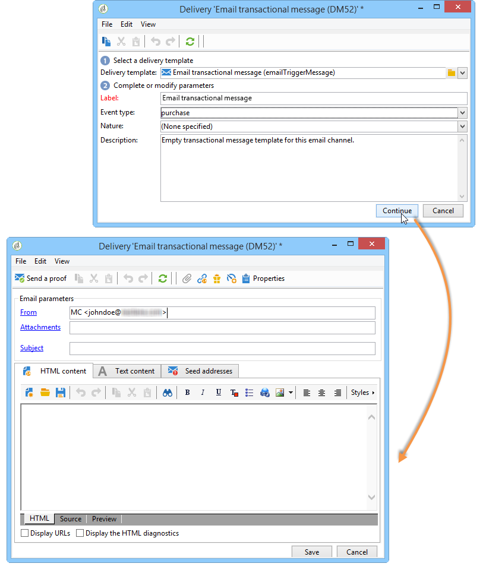
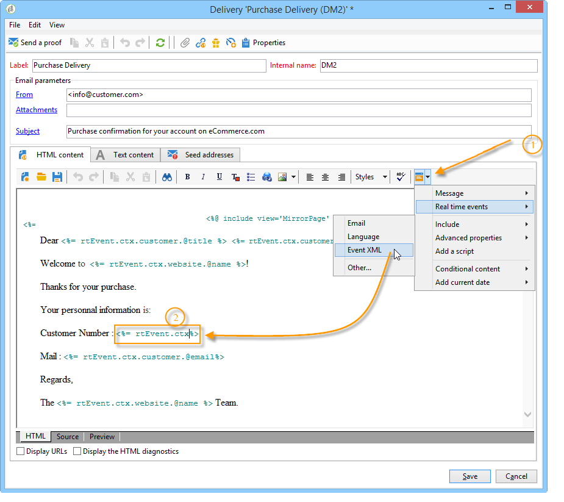

# Criar modelos de mensagem transacional {#creating-the-message-template}

Para garantir que cada evento possa ser alterado em uma mensagem personalizada, você precisa criar um modelo de mensagem para corresponder a cada tipo de evento.

>[!IMPORTANT]
>
>Os tipos de evento precisam ser criados previamente. Para obter mais informações, consulte [Criar tipos de evento](../../message-center/using/creating-event-types.md).

Os modelos de mensagem transacional contêm as informações necessárias para personalizar a mensagem transacional. Você também pode usar modelos para testar a pré-visualização da mensagem e enviar provas usando seed addresses antes de entregar ao target final. Para obter mais informações, consulte [Testar modelos de mensagem transacional](../../message-center/using/testing-message-templates.md).

## Criar o modelo de mensagem {#creating-message-template}

1. Acesse a pasta **[!UICONTROL Message Center >Transactional message templates]** da árvore do Adobe Campaign.

1. Clique com o botão direito do mouse na lista de templates de mensagem transacional e selecione **[!UICONTROL New]** no menu suspenso ou clique no botão **[!UICONTROL New]** acima da lista de templates de mensagem transacional.

   

1. Na janela do delivery, selecione o template do delivery apropriado para o canal que deseja usar.

   

1. Altere seu rótulo se necessário.

1. Selecione o tipo de evento que corresponda à mensagem a ser enviada.

   

   Os tipos de eventos precisam ser criados previamente no console. Para obter mais informações, consulte [Criar tipos de evento](../../message-center/using/creating-event-types.md).

   >[!IMPORTANT]
   >
   >Um tipo de evento não pode estar vinculado a mais de um modelo.

1. Insira uma natureza e uma descrição e clique em **[!UICONTROL Continue]** para criar o corpo da mensagem (consulte [Criar o conteúdo da mensagem](#creating-message-content)).

   

## Criar o conteúdo da mensagem {#creating-message-content}

A definição do conteúdo da mensagem transacional é a mesma para deliveries comuns no Adobe Campaign. Por exemplo, para um delivery de email, você pode criar conteúdo em formato HTML ou texto, adicionar anexos ou personalizar o objeto do delivery. Para obter mais informações, consulte o capítulo [Entrega de email](../../delivery/using/about-email-channel.md).

>[!IMPORTANT]
>
>As imagens incluídas na mensagem devem ser acessíveis publicamente. O Adobe Campaign não fornece nenhum mecanismo de carregamento de imagem para mensagens transacionais.\
>Ao contrário do JSSP ou webApp, `<%=`não tem nenhum escape padrão.
>
>Nesse caso, você precisa escapar cada dado que vem do evento corretamente. Este escape depende da forma como esse campo é usado. Por exemplo, dentro de uma URL, use encodeURIComponent. Para ser exibido no HTML, você pode usar escapeXMLString.

Após definir o conteúdo da mensagem, você pode integrar as informações do evento no corpo da mensagem e personalizá-lo. As informações do evento são inseridas no corpo do texto graças às tags de personalização.

* Todos os campos de personalização vêm da carga.
* É possível referenciar um ou vários blocos de personalização em uma mensagem transacional. O conteúdo do bloco será adicionado ao conteúdo de delivery durante a publicação para a instância de execução.

Para inserir tags de personalização no corpo de uma mensagem de email, siga as etapas abaixo:

1. No template de mensagem, clique na guia que corresponde ao formato do email (HTML ou texto).

1. Insira o corpo da mensagem.

1. No corpo do texto, insira a tag usando o menu **[!UICONTROL Real time events > Event XML]**.

   

1. Preencha a tag usando a seguinte sintaxe: **element name**.@**attribute name** como mostrado abaixo.

   

1. Salve o conteúdo.

Sua mensagem agora está pronta para ser [testada](../../message-center/using/testing-message-templates.md).
