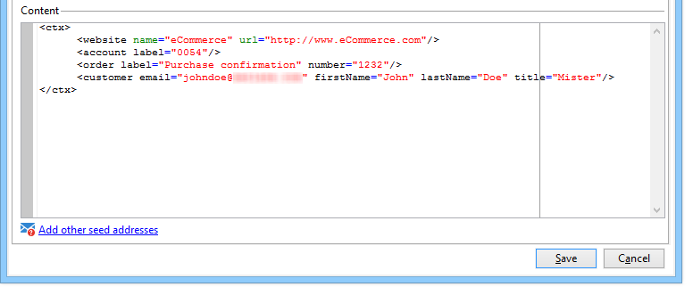

# Gestão de seed addresses em mensagens transacionais{#managing-seed-addresses-in-transactional-messages}

Um seed address permite exibir uma pré-visualização da mensagem, enviar uma prova e testar a personalização da mensagem antes de enviar o delivery de email ou de SMS. Os seed addresses estão vinculados ao delivery e não podem ser usados para outros deliveries.

## Criação de seed addresses {#creating-a-seed-address}

1. No modelo de mensagem transacional, clique na guia **[!UICONTROL Seed addresses]**.

   

1. Atribua um rótulo a ele para facilitar a seleção posteriormente.

   

1. Insira o seed address (email ou celular dependendo do canal de comunicação).

   

1. Digite o identificador externo: esse campo opcional permite inserir uma chave de negócios (ID exclusiva, nome + email, etc.) que é comum a todos os aplicativos em seu site, usado para identificar seus perfis. Se esse campo também estiver presente no banco de dados de marketing do Adobe Campaign, você poderá reconciliar um evento com um perfil no banco de dados.

   

1. Insira os dados de teste (consulte [Dados de personalização](../../message-center/using/personalization-data.md)).

   

   <!--## Creating several seed addresses {#creating-several-seed-addresses}-->
1. Clique no link **[!UICONTROL Add other seed addresses]** e depois no botão **[!UICONTROL Add]**.

   

   <!--1. Follow the configuration steps for a seed address detailed in the [Creating a seed address](#creating-a-seed-address) section.-->
1. Repita o processo para criar quantos endereços forem necessários.

   

Depois que os endereços forem criados, você poderá exibir sua pré-visualização e personalização. Consulte [Pré-visualização da mensagem transacional](../../message-center/using/transactional-message-preview.md).
