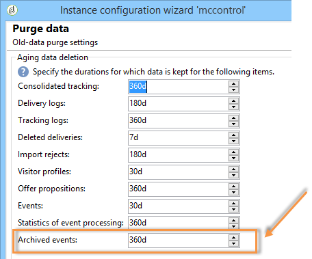

# Limpeza de eventos{#purging-events}

Você pode usar o assistente de implantação para definir por quanto tempo os dados devem ser armazenados no banco de dados.

A limpeza de eventos é executada automaticamente pelo fluxo de trabalho **[!UICONTROL Database cleanup]**. Esse workflow limpa os eventos recebidos e armazenados nas instâncias de execução e eventos arquivados em uma instância de controle.

Use as setas conforme o caso para alterar as configurações de limpeza:

Configurações de limpeza de eventos em uma instância de controle:

Configurações de limpeza de eventos em uma instância de execução:

Para obter mais informações sobre o workflow de limpeza de banco de dados, consulte [esta seção](../../production/using/database-cleanup-workflow.md).
