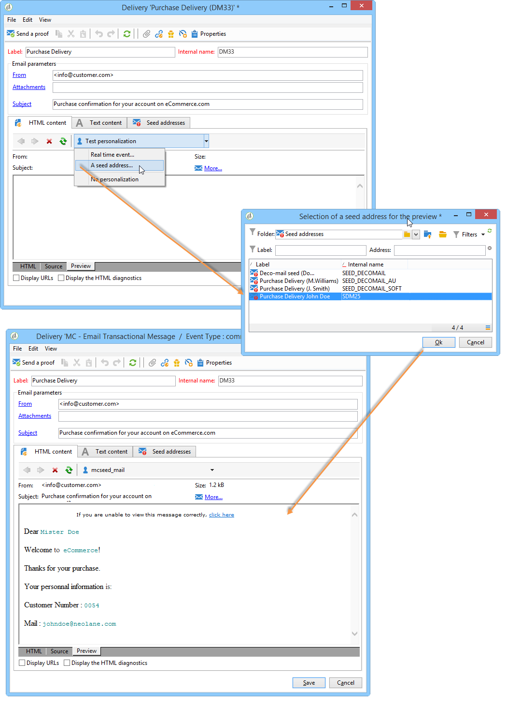

# Testar modelos de mensagem transacional {#testing-message-templates}

Quando o [modelo de mensagem](../../message-center/using/creating-the-message-template.md) estiver pronto, siga as etapas abaixo para pré-visualizá-lo e testá-lo.

## Gerenciar seed addresses em mensagens transacionais {#managing-seed-addresses-in-transactional-messages}

Um seed address permite exibir uma pré-visualização da mensagem, enviar uma prova e testar a personalização da mensagem antes de enviar o delivery de email ou de SMS. Os seed addresses estão vinculados ao delivery e não podem ser usados para outros deliveries.

Para criar seed addresses em uma mensagem transacional, siga as etapas abaixo:

1. No modelo de mensagem transacional, clique na guia **[!UICONTROL Seed addresses]**.

   

1. Atribua um rótulo a ele para facilitar a seleção posteriormente.

   

1. Insira o seed address (email ou celular dependendo do canal de comunicação).

   

1. Digite o identificador externo: esse campo opcional permite inserir uma chave de negócios (ID exclusiva, nome + email, etc.) que é comum a todos os aplicativos em seu site, usado para identificar seus perfis. Se esse campo também estiver presente no banco de dados de marketing do Adobe Campaign, você poderá reconciliar um evento com um perfil no banco de dados.

   

1. Insira os dados de teste (consulte [Dados de personalização](#personalization-data)).

   

   <!--## Creating several seed addresses {#creating-several-seed-addresses}-->
1. Clique no link **[!UICONTROL Add other seed addresses]** e depois no botão **[!UICONTROL Add]**.

   

   <!--1. Follow the configuration steps for a seed address detailed in the [Creating a seed address](#creating-a-seed-address) section.-->
1. Repita o processo para criar quantos endereços forem necessários.

   

Depois que os endereços forem criados, você poderá exibir sua pré-visualização e personalização. Consulte [Pré-visualização da mensagem transacional](#transactional-message-preview).

## Dados de personalização {#personalization-data}

É possível usar dados no template de mensagem para testar a personalização da mensagem transacional. Essa funcionalidade é usada para gerar uma pré-visualização ou enviar uma prova. Você também pode exibir a renderização da mensagem para vários provedores de acesso à Internet. Para obter mais informações, consulte [Renderização da caixa de entrada](../../delivery/using/inbox-rendering.md).

O objetivo desses dados é testar suas mensagens antes da entrega final. Essas mensagens não coincidem com os dados reais que serão processados. Entretanto, a estrutura XML deve ser idêntica à do evento armazenado na instância de execução, conforme mostrado abaixo:

Essas informações permitem personalizar o conteúdo da mensagem usando tags de personalização (para obter mais informações, consulte [Criar o conteúdo da mensagem](../../message-center/using/creating-the-message-template.md#creating-message-content)).

1. Publicar o modelo de mensagem transacional.

1. No modelo, clique na guia **[!UICONTROL Seed addresses]**.

1. No conteúdo do evento, insira as informações de teste no formato XML.

   

1. Clique em **[!UICONTROL Save]**.

## Pré-visualização de mensagem transacional {#transactional-message-preview}

Após criar um ou mais seed addresses e o corpo da mensagem, é possível pré-visualizar a mensagem e verificar sua personalização.

1. No modelo de mensagem, clique na guia **[!UICONTROL Preview]**.

   

1. Selecione **[!UICONTROL A seed address]** na lista suspensa.

   

1. Selecione o seed address criado anteriormente para exibir a mensagem personalizada.

   

Com os seed addresses, você também pode exibir a renderização da mensagem para vários provedores de acesso à Internet. Para obter mais informações, consulte [Renderização da caixa de entrada](../../delivery/using/inbox-rendering.md).

## Enviar uma prova {#sending-a-proof}

Você pode testar a entrega de mensagens enviando uma prova para um seed address criado anteriormente.

O envio de uma prova envolve o mesmo processo de [entrega regular](../../delivery/using/steps-validating-the-delivery.md#sending-a-proof). No entanto, com mensagens transacionais, é necessário realizar as seguintes operações antecipadamente:

* Crie um ou mais [seed addresses](#managing-seed-addresses-in-transactional-messages) com [dados de personalização](#personalization-data).
* [Criar o conteúdo da mensagem](../../message-center/using/creating-the-message-template.md#creating-message-content).

Para enviar a prova:

1. Clique no botão **[!UICONTROL Send a proof]** na janela do delivery.
1. Analise o delivery.
1. Corrija qualquer erro e confirme o delivery.

   

1. Verifique se a mensagem foi entregue ao seed address e se seu conteúdo está em conformidade com sua configuração.

   

É possível acessar as provas em cada modelo através da guia **[!UICONTROL Audit]**. Para obter mais informações, consulte [Enviar uma prova](../../delivery/using/steps-validating-the-delivery.md#sending-a-proof).

O modelo de mensagem agora está pronto para ser [publicado](../../message-center/using/publishing-message-templates.md).