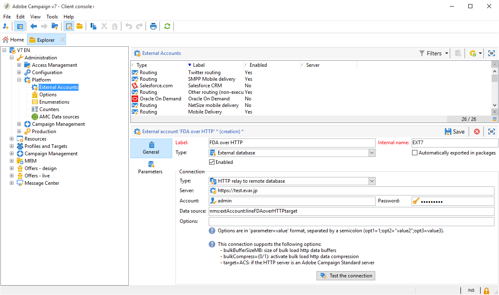
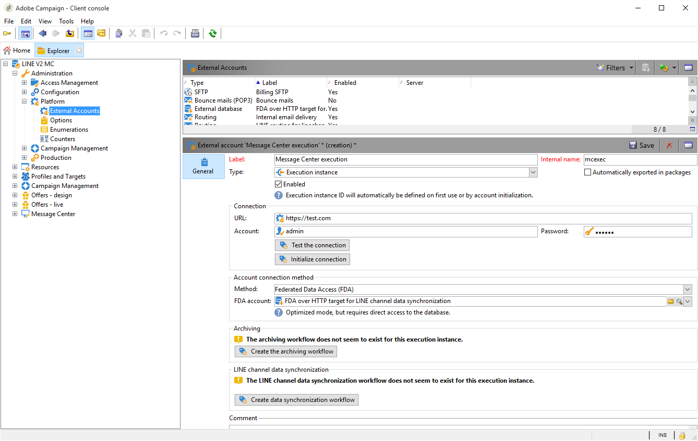

# Arquitetura de mensagens transacionais {#transactional-messaging-architecture}


As mensagens transacionais dependem de uma arquitetura específica, composta por várias instâncias:

* Uma **instância de controle**, na qual os modelos de mensagem são criados.

* Uma ou mais **instâncias de execução**, que recebem eventos e entregam mensagens.


| Instância de controle | Instância de execução |
|--- |--- |
| Os usuários do Adobe Campaign fazem logon na instância de controle para: <ul><li>Criar modelos de mensagem transacional</li><li>Gerar a pré-visualização da mensagem usando uma lista de seed</li><li>Exibir relatórios</li><li>Monitorar as instâncias de execução</li></ul> | As instâncias de execução estão aqui para: <ul><li>Receber eventos</li><li>Vinculá-los a modelos de mensagem transacional</li><li>Enviar uma mensagem personalizada para cada recipient</li></ul> |

## Instalar instâncias {#installing-instances}

Deve-se tomar várias precauções ao instalar os pacotes de mensagens transacionais. A Adobe recomenda que você trabalhe em um ambiente de teste antes de colocá-los em produção. Você também precisará ter uma licença compatível com Adobe Campaign. Para obter mais informações, entre em contato com o executivo da sua conta Adobe.

>[!IMPORTANT]
>
>A instância de controle e a instância de execução devem ser instaladas em máquinas diferentes. Elas não podem compartilhar a mesma instância do Campaign.

Se precisar usar vários canais, instale e configure pacotes relacionados antes de instalar pacotes de mensagens transacionais. Para obter mais informações, consulte [Adicionar um canal de entrega](#adding-a-delivery-channel).

## Instância de controle {#control-instance}

Para instalar a instância de controle em sua máquina, selecione o pacote **[!UICONTROL Transactional message control]** por meio do menu **[!UICONTROL Tools]** > **[!UICONTROL Advanced]** > **[!UICONTROL Import package]**. Para obter mais informações, consulte [Instalação de pacotes padrão do Campaign Classic](../../installation/using/installing-campaign-standard-packages.md).


As etapas detalhadas para configurar a instância de controle são apresentadas [nesta seção](../../message-center/using/configuring-instances.md#control-instance).

### Suporte a várias instâncias de controle {#supporting-several-control-instances}

>[!IMPORTANT]
>
>O compartilhamento de um cluster de execução com várias instâncias de controle só é compatível com ambientes locais.

É possível compartilhar um cluster de execução entre várias instâncias de controle. Por exemplo, se você gerenciar várias lojas especializadas, será possível configurar uma instância de controle por marca e vinculá-las para o mesmo cluster de execução.


>[!NOTE]
>
>Para obter mais informações sobre a configuração necessária, consulte [Usar várias instâncias de controle](../../message-center/using/configuring-instances.md#using-several-control-instances).

## Instância de execução {#execution-instance}

Para instalar uma instância de execução em sua máquina, selecione o pacote **[!UICONTROL Transactional message execution]** por meio do menu **[!UICONTROL Tools]** > **[!UICONTROL Advanced]** > **[!UICONTROL Import package]**. Para obter mais informações, consulte [Instalação de pacotes padrão do Campaign Classic](../../installation/using/installing-campaign-standard-packages.md).


As etapas detalhadas para configurar uma instância de execução são apresentadas [nesta seção](../../message-center/using/configuring-instances.md#execution-instance).

## Canais de entrega disponíveis

O canal de email está disponível por padrão. Para enviar mensagens transacionais em vários canais, você pode adicionar outros canais (canal móvel, canal de aplicativo móvel etc.).

>[!IMPORTANT]
>
>A adição de um canal de entrega (canal móvel, canal de aplicativo móvel, etc.) deverá ser executada antes de instalar o pacote de mensagem transacional.

### Adicionar um canal de entrega {#adding-a-delivery-channel}

A Adobe recomenda **sempre adicione o pacote de canal de entrega antes de instalar o pacote de mensagem transacional**.

No entanto, se iniciou um projeto de mensagens transacionais no canal de email e, durante o projeto, decidiu adicionar um novo canal, você pode seguir as etapas abaixo.

>[!NOTE]
>
>Esse procedimento só se aplica a clientes que usam um Windows NLServer instalado na mesma máquina em que estão trabalhando.

1. Instale o canal necessário, por exemplo, o **Canal móvel**, por meio do assistente de importação de pacote (**[!UICONTROL Tools > Advanced > Import package... > Adobe Campaign Package]** ).
1. Faça uma importação de arquivo (**[!UICONTROL Tools > Advanced > Import package... > File]**) e selecione o arquivo **datakitnms **`[Your language]`**packagemessageCenter.xml**.
1. No **[!UICONTROL XML content of the data to import]**, mantenha somente o template do delivery que corresponde ao canal adicionado. Por exemplo, se o **Canal móvel** foi adicionado, mantenha somente o elemento de **entidades** que corresponde ao **[!UICONTROL Mobile transactional message]** (smsTriggerMessage). Caso tenha adicionado o **Canal de aplicativo móvel**, mantenha somente a **mensagem transacional do iOS** (iosTriggerMessage) e a **mensagem transacional do Android** (androidTriggerMessage).

   

<!--## Transactional messages and inbound Interaction {#transactional-messages-and-inbound-interaction}

When combined with the Inbound Interaction module, transactional messaging enables you to insert a marketing offer dedicated to the recipient into the message.

>[!NOTE]
>
>The Interaction module is detailed in [Interaction](../../interaction/using/interaction-and-offer-management.md).

To use transactional messaging with Interaction, you need to apply the following configurations:

* Install the **Interaction** package onto the control instance and configure your offer catalog.

  >[!IMPORTANT]
  >
  >Do not replicate the offers onto the execution instances.

* The event must include an identifier linked to the recipients, for personalizing offers. The **@externalId** attribute must contain the value of this identifier. **Interaction** is configured by default to identify the recipient of the primary key:

  ```
  <rtEvent type="order_confirmation" email="john.doe@adobe.com" externalId="1242"> 
  ```

  You can configure **Interaction** so that identification takes place in the field of your choice, for example on the email address:

  ```
  <rtEvent type="order_confirmation" email="john.doe@adobe.com" externalId="john.doe@yahoo.com"> 
  ```

Create your delivery templates the way you would for an email campaign:

* Add the offer to your transactional message template.
* Check the preview, send a proof and publish the template.

You also have to enable the unitary mode on your offer spaces. For more on this, refer to [this section](../../interaction/using/creating-offer-spaces.md).-->

### Notificações por push transacionais {#transactional-messaging-and-push-notifications}

Quando combinado com o módulo de canal de Aplicativo móvel, as mensagens transacionais permitem que você envie mensagens transacionais por meio de notificações em dispositivos móveis.

>[!NOTE]
>
>O canal de Aplicativo Móvel é detalhado [nesta seção](../../delivery/using/about-mobile-app-channel.md).

Para usar módulos de mensagem transacional com o Canal de aplicativo móvel, você precisará aplicar as seguintes configurações:

1. Instale o pacote **Canal de aplicativo móvel** nas instâncias de controle e de execução.
1. Replique o serviço do Adobe Campaign do tipo **Aplicativo móvel**, bem como os aplicativos móveis que ele contém nas instâncias de execução.

O evento deverá conter os seguintes elementos:

* A ID do dispositivo móvel (**registrationId** para Android e **deviceToken** para iOS). Essa ID representa o &quot;endereço&quot; para o qual a notificação será enviada.
* O link para o aplicativo móvel ou a chave de integração (**uuid**) que permite recuperar as informações de conexão específicas do aplicativo.
* O canal para onde a notificação é enviada (**wishedChannel**): 41 para iOS e 42 para Android
* Todos os dados úteis para personalização

Este é um exemplo de um evento que contém essas informações:

```
<SOAP-ENV:Envelope xmlns:xsd="http://www.w3.org/2001/XMLSchema" xmlns:xsi="http://www.w3.org/2001/XMLSchema-instance" xmlns:SOAP-ENV="http://schemas.xmlsoap.org/soap/envelope/">
   <SOAP-ENV:Body>
     <urn:PushEvent>
         <urn:sessiontoken>mc/</urn:sessiontoken>
         <urn:domEvent>

              <rtEvent wishedChannel="41" type="DELIVERY" registrationToken="2cefnefzef758398493srefzefkzq483974">
                <mobileApp _operation=”none” uuid="com.adobe.NeoMiles"/>
                <ctx>
                    <deliveryTime>1:30 PM</deliveryTime>
                    <url>http://www.adobe.com</url>
                </ctx>
              </rtEvent>

         </urn:domEvent>
     </urn:PushEvent>           
   </SOAP-ENV:Body>
</SOAP-ENV:Envelope>
```

>[!NOTE]
>
>A criação de templates de mensagem permanece igual.

### Mensagens transacionais e LINE {#transactional-messaging-and-line}

Combinadas com o Canal LINE, as mensagens transacionais permitem enviar mensagens em tempo real no aplicativo LINE instalado em dispositivos móveis do consumidor. Isso é usado para enviar a mensagem de boas-vindas quando um usuário do LINE adiciona a página da marca.

Para usar o módulo de mensagem transacional com o LINE, os seguintes elementos são necessários para a configuração na sua instância de **marketing** e na sua instância de **execução**:

* Instale o pacote **[!UICONTROL LINE Connect]** em ambas as instâncias.
* Instale o pacote **[!UICONTROL Transactional message control]** na instância de marketing e o pacote **[!UICONTROL Transactional message execution]** na instância de execução.
* Cria uma **conta externa** e o **serviço** LINE em ambas as instâncias com nomes idênticos para que sejam sincronizados. Para obter mais informações sobre como criar uma conta externa e serviço LINE, consulte [esta seção](../../delivery/using/line-channel.md#setting-up-line-channel).

Em seguida, do **[!UICONTROL Explorer]**, em **[!UICONTROL External account]** > **[!UICONTROL Platform]**, é necessário configurar as contas externas diferentes em ambas as instâncias:

1. Crie uma conta externa **[!UICONTROL External database]** na instância de **execução** com a seguinte configuração:

   

   * **[!UICONTROL Label]** e **[!UICONTROL Internal name]**: nomeie a conta externa conforme necessário.
   * **[!UICONTROL Type]** : selecione **[!UICONTROL External database]**.
   * A caixa **[!UICONTROL Enabled]** deve ser marcada.

   Na categoria **[!UICONTROL Connection]**:

   * **[!UICONTROL Type]**: selecione o servidor de banco de dados, por exemplo, PostgresSQL.
   * **[!UICONTROL Server]**: digite o URL do servidor do banco de dados.
   * **[!UICONTROL Account]**: digite a conta do banco de dados.

      >[!NOTE]
      >
      >O usuário do banco de dados precisa ter direitos de leitura nas seguintes tabelas para conexão FDA: XtkOption, NmsVisitor, NmsVisitorSub, NmsService, NmsBroadLogRtEvent, NmsBroadLogBatchEvent, NmsTrackingLogRtEvent, NmsTrackingLogBatchEvent, NmsRtEvent, NmsBatchEvent, NmsBroadLogMsg, NmsTrackingUrl, NmsDelivery, NmsWebTrackingLogXtkFolder.

   * **[!UICONTROL Password]**: digite a senha da conta do banco de dados.
   * **[!UICONTROL Database]**: digite o nome do banco de dados da instância de execução.
   * A caixa **[!UICONTROL Target of an HTTP relay to remote database's account]** deve ser marcada.


1. Crie uma conta **[!UICONTROL External Database]** na sua instância de **marketing** com a seguinte configuração:

   

   * **[!UICONTROL Label]** e **[!UICONTROL Internal name]**: nomeie a conta externa conforme necessário.
   * **[!UICONTROL Type]** : selecione **[!UICONTROL External database]**.
   * A caixa habilitada deverá estar marcada.

   Na categoria **[!UICONTROL Connection]**:

   * **[!UICONTROL Type]** : selecione **[!UICONTROL HTTP relay to remote Database]**.
   * **[!UICONTROL Server]**: digite o URL do servidor da campanha da instância de execução.
   * **[!UICONTROL Account]**: digite a conta usada para acessar a instância de execução.
   * **[!UICONTROL Password]**: digite a senha da conta usada para acessar a instância de execução.
   * **[!UICONTROL Data Source]** : digite a seguinte sintaxe **[!UICONTROL nms:extAccount:ID of your external database account in the execution instance]**.


1. Crie uma conta externa **[!UICONTROL Execution instance]** em sua instância de **marketing** usando a seguinte configuração para criar o workflow de sincronização de dados:

   

   * **[!UICONTROL Label]** e **[!UICONTROL Internal name]**: nomeie a conta externa conforme necessário.
   * **[!UICONTROL Type]** : selecione **[!UICONTROL Execution instance]**.
   * A caixa habilitada deverá estar marcada.

   Na categoria **[!UICONTROL Connection]**:

   * **[!UICONTROL URL]**: digite o URL da instância de execução.
   * **[!UICONTROL Account]**: digite a conta usada para acessar a instância de execução.
   * **[!UICONTROL Password]**: digite a senha da conta usada para acessar a instância de execução.

   Na categoria **[!UICONTROL Account connection method]**:

   * **[!UICONTROL Method]** : selecione **[!UICONTROL Federated Data Access (FDA)]**.
   * **[!UICONTROL FDA account]**: selecione a conta FDA no menu suspenso.
   * Clique no botão **[!UICONTROL Create the archiving workflow]**.
   * Clique no botão **[!UICONTROL Create data synchronization workflow]** para criar o workflow de sincronização de dados do LINE.


1. Agora você pode começar a [criar mensagens transacionais](../../message-center/using/creating-the-message-template.md).
