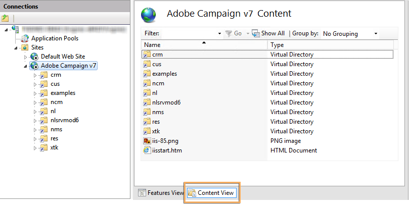

# Migração para o Adobe Campaign 7 no Windows{#migrating-in-windows-for-adobe-campaign}


## Procedimento geral {#general-procedure}

Para Windows, as etapas de migração são as seguintes:

1. Parar serviços: consulte [Service stop](#service-stop).
1. Faça backup do banco de dados: consulte [Fazer backup do banco de dados e da instalação atual](#back-up-the-database-and-the-current-installation).
1. Migre a plataforma: consulte [Implantação do Adobe Campaign v7](#deploying-adobe-campaign-v7).
1. Migrar o servidor de redirecionamento (IIS): consulte [Migrando o servidor de redirecionamento (IIS)](#migrating-the-redirection-server--iis-).
1. Reiniciar serviço: consulte [Reiniciar os serviços](#re-starting-the-services).
1. Excluir e limpar a versão anterior do Adobe Campaign: consulte [Excluindo e limpando a versão anterior do Adobe Campaign](#deleting-and-cleansing-adobe-campaign-previous-version).

## Parada de serviço {#service-stop}

Primeiro, pare todos os processos com acesso ao banco de dados em todas as máquinas em questão.

1. Todos os servidores que usam o módulo de redirecionamento (serviço **webmdl**) devem ser interrompidos. Para o IIS, execute o seguinte comando:

   ```
   iisreset /stop
   ```

1. O módulo **mta** e seus módulos filho (**mtachild**) devem ser interrompidos usando os seguintes comandos:

   ```
   nlserver stop mta@<instance name>
   nlserver stop mtachild@<instance name>
   ```

1. Pare os serviços da Adobe Campaign em todos os servidores. Faça logon com direitos de administrador e execute o seguinte comando:

   ```
   net stop nlserver6
   ```

   Se você estiver migrando da v5.11, execute o seguinte comando:

   ```
   net stop nlserver5
   ```

1. Para cada servidor, verifique se os serviços da Adobe Campaign foram interrompidos corretamente. Faça logon com direitos de administrador e execute o seguinte comando:

   ```
   tasklist /FI "IMAGENAME eq nlserver*"
   ```

   A lista de processos ativos junto com sua ID (PID) é exibida.

   ```
   Image Name                     PID Session Name        Session#    Mem Usage
   ========================= ======== ================ =========== ============
   nlserver.exe                  3192 Console                    1     13,108 K
   ```

1. Se um ou mais processos do Adobe Campaign ainda estiverem ativos ou bloqueados após alguns minutos, mate-os. Faça logon com direitos de administrador e execute o seguinte comando:

   ```
   taskkill /IM nlserver* /T
   ```

1. Se alguns processos ainda estiverem ativos após alguns minutos, você poderá forçá-los a fechar usando o comando :

   ```
   taskkill /F /IM nlserver* /T
   ```

## Faça o backup do banco de dados e da instalação atual {#back-up-the-database-and-the-current-installation}

O procedimento depende da versão anterior do Adobe Campaign.

### Migração do Adobe Campaign v5.11 {#migrating-from-adobe-campaign-v5-11}

1. Faça um backup do banco de dados do Adobe Campaign.
1. Faça um backup do diretório **Neolane v5** usando o seguinte comando:

   ```
   ren "Neolane v5" "Neolane v5.back"
   ```

   >[!IMPORTANT]
   >
   >Como precaução, recomendamos que você compacte a pasta **Neolane v5.back** e a salve em outro local seguro que não seja o servidor.

1. No console de gerenciamento do serviço do Windows, desative a inicialização automática do serviço do servidor de aplicativos 5.11. Você também pode usar o seguinte comando:

   ```
   sc config nlserver5 start= disabled
   ```

1. Edite o **config-`<instance name>`.xml** (no **Neolane v5. voltar** pasta) para impedir o **mta**, **wfserver**, **stat**, etc. de iniciar automaticamente. Por exemplo, substitua **autoStart** por **_autoStart**.

   ```
   <?xml version='1.0'?>
   <serverconf>
     <shared>
       <dataStore hosts="myServer*" lang="en_US">
         <dataSource name="default">
           <dbcnx encrypted="1" login="myLogin" password="myPassword"  provider="postgresql" server="myServer"/>
         </dataSource>
       </dataStore>
     </shared>
   
     <mta _autoStart="true" statServerAddress="myStatServer"/>
     <stat _autoStart="true"/>
     <wfserver _autoStart="true"/>
     <inMail _autoStart="true"/>
     <sms _autoStart="false"/>
   </serverconf>
   ```

### Migração do Adobe Campaign v6.02 {#migrating-from-adobe-campaign-v6-02}

1. Faça um backup do banco de dados do Adobe Campaign.
1. Faça um backup do diretório **Neolane v6** usando o seguinte comando:

   ```
   ren "Neolane v6" "Neolane v6.back"
   ```

   >[!IMPORTANT]
   >
   >Como precaução, recomendamos que você compacte a pasta **Neolane v6.back** e a salve em outro local seguro que não seja o servidor.

1. No gerenciador de serviços do Windows, desative a inicialização automática do servidor de aplicativos 6.02. Você também pode usar o seguinte comando:

   ```
   sc config nlserver6 start= disabled
   ```

1. Edite o **config-`<instance name>`.xml** (no **Neolane v6. voltar** pasta) para impedir o **mta**, **wfserver**, **stat**, etc. de iniciar automaticamente. Por exemplo, substitua **autoStart** por **_autoStart**.

   ```
   <?xml version='1.0'?>
   <serverconf>
     <shared>
       <dataStore hosts="myServer*" lang="en_US">
         <dataSource name="default">
           <dbcnx encrypted="1" login="myLogin" password="myPassword" provider="postgresql" server="myServer"/>
         </dataSource>
       </dataStore>
     </shared>
   
     <mta _autoStart="true" statServerAddress="myStatServer"/>
     <stat _autoStart="true"/>
     <wfserver _autoStart="true"/>
     <inMail _autoStart="true"/>
     <sms _autoStart="false"/>
   </serverconf>
   ```

### Migração do Adobe Campaign v6.1 {#migrating-from-adobe-campaign-v6-1}

1. Faça um backup do banco de dados do Adobe Campaign.
1. Faça um backup do diretório **Adobe Campaign v6** usando o seguinte comando:

   ```
   ren "Adobe Campaign v6" "Adobe Campaign v6.back"
   ```

   >[!IMPORTANT]
   >
   >Como precaução, recomendamos que você compacte a pasta **Adobe Campaign v6.back** e a salve em outro local seguro que não seja o servidor.

1. No console de gerenciamento do serviço do Windows, desative a inicialização automática do serviço do servidor de aplicativos 6.11. Você também pode usar o seguinte comando:

   ```
   sc config nlserver6 start= disabled
   ```

## Implantação do Adobe Campaign v7 {#deploying-adobe-campaign-v7}

A implantação do Adobe Campaign envolve duas etapas:

* Instalação do build v7: essa operação deve ser executada em cada servidor.
* A atualização posterior: esse comando deve ser iniciado em cada instância.

Para implantar o Adobe Campaign, siga as etapas abaixo:

1. Instale a build mais recente do Adobe Campaign v7 executando o arquivo de instalação **setup.exe**. Para obter mais informações sobre como instalar o servidor Adobe Campaign no Windows, consulte [esta seção](../../installation/using/installing-the-server.md).

   

   >[!NOTE]
   >
   >O Adobe Campaign v7 é instalado por padrão no diretório **C:\Program Files\Adobe\Adobe Campaign v7**.

1. Para disponibilizar o programa de instalação do console do cliente, copie o arquivo **setup-client-7.0.XXXX.exe** no diretório de instalação do Adobe Campaign: **C:\Program Files\Adobe\Adobe Campaign v7\datakit\nl\eng\jsp**.

   >[!NOTE]
   >
   >Para obter mais informações sobre como instalar o Adobe Campaign no Windows, consulte [esta seção](../../installation/using/installing-the-server.md).

1. Inicie a instância para o primeiro uso com os seguintes comandos:

   ```
   net start nlserver6-v7
   net stop nlserver6-v7
   ```

   >[!NOTE]
   >
   >Esses comandos permitem criar o sistema de arquivos interno do Adobe Campaign v7: **diretório conf** (com os arquivos **config-default.xml** e **serverConf.xml**), **var**, etc.

1. Copie e cole (substitua) os arquivos e as subpastas de configuração de cada instância por meio do arquivo de backup **Neolane v5.back**, **Neolane v6.back** ou **Adobe Campaign v6.back** (dependendo da versão da qual você está migrando - consulte [esta seção](#back-up-the-database-and-the-current-installation)).
1. De acordo com a versão da qual você está migrando, execute os seguintes comandos:

   ```
   copy "Neolane v5.back"/conf/config-<instance name>.xml "Adobe Campaign v7"/conf/
   copy "Neolane v5.back"/customers/* "Adobe Campaign v7"/customers/
   copy "Neolane v5.back"/var/* "Adobe Campaign v7"/var/
   ```

   ```
   copy "Neolane v6.back"/conf/config-<instance name>.xml "Adobe Campaign v7"/conf/
   copy "Neolane v6.back"/customers/* "Adobe Campaign v7"/customers/
   copy "Neolane v6.back"/var/* "Adobe Campaign v7"/var/
   ```

   ```
   copy "Adobe Campaign v6.back"/conf/config-<instance name>.xml "Adobe Campaign v7"/conf/
   copy "Adobe Campaign v6.back"/customers/* "Adobe Campaign v7"/customers/
   copy "Adobe Campaign v6.back"/var/* "Adobe Campaign v7"/var/
   ```

   >[!IMPORTANT]
   >
   >Para o primeiro comando acima, não copie o arquivo **config-default.xml**.

1. Nos arquivos **serverConf.xml** e **config-default.xml** do Adobe Campaign v7, aplique as configurações específicas que você tinha na versão anterior do Adobe Campaign. Para o arquivo **serverConf.xml**, use o arquivo **Neolane v5/conf/serverConf.xml.diff**, **Neolane v6/conf/serverConf.xml.diff** ou **Adobe Campaign v6/conf/serverConf.xml.diff**.

   >[!NOTE]
   >
   >Ao relatar configurações da versão anterior do Adobe Campaign para o Adobe Campaign v7, verifique se os caminhos para os diretórios físicos levam ao Adobe Campaign v7 (e não ao Neolane v5, Neolane v6 ou Adobe Campaign v6).

1. Recarregue a configuração do Adobe Campaign v7 usando o seguinte comando:

   ```
   nlserver config -reload
   ```

1. Inicie o processo pós-atualização usando o seguinte comando:

   ```
   nlserver config -postupgrade -instance:<instance name>
   ```

>[!IMPORTANT]
>
>Ainda não inicie os serviços da Adobe Campaign: algumas alterações precisam ser feitas no IIS.

## Migração do servidor de redirecionamento (IIS) {#migrating-the-redirection-server--iis-}

Nesse estágio, o servidor IIS deve ser interrompido. Consulte [Parada de serviço](#service-stop).

1. Abra o console **Gerenciador do Internet Information Services (IIS)**.
1. Altere os vínculos (portas de escuta) do site usado para a versão anterior do Adobe Campaign:

   * Clique com o botão direito do mouse no site usado para a versão anterior do Adobe Campaign e selecione **[!UICONTROL Edit bindings]**.
   * Para cada tipo de porta de escuta (**[!UICONTROL http]** e/ou **[!UICONTROL https]**), selecione a linha apropriada e clique em **[!UICONTROL Edit]**.
   * Insira uma porta diferente. Por padrão, a porta de escuta é 80 para http e 443 para https. Verifique se a nova porta está disponível.

      

      >[!NOTE]
      >
      >Se o servidor IIS incluir vários sites para o Adobe Campaign com uma configuração avançada (porta compartilhada e endereços IP diferentes), entre em contato com o administrador.

1. Crie um novo site para o Adobe Campaign v7:

   * Clique com o botão direito do mouse na pasta **[!UICONTROL Sites]** e selecione **[!UICONTROL Add Web Site...]**.

      

   * Insira o nome do site, **Adobe Campaign v7** por exemplo.
   * O caminho de acesso para o diretório básico do site não é usado, mas o campo **[!UICONTROL Physical access path]** deve ser inserido. Insira o caminho de acesso padrão do IIS: **C:\inetpub\wwwroot**.
   * Clique no botão **[!UICONTROL Connect as...]** como e verifique se a opção **[!UICONTROL Application user]** está selecionada.
   * Você pode deixar os valores padrão nos campos **[!UICONTROL IP address]** e **[!UICONTROL Port]**. Se quiser usar outros valores, verifique se o endereço IP e/ou a porta estão disponíveis.
   * Marque a caixa **[!UICONTROL Start Web site immediately]**.

      

1. Execute o script **iis_neolane_setup.vbs** para configurar automaticamente os recursos usados pelo servidor Adobe Campaign no diretório virtual criado anteriormente.

   * Esse arquivo é encontrado no diretório **`[Adobe Campaign v7]`\conf**, onde **`[Adobe Campaign v7]`** é o caminho de acesso para o diretório de instalação do Adobe Campaign. O comando para executar o script é o seguinte (para administradores):

      ```
      cd C:\Program Files (x86)\Adobe Campaign\Adobe Campaign v7\conf
      cscript iis_neolane_setup.vbs
      ```

   * Clique em **[!UICONTROL OK]** para confirmar a execução do script.

      

   * Insira o número do site criado anteriormente para o Adobe Campaign v7 e clique em **[!UICONTROL OK]**.

      

   * Uma mensagem de confirmação deve aparecer:

      

   * Na guia **[!UICONTROL Content view]** , verifique se a configuração do Site está configurada corretamente com os recursos do Adobe Campaign:

      

      >[!NOTE]
      >
      >Se a estrutura de árvore não for exibida, reinicie o IIS.
      >
      >As etapas de configuração do IIS a seguir são detalhadas em [this section](../../installation/using/integration-into-a-web-server-for-windows.md#configuring-the-iis-web-server).

## Zonas de segurança {#security-zones}

Se estiver migrando da v6.02 ou anterior, você deve configurar as zonas de segurança antes de iniciar os serviços. Para obter mais informações, consulte [Segurança](../../migration/using/general-configurations.md#security).

## Reiniciar os serviços {#re-starting-the-services}

Inicie os serviços IIS e Adobe Campaign em cada um dos seguintes servidores:

1. Servidor de rastreamento e redirecionamento.
1. Servidor Mid-sourcing.
1. Servidor de marketing.

Antes de prosseguir para a próxima etapa, execute um teste completo da nova instalação, verifique se não há regressões e se tudo funciona seguindo todas as recomendações da seção [Configurações gerais](../../migration/using/general-configurations.md).

## Como excluir e limpar a versão anterior do Adobe Campaign {#deleting-and-cleansing-adobe-campaign-previous-version}

O procedimento depende da versão anterior do Adobe Campaign.

### Adobe Campaign v5 {#adobe-campaign-v5}

Antes de excluir e limpar a instalação do Adobe Campaign v5, você deve aplicar as seguintes recomendações:

* Obtenha as equipes funcionais para executar uma verificação completa da nova instalação.
* Desinstale o Adobe Campaign v5 somente depois de ter certeza de que nenhuma reversão será necessária.

1. No IIS, exclua o site **Neolane v5** e, em seguida, o pool de aplicativos **Neolane v5**.
1. Renomeie a pasta **Neolane v5.back** como **Neolane v5**.
1. Desinstale o Adobe Campaign v5 usando o assistente Adicionar/remover componentes .

   

1. Exclua o serviço do Windows **nlserver5** usando o seguinte comando:

   ```
   sc delete nlserver5
   ```

1. Reinicie o servidor.

### Adobe Campaign v6.02 {#adobe-campaign-v6-02}

Antes de excluir e limpar a instalação do Adobe Campaign v6.02, você deve aplicar as seguintes recomendações:

* Obtenha as equipes funcionais para executar uma verificação completa da nova instalação.
* Desinstale o Adobe Campaign v6.02 somente quando tiver certeza de que nenhuma reversão será necessária.

1. No IIS, exclua o site **Neolane v6** e, em seguida, o pool de aplicativos **Neolane v6**.
1. Renomeie a pasta **Neolane v6.back** como **Neolane v6**.
1. Desinstale o Adobe Campaign v6.02 usando o assistente Adicionar/remover componentes .

   

1. Reinicie o servidor.

### Adobe Campaign v6.1 {#adobe-campaign-v6-1}

Antes de excluir e limpar a instalação do Adobe Campaign v6, você deve aplicar as seguintes recomendações:

* Obtenha as equipes funcionais para executar uma verificação completa da nova instalação.
* Desinstale o Adobe Campaign v6 somente depois de ter certeza de que nenhuma reversão será necessária.

1. No IIS, exclua o site do **Adobe Campaign v6** e, em seguida, o pool de aplicativos **Adobe Campaign v6**.
1. Renomeie a pasta **Adobe Campaign v6.back** como **Adobe Campaign v6**.
1. Desinstale o Adobe Campaign v6 usando o assistente Adicionar/remover componentes .

   

1. Reinicie o servidor.
