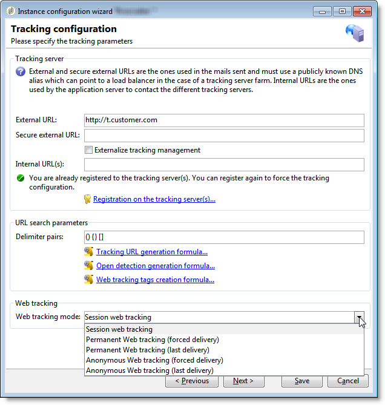

# Configurações específicas na v5.11{#specific-configurations-in-v5-11}

Esta seção detalha a configuração adicional necessária ao migrar da v5.11. Você também deve definir as configurações detalhadas na seção Configurações [](../../migration/using/general-configurations.md) gerais.

## Aplicações web {#web-applications}

O seguinte aviso será exibido automaticamente durante a migração:

```
The webApp ids have been modified during the migration process. Please make sure to check your scripts/css for broken compatibility (any client side javascript or css dealing directly with another element through its id is impacted). See file 'c:\svn\602\nl\build\ncs\var\upgrade/postupgrade/webAppsMigration_*************.txt' for details about the references that were automatically updated, if any.
```

Alguns componentes de aplicativos da Web, por exemplo os vários campos de fórmula, têm atributos @id. Eles são usados no código XML de aplicativos da Web e não são mais gerados da mesma maneira. Eles não são visíveis na interface e você não deve usá-los normalmente. No entanto, em alguns casos, os atributos @id podem ter sido usados para personalizar a renderização de aplicativos da Web, por exemplo, por meio de uma folha de estilos ou usando o código JavaScript.

Durante a migração, você **deve** verificar o caminho do arquivo de log especificado no aviso:

* **O arquivo não está vazio**: contém avisos relativos a inconsistências registradas antes da migração e que ainda existem. Pode ser o código JavaScript em um aplicativo da Web que faz referência a uma ID inexistente. Cada erro deve ser verificado e corrigido.
* **O arquivo está vazio**: isso significa que a Adobe Campaign não detectou nenhum problema.

Se o arquivo estiver vazio ou não, verifique se essas IDs não são usadas para configuração em outro lugar (e adapte a configuração, se isso for o caso).

## Fluxos de trabalho {#workflows}

Como o nome do diretório de instalação do Adobe Campaign foi alterado, alguns workflows podem não funcionar após a migração. Se um fluxo de trabalho fizer referência ao diretório nl5 em uma de suas atividades, isso gerará um erro. Substitua esta referência por **compilação**. Você pode executar um query SQL para identificar esses workflows (exemplo do PostgreSQL):

```
SELECT   iWorkflowId, sInternalName, sLabel 
FROM XtkWorkflow 
WHERE mData LIKE '%nl5%';
```

## Facilidade de uso {#user-friendliness}

O home page Adobe Campaign v5.11 não está mais disponível.

Embora não seja recomendado, existem algumas soluções se você desejar manter interfaces específicas do Adobe Campaign v5.11. Para obter mais informações, entre em contato conosco.

## MySQL {#mysql}

>[!IMPORTANT]
>
>O MySQL só é suportado na v7 como o mecanismo de banco de dados principal ao migrar da versão 6.02 ou 5.11 usando esse mecanismo.

O MySQL não gerencia fusos horários por padrão. Para ativar o gerenciamento de fuso horário, execute o seguinte comando:

```
mysql_tzinfo_to_sql /usr/share/zoneinfo | mysql -u root mysql
```

>[!NOTE]
>
>Para obter mais informações, consulte a página [https://dev.mysql.com/doc/refman/8.0/en/time-zone-support.html](https://dev.mysql.com/doc/refman/8.0/en/time-zone-support.html) .

Se modificações tiverem sido feitas na estrutura do banco de dados, durante a configuração, por exemplo (criação de índices específicos, criação de visualizações SQL etc.), determinadas precauções devem ser tomadas ao migrar. Com efeito, certas modificações podem ser geradas por incompatibilidades com o procedimento de migração. Por exemplo, a criação de visualizações SQL que contêm campos de **Carimbo de data e hora** não é compatível com a opção **usetimestamptz** . Por conseguinte, recomendamos que siga as recomendações abaixo:

1. Antes de iniciar a migração, faça backup do banco de dados.
1. Excluir alterações de SQL.
1. Execute o pós-upgrade de acordo com o procedimento detalhado na seção [Pré-requisitos para migração para o Adobe Campaign 7](../../migration/using/prerequisites-for-migration-to-adobe-campaign-7.md) .
   >[!NOTE]
   >
   >É imperativo que você siga as etapas de migração apresentadas na [seção Pré-requisitos para migração para o Adobe Campaign 7](../../migration/using/prerequisites-for-migration-to-adobe-campaign-7.md) .
1. Reintegrar alterações SQL.

Neste exemplo, uma visualização **NmcTrackingLogMessages** foi criada e tem um campo **Carimbo** de data e hora chamado **tslog**. Nesse caso, o procedimento de migração falha e a seguinte mensagem de erro é exibida:

```
2011-10-04 11:57:51.804Z B67B28C0 1 info log Updating table 'NmcTrackingLogMessages'
2011-10-04 11:57:51.804Z B67B28C0 1 error log PostgreSQL error: ERROR: cannot alter type of a column used by a view or rule\nDETAIL: rule _RETURN on view nmctrackinglogmessagesview depends on column "tslog"\n (iRc=-2006)
2011-10-04 11:57:51.804Z B67B28C0 1 error log SQL order 'ALTER TABLE NmcTrackingLogMessages ALTER COLUMN tsLog TYPE TIMESTAMPTZ' was not executed. (iRc=-2006)
```

Para garantir que a pós-atualização funcione, você deve excluir a visualização antes da migração e recriá-la após a migração, ao mesmo tempo em que a adapta ao modo TIMESTAMP WITH TIMEZONE.

## Rastreamento {#tracking}

A fórmula de rastreamento foi modificada. Ao migrar, a fórmula antiga (v5) é substituída pela nova (v7). Se você usar uma fórmula personalizada no Adobe Campaign v5, essa configuração deverá ser adaptada no Adobe Campaign v7 (opções **NmsTracking_ClickFórmula** e **NmsTracking_OpenFórmula** ).

O gerenciamento de rastreamentos web também foi modificado. Depois que a migração para v7 for realizada, você deverá start o assistente de implantação para concluir a configuração do rastreamento da Web.



Três modos estão disponíveis:

* **Rastreamento** da Web da sessão: Se o **[!UICONTROL Leads]** pacote não tiver sido instalado, essa opção será selecionada por padrão. Essa opção é a mais ideal em termos de desempenho e permite limitar o tamanho dos logs de rastreamento.
* **Rastreamento web permanente**
* **Rastreamento web** anônimo: Se o **[!UICONTROL Leads]** pacote estiver instalado, essa opção será selecionada por padrão. É a opção que mais consome recursos. Como acima, a coluna **sSourceId** deve ser indexada (na tabela de rastreamento e na tabela **CrmIncomingLead** ).

>[!NOTE]
>
>For more information on these three modes, refer to [this section](../../configuration/using/about-web-tracking.md).

## Estrutura em árvore do Adobe Campaign v7 {#campaign-vseven-tree-structure}

Durante a migração, a estrutura em árvore é automaticamente reorganizada com base nos padrões v7. As novas pastas são adicionadas, as pastas obsoletas são excluídas e seu conteúdo é colocado na pasta &quot;Para mover&quot;. Todos os itens desta pasta devem ser verificados após a migração, e o consultor deve decidir mantê-la ou excluí-la. Os artigos a conservar devem ser transferidos para o local certo.

Uma opção foi adicionada para desativar a migração automática da árvore de navegação. Esta operação agora é manual. Pastas obsoletas não são excluídas e novas pastas não são adicionadas. Essa opção só deve ser usada se a árvore de navegação predefinida v5 tiver sofrido muitas alterações. Adicione a opção ao console, antes de migrar, no **[!UICONTROL Administration > Options]** nó:

* Nome interno: NlMigration_KeepFolderStructure
* Tipo de dados: Número inteiro
* Valor (texto): 1

Se você usar essa opção, após a migração, será necessário excluir pastas obsoletas, adicionar as novas pastas e executar todas as verificações necessárias.

**Lista de novas pastas**:

As seguintes pastas precisam ser adicionadas após a migração:

| Nome interno | Rótulo | Condição |
|---|---|---|
| nmsAutoObjects | Objetos criados automaticamente | - |
| nmsCampaignAdmin | Gestão de campanha | - |
| nmsCampaignMgt | Gestão de campanha | - |
| nmsCampaignRes | Gestão de campanha | - |
| nmsModels | Modelos | - |
| nmsOnlineRes | Online | - |
| nmsProduction | Produção | - |
| nmsProfilProcess | Processos | - |
| xtkDashboard | Painéis | - |
| xtkPlatformAdmin | Plataforma | - |
| nmsLocalOrgUnit | Unidades organizacionais | - |
| nmsMRM | MRM | MRM instalado |
| nmsOperations | Campanhas | Campanha instalada |

**Lista de pastas** obsoletas:

As pastas obsoletas a serem excluídas após a migração são as seguintes:

>[!NOTE]
>
>Todo o conteúdo das pastas obsoletas deve ser verificado e, para cada item, o consultor decide se deseja mantê-lo ou excluí-lo. Os artigos a conservar devem ser deslocados para o local adequado.

| Nome interno | Rótulo | Condição |
|---|---|---|
| nmsAdministration | Administração | - |
| nmsDeliveryMgt | Execução da campanha | - |
| ncmContent | Gestão de conteúdo | Gerenciador de conteúdo instalado |
| ncmForm | Formulário de entrada | Gerenciador de conteúdo instalado |
| ncmImage | Imagens | Gerenciador de conteúdo instalado |
| ncmJavascript | Códigos JavaScript | Gerenciador de conteúdo instalado |
| ncmJst | Templates JavaScript | Gerenciador de conteúdo instalado |
| ncmParameters | Configuração | Gerenciador de conteúdo instalado |
| ncmSrcSchema | Schemas de dados | Gerenciador de conteúdo instalado |
| ncmStylesheet | Arquivos de estilo XSL | Gerenciador de conteúdo instalado |
| nmsAdminPlan | Administração | Campanha instalada |
| nmsResourcePlan | Recursos | Campanha instalada |
| nmsResourcesModels | Modelos | Campanha instalada |
| nmsRootPlan | Gestão de campanha | Campanha instalada |
| nmsOperador | Operadores de marketing | MRM instalado |

