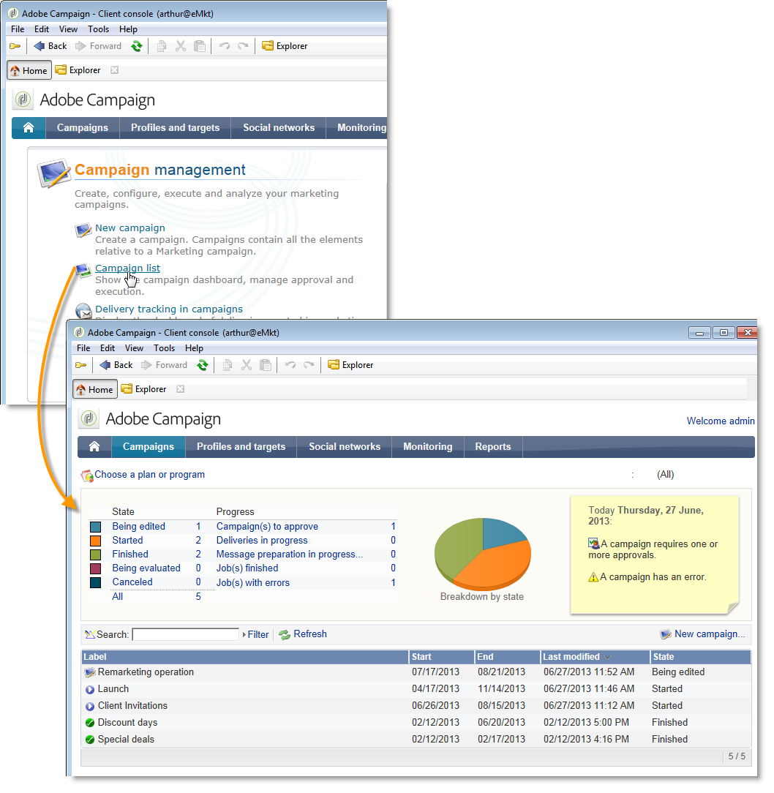

# Configurações específicas na v6.02{#specific-configurations-in-v6-02}


A seção a seguir detalha a configuração adicional necessária ao migrar da v6.02. Você também deve definir as configurações detalhadas na seção [Configurações gerais](../../migration/using/general-configurations.md).

## Aplicações web {#web-applications}

Se você estiver migrando da v6.02, os registros de erros relacionados aos aplicativos do tipo visão geral da Web poderão ser exibidos. Exemplos de mensagem de erro:

```
[PU-0006] Entity of type : 'xtk:entityBackupNew' and Id 'nms:webApp|taskOverview', expression '[SQLDATA[' was found : '...)) or (@id IN ([SQLDATA[select 
[PU-0006] Entity of type : 'xtk:formDictionary' and Id 'nms:webApp|lastTasks', expression '[SQLDATA[' was found : '...)) or (@id IN ([SQLDATA[select 
[PU-0006] Entity of type : 'nms:webApp' and Id 'taskOverview', expression '[SQLDATA[' was found : '...@owner-id] IN ([SQLDATA[select iGroupid...'. (iRc=-1)
```

Esses aplicativos Web usavam SQLData e não são compatíveis com o v7, devido a maior segurança. Esses erros levarão a uma falha de migração.

Se você não tiver usado esses aplicativos Web, execute o seguinte script de limpeza e execute novamente o postupgrade:

```
Nlserver javascript -instance:[instance_name] -file [installation_path]/datakit/xtk/fra/js/removeOldWebApp.js
```

Se você modificou essas aplicações Web e gostaria de continuar usando-as no v7, é necessário ativar a opção **allowSQLInjection** em suas diferentes zonas de segurança e reiniciar o pós-upgrade. Consulte a seção [SQLData](../../migration/using/general-configurations.md#sqldata) para obter mais informações.

## Facilidade de uso: Página inicial e navegação {#user-friendliness--home-page-and-navigation}

>[!IMPORTANT]
>
>Se quiser continuar usando os aplicativos do tipo visão geral v6.02, ative a opção **allowSQLInjection** em suas diferentes zonas de segurança antes da pós-atualização. Consulte [Aplicações Web](#web-applications).

Após uma migração da versão 6.02, a página inicial do Adobe Campaign v6.02 não é mais exibida, mas ainda é acessível e compatível com o Adobe Campaign v7.

Para continuar usando a página inicial da v6.02, você deve instalar um pacote de &quot;compatibilidade&quot; após a migração.

Para fazer isso, importe o pacote de compatibilidade:

Clique em **[!UICONTROL Tools > Advanced > Import package]** e escolha o pacote **campaignMigration.xml** no **`\nl\datakit\nms\[Your language]\package\optional`**.

Para permitir o acesso às interfaces do tipo da Aplicação Web v6.02, a opção de configuração do servidor **sessionTokenOnly** deve ser ativada no arquivo **serverConf.xml**:

```
sessionTokenOnly="true"
```

Essa opção altera os níveis de segurança para garantir a compatibilidade da interface.

Depois que o pacote é instalado, a página inicial do Adobe Campaign v7 é substituída pela página inicial v6.02 antiga concluída com as configurações gerais do v7 (banner azul de página inicial).


Todos os links nesta página inicial são vinculados a telas do v7, exceto as listas (**[!UICONTROL operation list]**, **[!UICONTROL delivery tracking in operations]**, etc.) que link para a visão geral da v6.02 (aplicativos web).



Se quiser adicionar outra visão geral configurada na v6.02, é necessário adicionar isso à página inicial no painel. (**[!UICONTROL Administration > Access management > Dashboard]**).

>[!NOTE]
>
>Lembre-se de desconectar e reconecte o console para registrar as modificações.

## Centro de mensagens {#message-center}

Após a migração da instância de controle do Centro de Mensagens, é necessário republicar os templates de mensagem transacional para que eles funcionem.

No v7, os nomes dos templates de mensagem transacional em instâncias de execução foram alterados. No momento, eles são prefixados pelo nome do operador que corresponde à instância de controle na qual foram criados, por exemplo **control1_template1_rt** (onde **control1** é o nome do operador). Se você tiver um volume significativo de modelos, recomendamos excluir os modelos antigos nas instâncias de controle.
