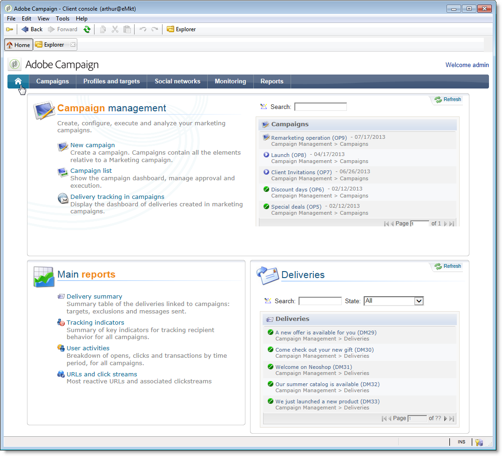

# Configurações específicas na v6.02{#specific-configurations-in-v6-02}

A seção a seguir detalha a configuração adicional necessária ao migrar da v6.02. Você também deve definir as configurações detalhadas na seção Configurações [](../../migration/using/general-configurations.md) gerais.

## Aplicações web {#web-applications}

Se você estiver migrando da v6.02, os registros de erros referentes a aplicativos da Web de tipo visão geral podem ser exibidos. Exemplos de mensagem de erro:

```
[PU-0006] Entity of type : 'xtk:entityBackupNew' and Id 'nms:webApp|taskOverview', expression '[SQLDATA[' was found : '...)) or (@id IN ([SQLDATA[select 
[PU-0006] Entity of type : 'xtk:formDictionary' and Id 'nms:webApp|lastTasks', expression '[SQLDATA[' was found : '...)) or (@id IN ([SQLDATA[select 
[PU-0006] Entity of type : 'nms:webApp' and Id 'taskOverview', expression '[SQLDATA[' was found : '...@owner-id] IN ([SQLDATA[select iGroupid...'. (iRc=-1)
```

Esses aplicativos da Web usavam SQLData e não são compatíveis com v7, devido a maior segurança. Esses erros levarão a uma falha de migração.

Se você não tiver usado esses aplicativos da Web, execute o seguinte script de limpeza e execute novamente o pós-atualização:

```
Nlserver javascript -instance:[instance_name] -file [installation_path]/datakit/xtk/fra/js/removeOldWebApp.js
```

Se você modificou esses aplicativos da Web e gostaria de continuar usando-os na v7, ative a opção **allowSQLInjection** em suas diferentes zonas de segurança e volte a start após a atualização. Consulte a seção [SQLData](../../migration/using/general-configurations.md#sqldata) para obter mais informações.

## Adequação ao usuário: Home page e navegação {#user-friendliness--home-page-and-navigation}

>[!IMPORTANT]
>
>Se você quiser continuar usando aplicativos da Web do tipo visão geral v6.02, ative a opção **allowSQLInjection** em suas diferentes zonas de segurança antes da pós-atualização. Refer to [Web applications](#web-applications).

Após uma migração da versão 6.02, a página inicial do Adobe Campaign v6.02 não é mais exibida, mas ainda está acessível e compatível com o Adobe Campaign v7.

Para continuar usando a página inicial v6.02, você deve instalar um pacote de &quot;compatibilidade&quot; após a migração.

Para fazer isso, importe o pacote de compatibilidade:

Clique **[!UICONTROL Tools > Advanced > Import package]** e escolha o pacote **campaignMigration.xml** no **`\nl\datakit\nms\[Your language]\package\optional`**.

Para permitir o acesso às interfaces do tipo de Aplicação web v6.02, a opção de configuração do servidor **sessionTokenOnly** deve ser ativada no arquivo **serverConf.xml** :

```
sessionTokenOnly="true"
```

Essa opção altera os níveis de segurança para garantir a compatibilidade da interface.

Depois que o pacote é instalado, o home page Adobe Campaign v7 é substituído pela sua página inicial v6.02 antiga, concluída com as configurações gerais da v7 (banner azul do home page).



Todos os links nesta página inicial são vinculados às telas v7, exceto as listas (**[!UICONTROL operation list]**, **[!UICONTROL delivery tracking in operations]** etc.) que link para a visão geral da v6.02 (aplicativos da Web).


Se quiser adicionar outra visão geral configurada na v6.02, é necessário adicionar isso ao home page a partir do painel. (**[!UICONTROL Administration > Access management > Dashboard]**).

>[!NOTE]
>
>Lembre-se de desconectar e reconectar o console para registrar as modificações.

## Centro de mensagens {#message-center}

Após a migração da instância de controle do centro de mensagens, você deve publicar novamente os templates de mensagem transacionais para que funcionem.

Na v7, os nomes dos templates de mensagem transacionais no instância de execução foram alterados. Atualmente, eles recebem o prefixo do nome do operador que corresponde à instância de controle na qual foram criados, por exemplo, **control1_template1_rt** (onde **control1** é o nome do operador). Se você tiver um volume significativo de modelos, recomendamos excluir modelos antigos no instância de controle.
