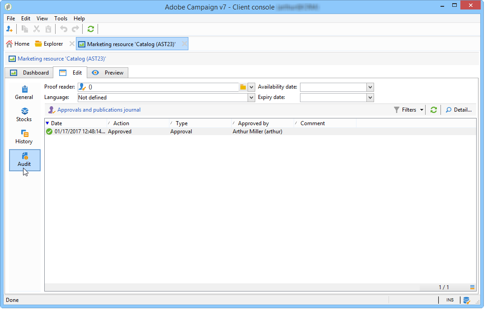
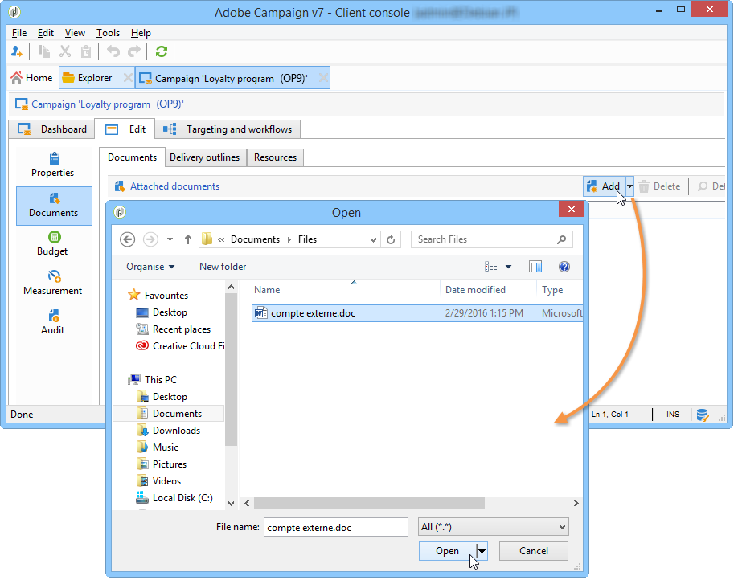

# Gerenciar recursos de marketing{#managing-marketing-resources}

O Adobe Campaign permite gerenciar e acompanhar os recursos de marketing envolvidos no ciclo de vida da campanha. Esses recursos de marketing podem ser um folheto, um auxílio visual ou qualquer outro meio de comunicação que envolva vários operadores.

Para cada recurso de marketing gerenciado pelo Adobe Campaign, é possível acompanhar o status e o histórico a qualquer momento e visualizar a versão atual.

## Adicionar um recurso de marketing {#adding-a-marketing-resource}

Os recursos de marketing são acessados pela guia **[!UICONTROL Campaigns]**.

Para adicionar um recurso, clique no botão **[!UICONTROL Create]**.

Para disponibilizar um recurso no servidor do Adobe Campaign, é necessário adicionar o recurso desejado arrastando e soltando na área intermediária do editor. É possível também clicar no link **[!UICONTROL Upload file to server...]**

Uma mensagem de confirmação permite iniciar o upload.

Quando o upload estiver concluído, o recurso será adicionado à lista de recursos disponíveis. É acessível aos operadores do Adobe Campaign. Eles podem exibi-lo (por meio da guia **[!UICONTROL Preview]**), fazer uma cópia para modificá-lo ou atualizar o arquivo no servidor (usando a guia **[!UICONTROL Edit]**).

Clique na guia **[!UICONTROL General]** para selecionar os operadores ou grupos de operadores responsáveis pelo monitoramento, rastreamento e aprovação deste recurso. A seleção do revisor é feita por meio do link **[!UICONTROL Advanced parameters]**.

* O operador para o qual o recurso é atribuído é responsável por rastreá-lo.
* O operador de aprovação é responsável pela aprovação do recurso de marketing. Eles serão notificados quando o processo de validação de recursos for iniciado.

   Se nenhum revisor estiver selecionado, o recurso **[!UICONTROL cannot be]** fica sujeito a aprovação.

* Se necessário, também pode-se especificar um leitor de prova.

É possível especificar uma data de disponibilidade (indicativa) para o recurso. Além dessa data, ele aparecerá com o status **[!UICONTROL Late]**.

## Trabalho colaborativo em recursos {#collaborative-work-on-resources}

É possível modificar e atualizar um recurso de marketing e, se necessário, informar outros operadores do Adobe Campaign. É possível:

* Baixe o recurso localmente para modificá-lo.
* Atualize o arquivo no servidor e torne ele acessível a outros operadores.
* Bloqueie um recurso para proibir sua modificação por outros operadores.

>[!NOTE]
>
>A guia **[!UICONTROL History]** contém os logs de download e de atualização do recurso. O botão **[!UICONTROL Details]** permite visualizar a versão selecionada:

### Bloquear/desbloquear um recurso {#locking-unlocking-a-resource}

Depois de criado, os recursos estão disponíveis no painel de recursos de marketing e os operadores podem editá-los e modificá-los.

Quando um operador deseja trabalhar em um recurso, é preferível bloqueá-lo antes de iniciar o trabalho, para impedir que outros operadores o modifiquem ao mesmo tempo. O recurso é então reservado; ele permanece acessível, mas não pode ser publicado ou atualizado no servidor por outro operador.

Uma mensagem especial notifica todos os operadores que tentarem acessá-lo:

A guia **[!UICONTROL Tracking]** indica o nome do operador que bloqueou o recurso e a data de atualização planejada.

Para bloquear um recurso, é necessário clicar no recurso seguido pelo botão **[!UICONTROL Lock]** no painel de recursos.

É possível indicar a data de retorno planejada na guia **[!UICONTROL Tracking]** do recurso.

Essas informações permitem que informar outros operadores do Adobe Campaign da data em que o recurso será desbloqueado.

Quando o recurso for atualizado, ele é automaticamente desbloqueado e disponibilizado para todos os operadores novamente.

Se necessário, também é possível desbloqueá-lo manualmente no painel.

>[!NOTE]
>
>Somente o operador que bloqueou o recurso e os operadores com direitos de Administrador estão autorizados a desbloquearem um recurso.

### Fóruns de discussão {#discussion-forums}

Em cada recurso, a guia **[!UICONTROL Forum]** permite que os participantes troquem informações.

[Fóruns de discussão](../../mrm/using/discussion-forums.md) explica como os fóruns de discussão operam no Adobe Campaign.

## Ciclo de vida de um recurso de marketing {#life-cycle-of-a-marketing-resource}

Quando o recurso é criado, os operadores do Adobe Campaign são indicados para projetar, revisar, aprovar e publicar o recurso. Uma duração pode ser determinada para essas campanhas.

A guia **[!UICONTROL Tracking]** permite monitorar qualquer ação realizada no recurso: aprovações, rejeições de aprovações, comentários relacionados ou publicações.

A guia **[!UICONTROL History]** exibe as transferências de arquivos realizadas para esse recurso.

### Processo de aprovação {#approval-process}

A data esperada de disponibilidade é exibida nos detalhes do recurso, se ela foi especificada na guia **[!UICONTROL Tracking]**. Depois que essa data for atingida, é possível executar o processo de aprovação usando o botão **[!UICONTROL Submit for approval]** no painel de recursos. O status do recurso é alterado para **[!UICONTROL Approval in progress]**.

Um recurso pode ser aprovado por meio do botão **[!UICONTROL Approve resource]** no painel.

Os operadores autorizados podem aceitar ou rejeitar aprovações. Essa ação é possível: por meio da mensagem de email enviada (clicando no link da mensagem de notificação) ou pelo console (clicando no botão **[!UICONTROL Approve]**).

A janela de aprovação permite inserir um comentário.

A guia **[!UICONTROL Tracking]** permite que todos os operadores acompanhem os vários estágios do processo de aprovação.

>[!NOTE]
>
>Além do revisor especificado para cada recurso de marketing, os operadores com direitos de administrador e o gerente de recursos estão autorizados a aprovar um recurso de marketing.

### Publicar um recurso {#publishing-a-resource}

Quando aprovado, o recurso de marketing deve ser publicado. O processo de publicação deve estar sujeito à implementação específica de acordo com os requisitos da empresa. Isso significa que os recursos podem ser publicados em uma extranet ou em qualquer outro servidor, informações específicas podem ser enviadas para um provedor de serviços externo etc.

Para publicar um recurso, clique no botão **[!UICONTROL Publish]** na zona de edição do painel de recursos de marketing.

É possível também automatizar a publicação de um recurso por meio de um workflow.

Publicar um recurso significa torná-lo disponível para uso (por outra tarefa, por exemplo). Publicações como tal variam dependendo da natureza do seu recurso: para um panfleto, publicar pode significar enviar o arquivo para uma impressora, para uma agência da Web, pode significar publicá-lo em um site etc.

Para que o Adobe Campaign publique, você precisa criar um workflow adequado e vinculá-lo ao recurso. Para fazer isso, abra a caixa do recurso **[!UICONTROL Advanced settings]** e selecione o fluxo de trabalho desejado no campo **[!UICONTROL Post-processing]**.

O workflow será executado:

* Quando o revisor clicar no link **[!UICONTROL Publish resource]** (ou, se nenhum revisor foi definido, a pessoa encarregada do recurso).
* Se o recurso for gerenciado por meio de uma tarefa de criação de recurso de marketing, ele será executado quando a tarefa for definida como **[!UICONTROL Finished]**, desde que a caixa **[!UICONTROL Publish the marketing resource]** esteja marcada na tarefa (Consulte [Tarefa de criação de recurso de marketing](../../mrm/using/creating-and-managing-tasks.md#marketing-resource-creation-task))

Se um fluxo de trabalho não for iniciado imediatamente (se ele for interrompido, por exemplo), o status do recurso será alterado para **[!UICONTROL Pending publication]**. Quando o fluxo de trabalho for iniciado, o status do recurso será alterado para **[!UICONTROL Published]**. Este status não leva em conta os possíveis erros no processo de publicação. Verifique o status do seu workflow para verificar se ele foi executado corretamente.

## Vincular um recurso a uma campanha {#linking-a-resource-to-a-campaign}

### Fazendo referência a um recurso de marketing {#referencing-a-marketing-resource}

Os recursos de marketing podem ser associados a campanhas, desde que este recurso tenha sido selecionado no template de campanha.

>[!NOTE]
>
>Para obter detalhes sobre como criar e configurar modelos de campanha, consulte [Modelos de campanha](../../campaign/using/marketing-campaign-templates.md#campaign-templates).

Clique na guia **[!UICONTROL Documents > Resources]** no painel de campanha e, em seguida, clique em **[!UICONTROL Add]** para selecionar o recurso relacionado.

Você pode filtrar recursos por status, natureza ou tipo ou aplicar um filtro personalizado.

Clique em **[!UICONTROL OK]** para adicionar o recurso à lista de recursos de marketing destinados a essa campanha.

O botão **[!UICONTROL Details]** permite editá-lo e visualizá-lo.

Os recursos adicionados serão exibidos no painel. Eles também poderão ser editados lá.

### Adicionando um recurso de marketing a um delivery outline {#adding-a-marketing-resource-to-a-delivery-outline}

Os recursos de marketing podem ser associados a deliveries por meio de delivery outlines.

>[!NOTE]
>
>Para obter mais informações sobre delivery outlines, consulte [Associar e estruturar recursos vinculados por meio de um delivery outline](../../campaign/using/marketing-campaign-deliveries.md#associating-and-structuring-resources-linked-via-a-delivery-outline).

## Gerenciamento de estoque {#stock-management}

Você pode associar um recurso de marketing a um ou mais estoques para gerenciar seus suprimentos e exibir um aviso no painel em caso de estoque insuficiente.

>[!NOTE]
>
>Para obter mais informações sobre gerenciamento de estoque no Adobe Campaign, consulte [Gerenciamento de estoque](../../campaign/using/providers--stocks-and-budgets.md#stock-management).

Para associar um recurso de marketing a um estoque, edite o mapa de ações e edite ou crie um estoque. Adicione uma linha de estoque e selecione o recurso de marketing correspondente.

Se necessário, você poderá editar o recurso selecionado por meio do ícone (lupa) **[!UICONTROL Edit the link]** localizado à direita do recurso depois de selecioná-lo.

Especifique o estoque inicial e o alerta de estoque e salve.

O estoque é indicado nos detalhes do recurso.

Quando o estoque for insuficiente, um aviso será enviado para os operadores relacionados.

## Funções avançadas {#advanced-functions}

O painel de recursos de marketing permite que você realize os tipos comuns de operações: adicionar, editar, bloquear/desbloquear, aprovar, publicar. Você poderá criar outros tipos de recursos de marketing e acessar funcionalidades avançadas através da árvore do Adobe Campaign. Para fazer isso, clique em **[!UICONTROL Explorer]** na página inicial do Adobe Campaign.

Por padrão, os recursos de marketing são armazenados no nó **[!UICONTROL MRM > Marketing resources]** da árvore.

Você poderá adicionar os seguintes recursos nessa visualização:

* Arquivo
* HTML
* Texto
* URL
