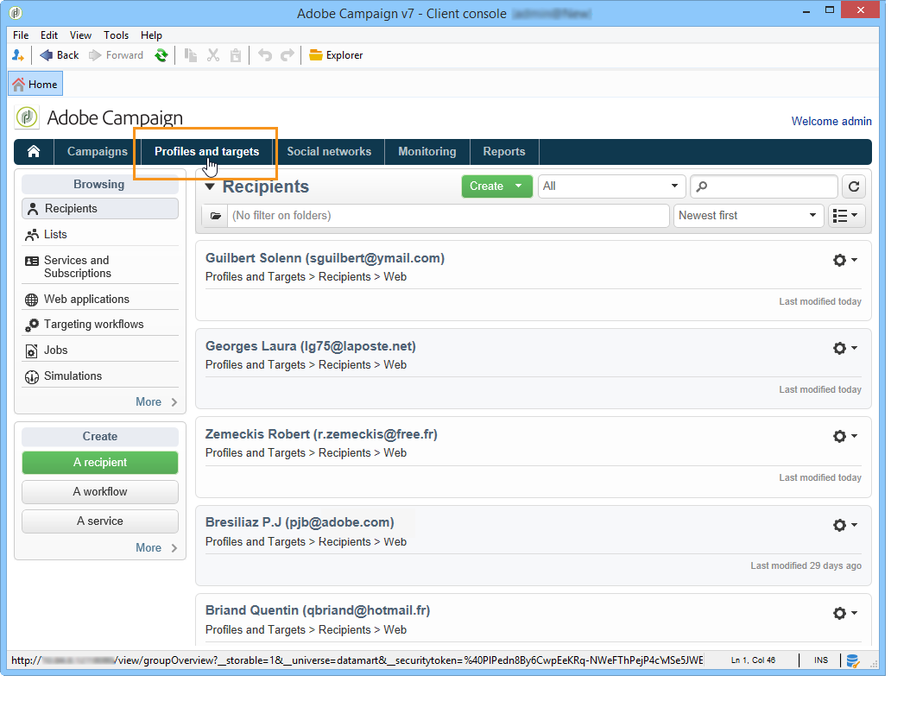

# Sobre perfis{#about-profiles}

## Tipos de perfil {#profile-types}

O Adobe Campaign permite gerenciar perfis em todo o ciclo de vida: criação, importação, direcionamento, rastreamento de ações, atualizações, etc.

Cada perfil corresponde a uma entrada do banco de dados. Eles contêm todas as informações necessárias para direcionamento, qualificação e acompanhamento de indivíduos.

Os perfis podem ser identificados com base no espaço de armazenamento. Isso significa que um perfil pode corresponder a: um recipient, um visitante, um operador, um assinante, um prospecto, etc.

## Perfis de destinatário {#recipient-profiles}

Os destinatários de entrega são armazenados no banco de dados como perfis que contêm as informações vinculadas a eles: sobrenome, nome, endereço, assinaturas, entregas, etc. Ao criar campanhas, é possível definir o direcionamento das entregas a uma seleção de perfis da base de acordo com critérios simples ou avançados.

Também é possível criar campanhas direcionadas a destinatários cujos perfis estão armazenados em arquivos, em vez de em banco de dados. Elas são conhecidas como entregas &quot;externas&quot;. Para obter mais informações sobre esse tipo de entrega, consulte [esta página](../../delivery/using/steps-defining-the-target-population.md#selecting-external-recipients).

Os principais métodos para criar perfis de destinatários são os seguintes:

* entrada direta nas telas da interface gráfica;
* importação de listas de destinatários;
* coleta on-line via formulários web.

>[!NOTE]
>
>Para saber como arquivos e formulários web são importados, consulte [Importações e exportações genéricas](../../platform/using/generic-imports-and-exports.md).

## Profiles and targets {#profiles-and-targets}

The **[!UICONTROL Profiles and targets]** link lets you display recipients stored in Adobe Campaign database. É possível criar um novo destinatário, editar um destinatário existente e acessar o perfil dele. Para obter mais informações, consulte [esta página](../../platform/using/editing-a-profile.md).

Ele também dá acesso a:

* listas; consulte [Criação e gerenciamento de listas](../../platform/using/creating-and-managing-lists.md),
* serviços de assinatura; consulte [esta página](../../delivery/using/managing-subscriptions.md);
* aplicativos web; consulte [esta página](../../web/using/about-web-applications.md);
* importações e exportações (tarefas); consulte [Importações e exportações genéricas](../../platform/using/generic-imports-and-exports.md),
* fluxos de trabalho de direcionamento; consulte [esta página](../../workflow/using/building-a-workflow.md#implementation-steps-).

A página de destinatários permite executar operações frequentes em perfis: edições, atualizações, adições, exclusões e classificações.

Para manipulações de perfil mais avançadas, é necessário editar a árvore do Adobe Campaign. Para fazer isso, clique no link **[!UICONTROL Explorer]** na página inicial do Adobe Campaign.

By default, recipients are stored in the **[!UICONTROL Profiles and Targets > Recipients]** node of the tree. É possível criar destinatários nesta tela, bem como:

* classificar e filtrar os perfis do banco de dados; consulte [Opções de filtragem](../../platform/using/filtering-options.md),
* mover, copiar ou excluir perfis do banco de dados; consulte [Gerenciamento de perfis](../../platform/using/managing-profiles.md),
* atualizar perfis; consulte [Atualização de dados](../../platform/using/updating-data.md),
* destinatários da exportação; consulte [Exportação e importação de perfis](../../platform/using/exporting-and-importing-profiles.md),
* criar grupos de recipients; consulte [Criação e gerenciamento de listas](../../platform/using/creating-and-managing-lists.md).

Para acessar funcionalidades e configurações avançadas, clique no ícone **[!UICONTROL Explorer]**.

O layout geral do Adobe Campaign Explorer é apresentado em [Uso do Adobe Campaign Explorer](../../platform/using/adobe-campaign-workspace.md#using-adobe-campaign-explorer).

>[!NOTE]
>
>Também é possível exibir uma visualização avançada dessa lista na árvore do Adobe Campaign clicando no link **[!UICONTROL Profiles and targets > Recipients]** A exibição da lista pode ser configurada para atender às suas necessidades. É possível adicionar ou excluir colunas, definir a ordem das colunas, classificar dados etc. A configuração de exibição de lista é descrita em [Uso do Adobe Campaign Explorer](../../platform/using/adobe-campaign-workspace.md#using-adobe-campaign-explorer).
>
>Também é possível definir as visualizações de destinatários. Para obter mais informações sobre essa funcionalidade, consulte [Pastas e exibições](../../platform/using/access-management.md#folders-and-views).

## Perfis ativos {#active-profiles}

Os perfis ativos são aqueles que são contados para fins de cobrança.

“**Perfil**” significa um registro de informações (por exemplo: um registro na tabela nmsRecipient ou uma tabela externa contendo uma ID de cookie, ID do cliente, identificador móvel ou outras informações relevantes para um canal específico) representando um cliente final, um prospecto ou um cliente potencial.

A cobrança só afeta perfis que estão **ativos**. Um perfil é considerado ativo quando ele é visado ou recebe comunicação nos últimos 12 meses por meio de qualquer canal.

Os perfis excluídos durante a preparação da entrega (regras de tipologia, quarentenas) não são levados em consideração. Um perfil que foi visado por várias entregas será contado apenas uma vez.

>[!NOTE]
>
>Os canais Facebook e Twitter não são considerados.

Você pode ter uma visão geral do **[!UICONTROL Number of active profiles]** menu Campaign Standard **[!UICONTROL Administration > Campaign Management > Customer metrics]** . The actual count is performed by the **[!UICONTROL Number of active billing profiles]** (**[!UICONTROL billingActiveContactCount]**) [technical workflow](../../workflow/using/deliveries.md), which runs every day and adds the new data to the existing report for the current period in the **[!UICONTROL Customer metrics]** menu. Cada período dura 12 meses.

Se você estiver hospedado no AWS e usando o Campaign Classic da versão 8931, também poderá monitorar o número de perfis ativos usados em suas instâncias diretamente do Painel de controle. For more on this, refer to the [Control Panel documentation](https://docs.adobe.com/content/help/en/control-panel/using/performance-monitoring/active-profiles-monitoring.html).
