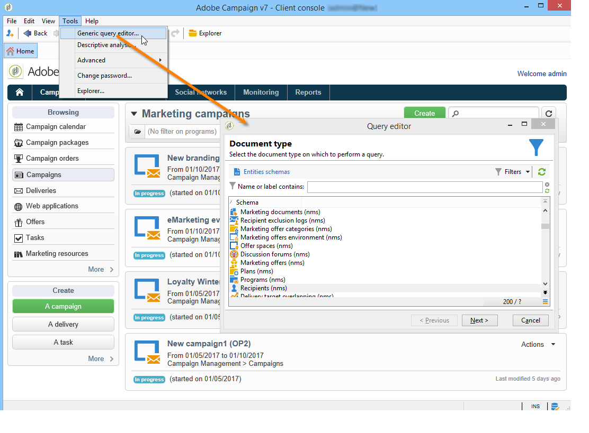

# Introdução a consultas{#about-queries-in-campaign}

A ferramenta de consulta está disponível em vários níveis do aplicativo e pode ser usada para definir populações do target, segmentar clientes, extrair e filtrar logs de rastreamento, criar filtros e muito mais.

Ele fornece um assistente dedicado — o editor de query genérico — acessível pelo menu **[!UICONTROL Tools > Generic query editor...]**. Esse editor permite que as consultas de banco de dados extraiam, organizem, agrupem e classifiquem informações. Por exemplo, ele pode recuperar recipients que clicaram mais de n vezes em um link de boletim informativo durante um determinado período.

O Editor de consultas genérico centraliza todos os recursos de consulta. Ela permite a criação e o armazenamento de filtros de restrição, que podem ser reutilizados em outros contextos, como a caixa Query de um workflow de direcionamento.

>[!BEGINTABS]

>[!TAB Consultar o banco de dados]

As etapas para criar uma consulta estão detalhadas na **[documentação do Campaign v8 (console)](https://experienceleague.adobe.com/pt-br/docs/campaign/campaign-v8/data/query/query-editor){target=_blank}**

{target=_blank}

>[!TAB Adicionar uma consulta em um fluxo de trabalho]

Saiba mais sobre as principais etapas relacionadas à criação de consultas no contexto de um fluxo de trabalho na **[documentação do Campaign v8](https://experienceleague.adobe.com/pt-br/docs/campaign/automation/workflows/wf-activities/targeting-activities/query){target=_blank}**

{target=_blank}

>[!TAB Condições de filtro]

Para criar sua query, você deve selecionar as condições de filtragem no editor de query. Os recursos e casos de uso disponíveis estão detalhados na **[documentação do Campaign v8](https://experienceleague.adobe.com/pt-br/docs/campaign/campaign-v8/data/query/filter-conditions){target=_blank}**

{target=_blank}

>[!ENDTABS]

