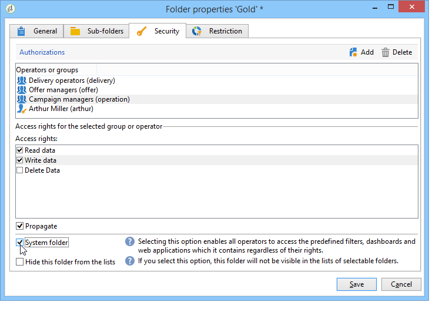

# Gerenciar o acesso a pastas{#folder-access-management}

Cada pasta da árvore de navegação do Explorer tem direitos de acesso de leitura, gravação e exclusão atribuídos a ela. Para acessar um arquivo, um operador ou grupo de operadores deve ter pelo menos acesso de leitura a ele.

## Pastas e visualizações {#folders-and-views}

### O que é uma pasta {#about-folders}

Pastas são nós na árvore do Adobe Campaign. Esses nós são criados clicando com o botão direito do mouse na árvore, por meio do menu **[!UICONTROL Add new folder]**. Por padrão, o primeiro menu permite adicionar a pasta correspondente ao contexto atual.

Você pode personalizar a árvore de navegação do Explorer. Saiba mais sobre as etapas de configuração e as práticas recomendadas [nesta seção](adobe-campaign-workspace.md).

### O que é uma visualização {#about-views}

Além disso, você pode criar visualizações para restringir o acesso aos dados e organizar o conteúdo da árvore para atender aos seus requisitos. É possível atribuir direitos às visualizações.

Uma visualização é uma pasta que exibe os registros fisicamente armazenados em uma ou mais pastas do mesmo tipo. Por exemplo, se você criar uma pasta do Campaing que seja uma visualização, ela exibirá todas as campanhas presentes no banco de dados por padrão, independente de sua origem. Esses dados podem ser filtrados.

Quando você converte uma pasta em uma visualização, todos os dados correspondentes ao tipo de pasta presentes no banco de dados são exibidos na visualização, independentemente da pasta em que são salvos. É possível filtrar para restringir a lista de dados exibidos.

>[!IMPORTANT]
>
>As visualizações contêm dados e fornecem acesso a eles, mas os dados não são armazenados fisicamente na pasta de visualização. O operador deve ter os direitos apropriados para a ação desejada nas pastas da fonte de dados (acesso de leitura no mínimo).
>
>Para conceder acesso a uma visualização sem conceder acesso à pasta de origem, basta não conceder acesso de leitura no nó pai da pasta de origem.

Para distinguir visualizações de pastas, o nome de cada visualização é exibido em uma cor diferente (ciano escuro).

### Adicionar pastas e criar visualizações {#adding-folders-and-creating-views}

No exemplo abaixo, criaremos novas pastas para exibir dados específicos:

1. Crie uma nova pasta do tipo **[!UICONTROL Deliveries]** e a nomeie como **Deliveries France**.
1. Clique com o botão direito do mouse nessa pasta e selecione **[!UICONTROL Properties...]**.

   

1. Na guia **[!UICONTROL Restriction]**, selecione **[!UICONTROL This folder is a view]**. Todos os deliveries no banco de dados serão exibidos.

   

1. Defina os critérios do filtro de delivery no editor de query na seção intermediária da janela: as campanhas correspondentes ao filtro definido serão exibidas.

   >[!NOTE]
   >
   >O editor de query é apresentado [nesta seção](../../platform/using/about-queries-in-campaign.md).

   Com as seguintes condições de filtro:

Os seguintes deliveries serão exibidos na visualização:

>[!NOTE]
>
>Ao gerenciar os eventos de [mensagens transacionais](../../message-center/using/about-transactional-messaging.md), as pastas **[!UICONTROL Real time events]** ou **[!UICONTROL Batch events]** não devem ser definidas como visualizações nas instâncias de execução, pois isso pode levar a problemas de direito de acesso. Para obter mais informações sobre a coleção do evento, consulte [esta seção](../../message-center/using/about-event-processing.md#event-collection).

## Permissões em uma pasta

### Editar permissões em uma pasta {#edit-permissions-on-a-folder}

Para editar permissões em uma pasta específica da árvore, siga as etapas abaixo:

1. Clique com o botão direito do mouse na pasta e selecione **[!UICONTROL Properties...]**.

   

1. Clique na guia **[!UICONTROL Security]** para visualizar as autorizações nessa pasta.

   

### Modificar permissões {#modify-permissions}

Para modificar permissões, você pode:

* **Substituir um grupo ou um operador**. Para fazer isso, clique em um dos grupos (ou operadores) com direitos à pasta e selecione um novo grupo (ou um novo operador) na lista suspensa:

   

* **Autorizar um grupo ou um operador**. Para fazer isso, clique no botão **[!UICONTROL Add]** e selecione o grupo ou operador ao qual deseja atribuir autorizações para essa pasta.
* **Proibir um grupo ou operador**. Para fazer isso, clique em **[!UICONTROL Delete]** e selecione o grupo ou operador do qual deseja remover a autorização para essa pasta.
* **Selecionar os direitos atribuídos a um grupo ou a um operador**. Para fazer isso, clique no grupo ou operador relacionado, selecione os direitos de acesso que deseja conceder e desmarque os outros.

   

### Propagar permissões {#propagate-permissions}

Você pode propagar autorizações e direitos de acesso. Para fazer isso, selecione a opção **[!UICONTROL Propagate]** nas propriedades da pasta.

As autorizações definidas nessa janela serão aplicadas a todas as subpastas do nó atual. É possível sobrecarregar essas autorizações para cada uma das subpastas.

>[!NOTE]
>
>Limpar essa opção para uma pasta não a limpa automaticamente para as subpastas. Você deve limpá-la explicitamente para cada uma das subpastas.

### Conceder acesso a todos os operadores {#grant-access-to-all-operators}

Na guia **[!UICONTROL Security]**, se a opção **[!UICONTROL System folder]** estiver selecionada, todos os operadores terão acesso a esses dados, independentemente dos direitos. Se essa opção for desmarcada, você deverá adicionar explicitamente o operador (ou seu grupo) à lista de autorizações para que ele tenha acesso.

