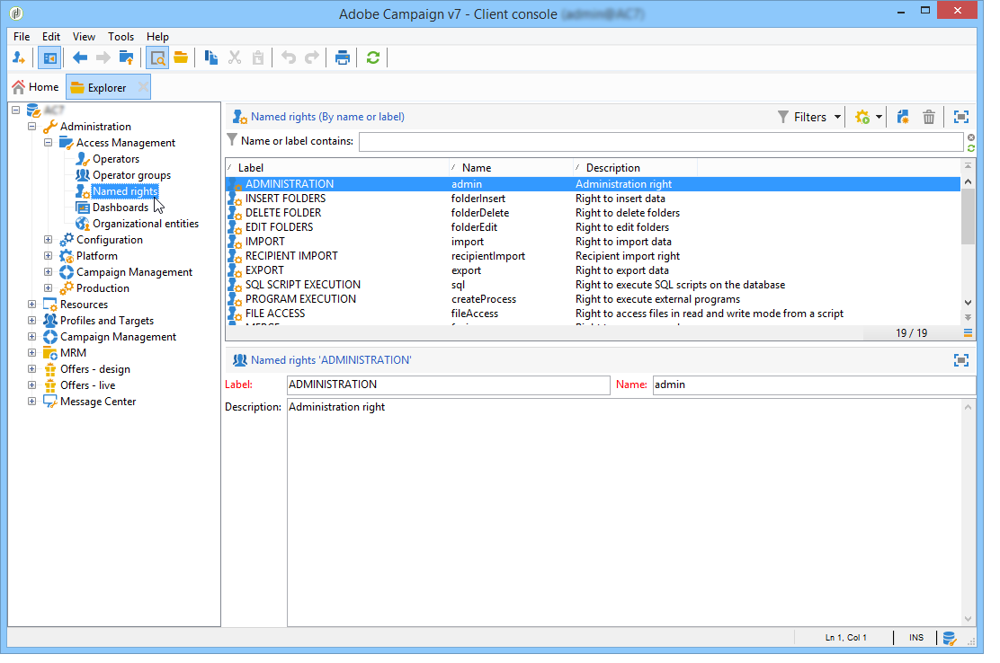

# Usar direitos nomeados para configurar permissões{#named-rights}

Por padrão, o Adobe Campaign propõe um conjunto de direitos nomeados que permitem definir as autorizações atribuídas aos operadores e grupos de operadores. Esses direitos podem ser editados no nó **[!UICONTROL Administration > Access management > Named rights]** da árvore.

Esses direitos são os seguintes:

* **[!UICONTROL ADMINISTRATION]**: operadores com o direito **[!UICONTROL ADMINISTRATION]** têm acesso total na instância. Os usuários administradores podem executar/criar/editar/excluir qualquer objeto, como fluxo de trabalho, entrega, scripts etc.

  >[!IMPORTANT]
  >
  >**Depois de migrar para o IMS:** depois de migrar para o Adobe Identity Management System (IMS), qualquer perfil de produto ou direito nomeado que contenha a palavra “admin” em seu nome (como “admins”, “administradores”, “administrador”, “administradoras” etc.) concederá automaticamente o acesso ao Painel de controle do Campaign. Recomendamos evitar o uso de “admin” em nomes de direitos nomeados ou funções, a menos que você pretenda que esses usuários tenham acesso ao Painel de controle do Campaign. Saiba mais sobre [migração do IMS](../../technotes/using/migrate-users-to-ims.md) e [gerenciamento do acesso ao Painel de controle](https://experienceleague.adobe.com/docs/control-panel/using/discover-control-panel/managing-permissions.html?lang=pt-BR){target="_blank"}.

* **[!UICONTROL APPROVAL ADMINISTRATION]**: é possível definir várias etapas de aprovação em fluxos de trabalho e entregas para garantir que o estado atual tenha sido aprovado por um operador ou grupo atribuído. Os usuários com o direito **[!UICONTROL APPROVAL ADMINISTRATION]** podem definir etapas de aprovação e também atribuir um operador ou grupo de operadores que devem aprovar essas etapas.

  >[!IMPORTANT]
  >
  >**Após migrar para o IMS:** perfis de produto ou direitos nomeados que contenham a palavra “admin” (como “Administrador de aprovação”) concederão acesso ao Painel de controle do Campaign. Saiba mais sobre [migração do IMS](../../technotes/using/migrate-users-to-ims.md) e [gerenciamento do acesso ao Painel de controle](https://experienceleague.adobe.com/docs/control-panel/using/discover-control-panel/managing-permissions.html?lang=pt-BR){target="_blank"}.

* **[!UICONTROL CENTRAL]**: direito de gerenciamento central (marketing distribuído).

* **[!UICONTROL DELETE FOLDER]**: direito de excluir pastas. Com esse direito, os usuários podem excluir pastas da visualização do explorer.

* **[!UICONTROL EDIT FOLDERS]**: direito de alterar as propriedades da pasta, como nome interno, rótulo, imagem associada, pedido de subpastas etc.

* **[!UICONTROL EXPORT]**: os usuários podem exportar dados de suas instâncias do Adobe Campaign para um arquivo no servidor ou computador local usando a atividade de fluxo de trabalho **[!UICONTROL EXPORT]**.

* **[!UICONTROL FILES ACCESS]**: direito de ler e gravar o acesso de arquivos por meio de um script que pode ser gravado na atividade de fluxo de trabalho **[!UICONTROL JavaScript]** para arquivos de leitura/gravação em um servidor.

* **[!UICONTROL IMPORT]**: direito de importação de dados genéricos. **[!UICONTROL IMPORT]** permite importar dados para qualquer outra tabela, enquanto o direito **[!UICONTROL RECIPIENT IMPORT]** permite importar somente para a tabela do destinatário.

* **[!UICONTROL INSERT FOLDERS]**: direito de inserir pastas. Os usuários com o direito **[!UICONTROL INSERT FOLDERS]** podem criar novas pastas na árvore de pastas na visualização do explorer.

* **[!UICONTROL LOCAL]**: direito para gerenciamento local (marketing distribuído).

* **[!UICONTROL MERGE]**: direito de mesclar os registros selecionados em um. Se houver destinatários duplicados, o direito **[!UICONTROL MERGE]** permitirá que o usuário selecione os duplicados e os mescle em um destinatário primário.

* **[!UICONTROL PREPARE DELIVERIES]**: direito de criar, editar e salvar uma entrega. Os usuários com o direito **[!UICONTROL PREPARE DELIVERIES]** também podem iniciar o processo de análise da entrega.

* **[!UICONTROL PRIVACY DATA RIGHT]**: direito de coletar e excluir dados de privacidade. Para obter mais informações, consulte esta [página](https://helpx.adobe.com/br/campaign/kb/acc-privacy.html).

* **[!UICONTROL PROGRAM EXECUTION]**: direito de executar comandos em várias linguagens de programação.

* **[!UICONTROL RECIPIENT IMPORT]**: direito de importar destinatários. Os usuários com o direito **[!UICONTROL RECIPIENT IMPORT]** podem importar um arquivo local para a tabela do destinatário.

* **[!UICONTROL SQL SCRIPT EXECUTION]** Direito de executar qualquer comando SQL diretamente no banco de dados.

* **[!UICONTROL START DELIVERIES]**: Direito de aprovar entregas anteriormente analisadas. Após a análise, a entrega pausará em várias etapas de aprovação e precisará ser aprovada para retomar. Os usuários com o direito **[!UICONTROL START DELIVERIES]** podem aprovar entregas.

* **[!UICONTROL USE SQL DATA MANAGEMENT ACTIVITY]**: direito de escrever seus próprios scripts SQL com a atividade de gerenciamento de dados SQL para criar e preencher tabelas de trabalho. Consulte a [documentação do Campaign v8](https://experienceleague.adobe.com/docs/campaign/automation/workflows/wf-activities/action-activities/sql-data-management.html?lang=pt-BR){target="_blank"}.

* **[!UICONTROL WORKFLOW]**: direito de executar fluxos de trabalho. Sem esse direito, os usuários não podem iniciar, parar ou reiniciar fluxos de trabalho.

* **[!UICONTROL WEBAPP]**: direito de usar aplicações web.

>[!NOTE]
>
>Essa lista pode variar dependendo dos complementos instalados na plataforma.

## Acessar matriz de direitos {#access-rights-matrix}

Os grupos padrão e os direitos nomeados permitem que os operadores acessem determinadas pastas na hierarquia de navegação e concedam permissões de leitura, gravação e exclusão.

A matriz de direitos de acesso do Adobe Campaign está disponível [aqui](/help/platform/using/assets/access-rights-matrix.pdf).

