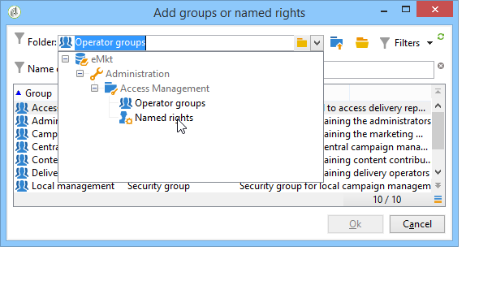
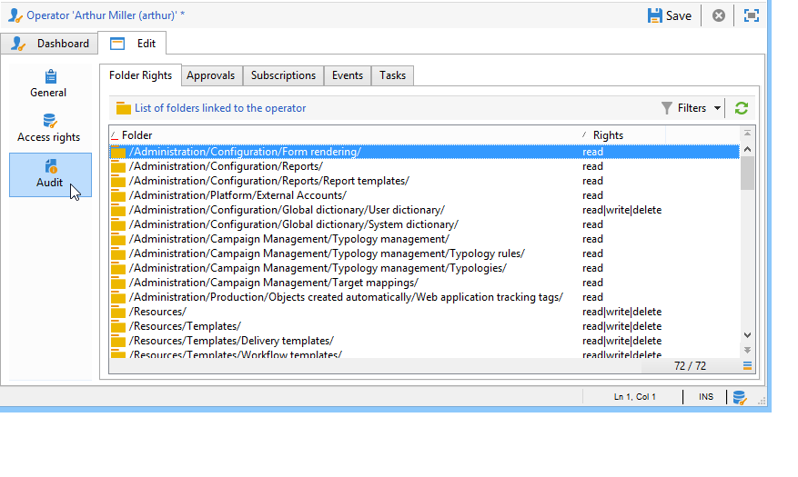
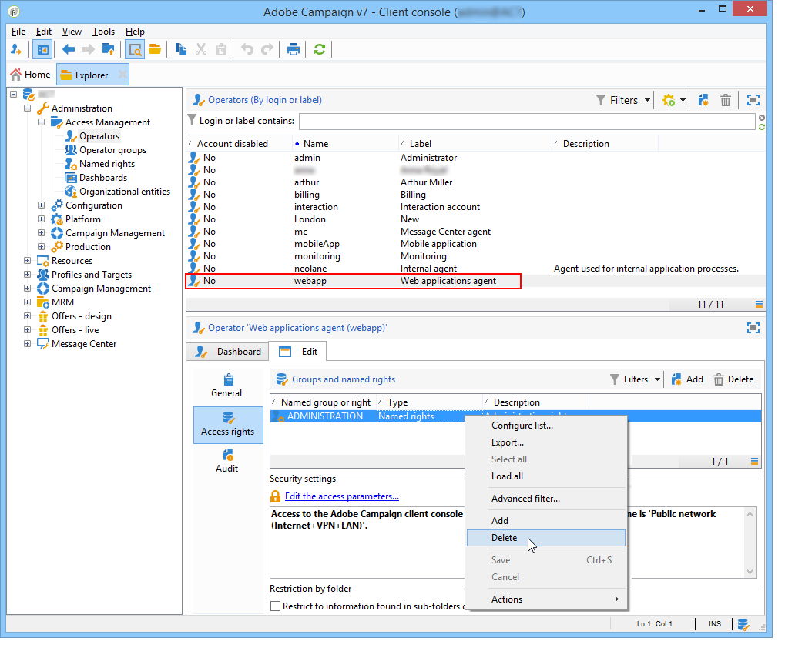
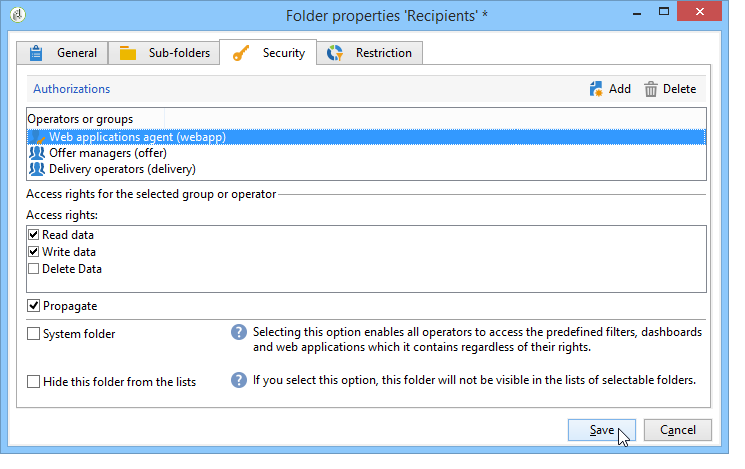

# Criar e gerenciar operadores {#operators}

## Introdução aos operadores do Campaign  {#about-operators}

Um operador é um usuário do Adobe Campaign que tem permissões para fazer o login e executar ações.

Por padrão, os operadores são armazenados no nó **[!UICONTROL Administration > Access management > Operators]**.

Os operadores podem ser criados manualmente ou mapeados em um diretório LDAP existente.

O procedimento completo para criar um operador é descrito [nesta página](#creating-an-operator).

Para obter mais informações sobre o Adobe Campaign e a integração de LDAP, consulte [esta página](../../installation/using/connecting-through-ldap.md).

>[!IMPORTANT]
>
>Os operadores devem ser vinculados a uma zona de segurança para fazer logon em uma instância. Para obter mais informações sobre as zonas de segurança do Adobe Campaign, consulte [esta página](../../installation/using/security-zones.md).

Usuários podem se conectar ao Adobe Campaign usando a Adobe ID. Para obter mais informações, consulte esta [página](../../integrations/using/about-adobe-id.md).

## Criar um operador {#creating-an-operator}

Para criar um novo operador e conceder permissões, siga as etapas abaixo:

1. Clique no botão **[!UICONTROL New]** acima da lista de operadores e insira os detalhes do novo operador.

   

1. Especifique os **[!UICONTROL Identification parameters]** do usuário: o login, a senha e o nome. O login e a senha serão usados pelo operador para se conectar ao Adobe Campaign. Após se conectar, o usuário poderá alterar a senha no menu **[!UICONTROL Tools > Change password]**. O e-mail do operador é essencial, pois permite que o operador receba notificações, por exemplo, ao processar aprovações.

   Esta seção também permite vincular um operador a uma entidade organizacional. Para obter mais informações, consulte [esta página](../../distributed/using/about-distributed-marketing.md).

1. Selecione as permissões concedidas ao operador na seção **[!UICONTROL Operator access rights]**.

   Para atribuir direitos ao operador, clique no botão **[!UICONTROL Add]** localizado acima da lista de direitos, e depois selecione um grupo de operadores na lista de grupos disponíveis:

   

   Também é possível selecionar um ou mais direitos nomeados (consulte [Direitos nomeados](#named-rights)). Para fazer isso, clique na seta à direita do campo **[!UICONTROL Folder]** e selecione **[!UICONTROL Named rights]**:

   

   Selecione grupos e/ou direitos nomeados a serem atribuídos e clique em **[!UICONTROL OK]** para validar.

1. Clique em **[!UICONTROL Ok]** para criar o operador: o perfil é adicionado à lista de operadores existentes.

   

>[!NOTE]
>
>Você pode organizar os operadores de acordo com suas necessidades criando novas pastas de operadores. Para fazer isso, clique com o botão direito do mouse na pasta de operadores e selecione **[!UICONTROL Add an 'Operators' folder]**.

Após criar o perfil do operador, você pode adicionar ou atualizar suas informações. Para fazer isso, clique na guia **[!UICONTROL Edit]**.

>[!NOTE]
>
>O campo **[!UICONTROL Session timeout]** permite ajustar o atraso antes do tempo limite da sessão FDA. Para obter mais informações, consulte [Sobre o Federated Data Access](../../installation/using/about-fda.md).

## Definir o fuso horário do operador {#time-zone-of-the-operator}

Na guia **[!UICONTROL General]**, é possível selecionar o fuso horário do operador. Por padrão, os operadores trabalham no fuso horário do servidor. No entanto, é possível selecionar outro fuso horário usando a lista suspensa.

A configuração de fusos horários é descrita [nesta página](../../installation/using/time-zone-management.md).

>[!NOTE]
>
>Colaborações em diferentes fusos horários exigem o armazenamento de datas em formato UTC. As datas são convertidas no fuso horário apropriado nos seguintes contextos: quando uma data é exibida no fuso horário do usuário, quando os arquivos são importados e exportados, quando um delivery de e-mail é agendado, quando as atividades são agendadas em um workflow (agendador, espera, restrição de tempo e etc.)
>
>Restrições e recomendações vinculadas a esses contextos são apresentadas nas seções relacionadas da documentação do Adobe Campaign.

Além disso, a lista suspensa **[!UICONTROL Regional settings]** permite selecionar o formato para exibir datas e números.

## Adicionar permissões {#access-rights-options}

Use a guia **[!UICONTROL Access rights]** para atualizar os grupos e os direitos nomeados vinculados ao operador.

O link **[!UICONTROL Edit the access parameters...]** permite acessar as seguintes opções:

* A opção **[!UICONTROL Disable account]** permite desabilitar a conta do operador: esse usuário não acessará mais o Adobe Campaign.

   >[!NOTE]
   >
   >Mesmo que a conta esteja desativada, o operador ainda poderá receber alertas ou notificações do Campaign. Para interromper o envio de notificações do Campaign a esse operador, a Adobe recomenda remover o endereço de email do perfil.

* A opção **[!UICONTROL Forbid access from the rich client]** permite restringir o uso do Adobe Campaign para [acesso à Web](../../platform/using/adobe-campaign-workspace.md#console-and-web-access) ou por meio de APIs: o acesso ao console do cliente Adobe Campaign não está mais disponível.
* É possível vincular uma zona de segurança ao operador. Para obter mais informações, consulte [esta página](../../installation/using/security-zones.md).
* Também é possível definir uma máscara IP confiável usando o link apropriado.

   O operador poderá se conectar ao Adobe Campaign sem inserir a senha se o endereço IP estiver nessa lista.

   Você também pode especificar um conjunto de endereços IP que serão autorizados a se conectar sem uma senha, como no exemplo a seguir:

   

   >[!NOTE]
   >
   >Para manter seguro o acesso à sua plataforma, essa opção deve ser usada com cuidado.

* A opção **[!UICONTROL Restrict to information found in sub-folders of:]** permite limitar os direitos atribuídos ao operador de uma pasta. Somente as subpastas do nó especificado nessa opção estarão visíveis para o usuário:

   

   >[!IMPORTANT]
   >
   >Essa é uma restrição muito rígida e deve ser usada com cuidado. Um operador conectado com este tipo de direito pode ver SOMENTE o conteúdo da pasta especificada e não tem acesso a nenhum outro nó da árvore por meio do explorador. No entanto, dependendo das funcionalidades as quais esse operador tem acesso (por exemplo: fluxos de trabalho), o usuário pode exibir dados que normalmente são armazenados em nós que não estão acessíveis.

### Verificar configurações {#check-settings}

A guia **[!UICONTROL Audit]** permite visualizar informações relacionadas ao operador. As várias guias são adicionadas automaticamente com base nas configurações definidas na área de intervenção do operador.

Você pode acessar:

* A lista de direitos nas pastas vinculadas ao operador.

   

   >[!NOTE]
   >
   >Para obter mais informações, consulte [Gerenciamento de acesso a pastas](#folder-access-management).

* O log de aprovações do operador.

   

* A lista de fóruns de discussão que eles assinaram.
* Eventos em seu calendário.
* A lista de tarefas atribuídas a eles.

## Operadores padrão {#default-operators}

O Adobe Campaign usa operadores técnicos com perfis configurados por padrão: administrador (&quot;admin&quot;), faturamento (&quot;billing&quot;), monitoramento, agente de aplicação web (&quot;webapp&quot;) etc. Alguns deles dependem dos aplicativos e opções instalados na plataforma: os operadores &quot;central&quot; e &quot;local&quot;, por exemplo, só estarão visíveis se a opção &quot;Distributed Marketing&quot; estiver instalada.

>[!IMPORTANT]
>
>Esses operadores técnicos são notificados por padrão quando as mensagens de informação são devolvidas pela plataforma. É altamente recomendável fornecer um e-mail de contato para eles.
>
>Para garantir que os aplicativos Web funcionem corretamente, também recomendamos não definir configurações regionais específicas para o operador &#39;webapp&#39;.

Por padrão, o operador técnico &#39;webapp&#39; tem o direito nomeado ADMINISTRATION, que pode levar a riscos de segurança. Para corrigir esse problema, recomendamos remover esse direito. Para fazer isso:

1. No nó **[!UICONTROL Administration > Access management > Named rights]**, clique em **[!UICONTROL New]** para criar um direito e nomeá-lo como WEBAPP.

   

   Os direitos nomeados são detalhados na seção [Direitos nomeados](#named-rights).

1. No nó **[!UICONTROL Administration > Access management > Operators]**, selecione o operador de agente de aplicações Web (&quot;webapp&quot;).

   Selecione a guia **[!UICONTROL Edit]** e depois a guia **[!UICONTROL Access rights]** e exclua o direito nomeado ADMINISTRATION da lista.

   

   Clique em **[!UICONTROL Add]**, selecione o direito WEBAPP recém-criado e salve as alterações.

   

1. Atribua ao operador “webapp” direitos de acesso para leitura e gravação de dados nas pastas que dizem respeito a esse operador, que são principalmente as pastas “Recipient”.

   

   A modificação de direitos em pastas de árvore é detalhada na seção [Gerenciamento de acesso a pastas](#folder-access-management).

>[!NOTE]
>
>Para obter mais informações sobre Diretrizes de segurança, consulte a [lista de verificação de configuração do Adobe Campaign Security](https://helpx.adobe.com/br/campaign/kb/acc-security.html).
