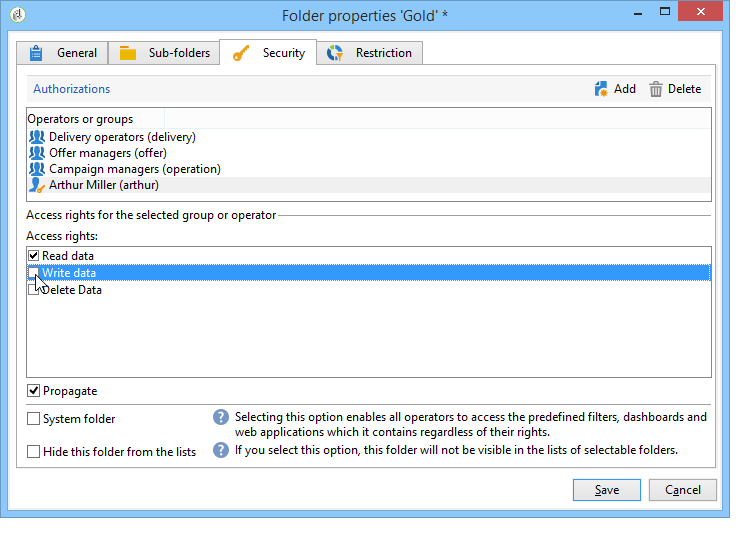
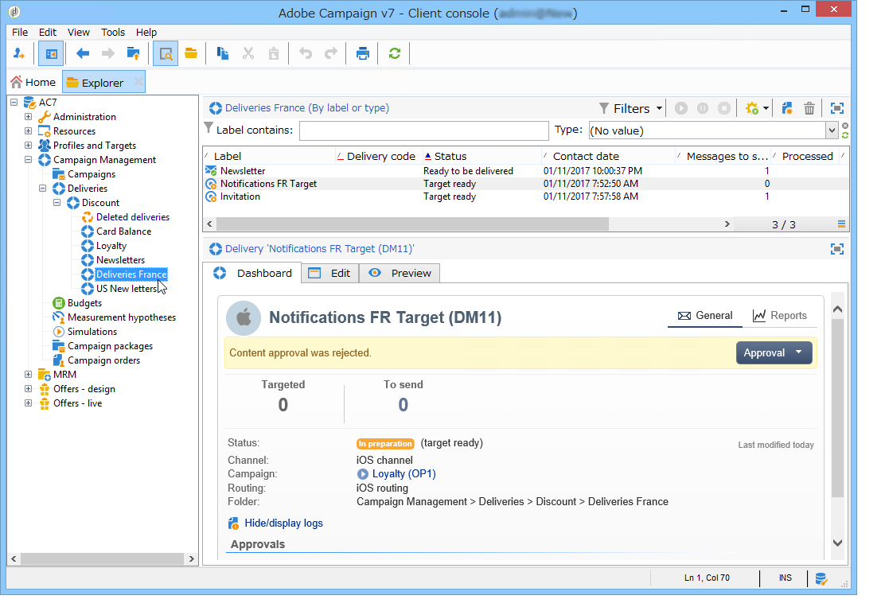

# Gerenciamento de acesso{#access-management}

## Sobre permissões {#about-permissions}

O Adobe Campaign permite definir e gerenciar os direitos atribuídos aos diversos operadores. Veja um conjunto de direitos e restrições que autorizam ou negam:

* Acesso a certas funcionalidades (por meio dos direitos nomeados),
* Acesso a certos registros,
* Criação, modificação e/ou exclusão de registros (ações, contatos, campanhas, grupos, etc.).

As permissões se aplicam a perfis ou grupos de operadores.

Os perfis são preenchidos por parâmetros de segurança vinculados ao modo de conexão do operador para o Adobe Campaign. Para obter mais informações, consulte [esta página](../../installation/using/configuring-campaign-server.md#defining-security-zones).

Há dois tipos de permissões que você pode conceder a um usuário:

* Você pode definir grupos de operadores para atribuir direitos e, em seguida, associar os operadores a um ou mais grupos. Isso permite que você reutilize os direitos e torne os perfis de operadores mais consistentes. Também facilita o gerenciamento e a manutenção de perfis. A criação e o gerenciamento de grupos são apresentados em [Operator groups](#operator-groups).
* Você pode atribuir direitos nomeados diretamente aos usuários, em alguns casos para sobrecarregar os direitos alocados por meio de grupos. Esses direitos são apresentados em [Named rights](#named-rights).

>[!NOTE]
>
>Antes de começar a definir as permissões, a Adobe recomenda que você leia a [Lista de verificação de configuração de segurança](https://helpx.adobe.com/br/campaign/kb/acc-security.html).

## Operadores {#operators}

### Sobre operadores {#about-operators}

Um operador é um usuário do Adobe Campaign que tem permissões para fazer o login e executar ações.

Por padrão, os operadores são armazenados no nó **[!UICONTROL Administration > Access management > Operators]**.

Os operadores podem ser criados manualmente ou mapeados em um diretório LDAP existente.

O procedimento completo para criar um operador é descrito [nesta página](#creating-an-operator).

Para obter mais informações sobre o Adobe Campaign e a integração de LDAP, consulte [esta página](../../installation/using/connecting-through-ldap.md).

>[!IMPORTANT]
>
>Os operadores devem ser vinculados a uma zona de segurança para fazer logon em uma instância. Para obter mais informações sobre as zonas de segurança do Adobe Campaign, consulte [esta página](../../installation/using/configuring-campaign-server.md#defining-security-zones).

Usuários podem se conectar ao Adobe Campaign usando a Adobe ID. Para obter mais informações, consulte esta [página](../../integrations/using/about-adobe-id.md).

### Criação de um operador {#creating-an-operator}

Para criar um novo operador e conceder permissões, siga as etapas abaixo:

1. Clique no botão **[!UICONTROL New]** acima da lista de operadores e insira os detalhes do novo operador.

   

1. Especifique os **[!UICONTROL Identification parameters]** do usuário: o login, a senha e o nome. O login e a senha serão usados pelo operador para se conectar ao Adobe Campaign. Após se conectar, o usuário poderá alterar a senha no menu **[!UICONTROL Tools > Change password]**. O e-mail do operador é essencial, pois permite que o operador receba notificações, por exemplo, ao processar aprovações.

   Esta seção também permite vincular um operador a uma entidade organizacional. Para obter mais informações, consulte [esta página](../../campaign/using/about-distributed-marketing.md).

1. Selecione as permissões concedidas ao operador na seção **[!UICONTROL Operator access rights]**.

   Para atribuir direitos ao operador, clique no botão **[!UICONTROL Add]** localizado acima da lista de direitos, e depois selecione um grupo de operadores na lista de grupos disponíveis:

   

   Também é possível selecionar um ou mais direitos nomeados (consulte [Direitos nomeados](#named-rights)). Para fazer isso, clique na seta à direita do campo **[!UICONTROL Folder]** e selecione **[!UICONTROL Named rights]**:

   

   Selecione grupos e/ou direitos nomeados a serem atribuídos e clique em **[!UICONTROL OK]** para validar.

1. Clique em **[!UICONTROL Ok]** para criar o operador: o perfil é adicionado à lista de operadores existentes.

   

>[!NOTE]
>
>Você pode organizar os operadores de acordo com suas necessidades criando novas pastas de operadores. Para fazer isso, clique com o botão direito do mouse na pasta de operadores e selecione **[!UICONTROL Add an 'Operators' folder]**.

Após criar o perfil do operador, você pode adicionar ou atualizar suas informações. Para fazer isso, clique na guia **[!UICONTROL Edit]**.

>[!NOTE]
>
>O campo **[!UICONTROL Session timeout]** permite ajustar o atraso antes do tempo limite da sessão FDA. Para obter mais informações, consulte [Sobre Federated Data Access](../../platform/using/about-fda.md).

### Fuso horário do operador {#time-zone-of-the-operator}

Na guia **[!UICONTROL General]**, é possível selecionar o fuso horário do operador. Por padrão, os operadores trabalham no fuso horário do servidor. No entanto, é possível selecionar outro fuso horário usando a lista suspensa.

A configuração de fusos horários é descrita [nesta página](../../installation/using/time-zone-management.md).

>[!NOTE]
>
>Colaborações em diferentes fusos horários exigem o armazenamento de datas em formato UTC. As datas são convertidas no fuso horário apropriado nos seguintes contextos: quando uma data é exibida no fuso horário do usuário, quando os arquivos são importados e exportados, quando um delivery de e-mail é agendado, quando as atividades são agendadas em um workflow (agendador, espera, restrição de tempo e etc.)
>
>Restrições e recomendações vinculadas a esses contextos são apresentadas nas seções relacionadas da documentação do Adobe Campaign.

Além disso, a lista suspensa **[!UICONTROL Regional settings]** permite selecionar o formato para exibir datas e números.

### Opções de direitos de acesso {#access-rights-options}

Use a guia **[!UICONTROL Access rights]** para atualizar os grupos e os direitos nomeados vinculados ao operador.

O link **[!UICONTROL Edit the access parameters...]** permite acessar as seguintes opções:

* A opção **[!UICONTROL Disable account]** permite desabilitar a conta do operador: ele não acessará mais o Adobe Campaign.
* A opção **[!UICONTROL Forbid access from the rich client]** permite restringir o uso do Adobe Campaign para [acesso à Web](../../platform/using/adobe-campaign-workspace.md#console-and-web-access) ou por meio de APIs: o acesso ao console do cliente Adobe Campaign não está mais disponível.
* É possível vincular uma zona de segurança ao operador. Para obter mais informações, consulte [esta página](../../installation/using/configuring-campaign-server.md#defining-security-zones).
* Também é possível definir uma máscara IP confiável usando o link apropriado.

   O operador poderá se conectar ao Adobe Campaign sem inserir a senha se o endereço IP estiver nessa lista.

   Você também pode especificar um conjunto de endereços IP que serão autorizados a se conectar sem uma senha, como no exemplo a seguir:

   

   >[!NOTE]
   >
   >Para manter seguro o acesso à sua plataforma, essa opção deve ser usada com cuidado.

* A opção **[!UICONTROL Restrict to information found in sub-folders of:]** permite limitar os direitos atribuídos ao operador de uma pasta. Somente as subpastas do nó especificado nessa opção estarão visíveis para o usuário:

   

   >[!IMPORTANT]
   >
   >Essa é uma restrição muito rígida e deve ser usada com cuidado. Um operador conectado com este tipo de direito pode ver SOMENTE o conteúdo da pasta especificada e não tem acesso a nenhum outro nó da árvore por meio do explorador. No entanto, dependendo das funcionalidades que ele tem acesso (por exemplo: workflows), é possível exibir dados que normalmente são armazenados em nós que não podem ser vistos.

### Pastas, aprovação e tarefas de um operador {#folders--approval-and-tasks-of-an-operator}

A guia **[!UICONTROL Audit]** permite visualizar informações relacionadas ao operador. As várias guias são adicionadas automaticamente com base nas configurações definidas na área de intervenção do operador.

Você pode acessar:

* A lista de direitos nas pastas vinculadas ao operador.

   

   >[!NOTE]
   >
   >Para obter mais informações, consulte [Gerenciamento de acesso a pastas](#folder-access-management).

* O log de aprovações do operador.

   

* A lista de fóruns de discussão que eles assinaram.
* Eventos em seu calendário.
* A lista de tarefas atribuídas a eles.

### Operadores padrão {#default-operators}

O Adobe Campaign usa operadores técnicos com perfis configurados por padrão: administrador (&quot;admin&quot;), faturamento (&quot;billing&quot;), monitoramento, agente de aplicação web (&quot;webapp&quot;) etc. Alguns deles dependem dos aplicativos e opções instalados na plataforma: os operadores &quot;central&quot; e &quot;local&quot;, por exemplo, só estarão visíveis se a opção &quot;Distributed Marketing&quot; estiver instalada.

>[!IMPORTANT]
>
>Esses operadores técnicos são notificados por padrão quando as mensagens de informação são devolvidas pela plataforma. É altamente recomendável fornecer um e-mail de contato para eles.
>
>Para garantir que os aplicativos Web funcionem corretamente, também recomendamos não definir configurações regionais específicas para o operador &#39;webapp&#39;.

Por padrão, o operador técnico &#39;webapp&#39; tem o direito nomeado ADMINISTRATION, que pode levar a riscos de segurança. Para corrigir esse problema, recomendamos remover esse direito. Para fazer isso:

1. No nó **[!UICONTROL Administration > Access management > Named rights]**, clique em **[!UICONTROL New]** para criar um direito e nomeá-lo como WEBAPP.

   

   Os direitos nomeados são detalhados na seção [Direitos nomeados](#named-rights).

1. No nó **[!UICONTROL Administration > Access management > Operators]**, selecione o operador de agente de aplicações Web (&quot;webapp&quot;).

   Selecione a guia **[!UICONTROL Edit]** e depois a guia **[!UICONTROL Access rights]** e exclua o direito nomeado ADMINISTRATION da lista.

   

   Clique em **[!UICONTROL Add]**, selecione o direito WEBAPP recém-criado e salve as alterações.

   

1. Atribua ao operador “webapp” direitos de acesso para leitura e gravação de dados nas pastas que dizem respeito a esse operador, que são principalmente as pastas “Recipient”.

   

   A modificação de direitos em pastas de árvore é detalhada na seção [Gerenciamento de acesso a pastas](#folder-access-management).

>[!NOTE]
>
>Para obter mais informações sobre Diretrizes de segurança, consulte a [lista de verificação de configuração do Adobe Campaign Security](https://helpx.adobe.com/br/campaign/kb/acc-security.html).

## Grupos de operadores {#operator-groups}

Os grupos de operadores são criados por meio do nó **[!UICONTROL Administration > Access management > Operator groups]** na árvore.

### Criação de um novo grupo de operadores {#creating-a-new-operator-group}

Para criar um novo grupo de operadores, siga as etapas abaixo:

1. Clique no botão **[!UICONTROL New]** à direita da lista de grupos ou clique com o botão direito do mouse na lista e escolha **[!UICONTROL New]**.
1. Na janela inferior da seção, na guia **[!UICONTROL General]**, digite o nome e uma descrição para esse grupo nos campos correspondentes.

   

1. Clique na guia **[!UICONTROL Content]** para definir autorizações para esse grupo.
1. Clique no botão **[!UICONTROL Add]** para selecionar um direito designado ou um operador para associar ao grupo.
1. Clique na lista suspensa ou na pasta à direita do campo **[!UICONTROL Folder]** para localizar os direitos ou operadores designados para associar a esse grupo.
1. Selecione os direitos ou operadores a serem adicionados e clique em **[!UICONTROL OK]** para validar.

   

   Repita essa operação para adicionar outros direitos ou operadores.

1. Clique no botão **[!UICONTROL Save]** para adicionar o grupo à lista.

### Grupos padrão {#default-groups}

Os grupos de operadores padrão são:

1. **[!UICONTROL Administrator]**

   Os operadores neste grupo têm acesso total à instância. Administradores são usuários que podem acessar as partes mais técnicas da interface. Eles assumem a **[!UICONTROL Administration]** função e garantem que a plataforma esteja configurada.

   Este grupo contém o seguinte direito nomeado:

   * **[!UICONTROL ADMINISTRATION]**: direito de executar/criar/editar/excluir qualquer objeto, como fluxo de trabalho, delivery, scripts etc.

1. **[!UICONTROL Delivery operators]**

   Os operadores nesse grupo são responsáveis pelo gerenciamento de deliveries: eles permitem o acesso aos principais recursos necessários para a criação e preparação de deliveries (tipologias de campanha, mapeamentos de delivery, templates padrão, blocos de personalização, etc.).

   Esse grupo contém os seguintes direitos nomeados:

   * **[!UICONTROL PREPARE DELIVERIES]**: direito de criar, editar e iniciar a análise de delivery,
   * **[!UICONTROL START DELIVERIES]**: direito de aprovar delivery previamente analisados.

1. **[!UICONTROL Campaign managers]**

   Os operadores nesse grupo podem gerenciar campanhas de marketing: isso permite acessar os objetos vinculados às campanhas (planos, programas, workflows, orçamentos, etc.) no âmbito do **[!UICONTROL Campaign]** (módulo Adobe Campaign opcional).

   Esse grupo contém os seguintes direitos nomeados:

   * **[!UICONTROL INSERT FOLDERS]**: direito de inserir pastas à árvore do Adobe Campaign (se você tiver o direito de editar ramificações),
   * **[!UICONTROL WORKFLOW]**: direito de usar workflows.

   >[!NOTE]
   >
   >Esse grupo não permite que os operadores iniciem deliveries.

1. **[!UICONTROL Content contributors]**

   The operators in this group can access the Content folders, within the framework of **[!UICONTROL Content management]** (optional Adobe Campaign module). Esse grupo não concede direitos adicionais.

1. **[!UICONTROL Access to reports]**

   Esse grupo é reservado para operadores externos, para acessar os relatórios do delivery por meio de um acesso à Web.

1. **[!UICONTROL Workflow execution]**

   Esse grupo permite atribuir aos operadores o direito de gerenciar workflows que não estão relacionados a campanhas.

1. **[!UICONTROL Workflow supervisors]**

   Os operadores nesse grupo recebem uma notificação por e-mail no caso de alertas relativos aos workflows da campanha.

1. Gerenciamento local / central

   These groups let you use **[!UICONTROL Distributed marketing]** (optional Adobe Campaign module).

1. **[!UICONTROL Offer managers]**

   Os operadores neste grupo podem criar e manter ofertas. Para obter mais informações sobre essas operações, consulte esta [página](../../interaction/using/operator-profiles.md).
Esse grupo contém os seguintes direitos nomeados:

   * **[!UICONTROL INSERT FOLDERS]**: direito de inserir pastas à árvore do Adobe Campaign (se você tiver o direito de editar ramificações),
   * **[!UICONTROL EDIT FOLDERS]**: direito de alterar as propriedades da pasta, como nome interno, rótulo, imagem associada, pedido de subpastas etc.

## Direitos nomeados {#named-rights}

Por padrão, o Adobe Campaign propõe um conjunto de direitos nomeados que permitem definir as autorizações atribuídas aos operadores e grupos de operadores. Esses direitos podem ser editados no nó **[!UICONTROL Administration > Access management > Named rights]** da árvore.

Esses direitos são os seguintes:

* **[!UICONTROL ADMINISTRATION]**: operadores com o direito **[!UICONTROL ADMINISTRATION]** têm acesso total na instância. Os usuários administradores podem executar/criar/editar/excluir qualquer objeto, como workflow, delivery, scripts etc.

* **[!UICONTROL APPROVAL ADMINISTRATION]**: é possível definir várias etapas de aprovação em workflows e deliveries para garantir que o estado atual tenha sido aprovado por um operador ou grupo atribuído. Os usuários com o direito **[!UICONTROL APPROVAL ADMINISTRATION]** podem definir etapas de aprovação e também atribuir um operador ou grupo de operadores que devem aprovar essas etapas.

* **[!UICONTROL CENTRAL]**: direito de gerenciamento central (marketing distribuído).

* **[!UICONTROL DELETE FOLDER]**: direito de excluir pastas. Com esse direito, os usuários podem excluir pastas da visualização do explorador.

* **[!UICONTROL EDIT FOLDERS]**: direito de alterar as propriedades da pasta, como nome interno, rótulo, imagem associada, pedido de subpastas etc.

* **[!UICONTROL EXPORT]**: os usuários podem exportar dados de suas instâncias do Adobe Campaign para um arquivo no servidor ou computador local usando a atividade de workflow **[!UICONTROL EXPORT]**.

* **[!UICONTROL FILES ACCESS]**: direito de ler e gravar o acesso de arquivos por meio de um script que pode ser gravado na atividade de workflow **[!UICONTROL JavaScript]** para arquivos de leitura/gravação em um servidor.

* **[!UICONTROL IMPORT]**: direito de importação de dados genéricos. **[!UICONTROL IMPORT]** permite importar dados para qualquer outra tabela, enquanto o direito **[!UICONTROL RECIPIENT IMPORT]** permite importar somente para a tabela do recipient.

* **[!UICONTROL INSERT FOLDERS]**: direito de inserir pastas. Os usuários com o direito **[!UICONTROL INSERT FOLDERS]** podem criar novas pastas na árvore de pastas na visualização do explorador.

* **[!UICONTROL LOCAL]**: direito para gerenciamento local (marketing distribuído).

* **[!UICONTROL MERGE]**: direito de unir os registros selecionados em um. Se houver recipients duplicados, o direito **[!UICONTROL MERGE]** permitirá que o usuário selecione os duplicados e os mescle em um recipient primário.

* **[!UICONTROL PREPARE DELIVERIES]**: direito de criar, editar e salvar um delivery. Os usuários com o direito **[!UICONTROL PREPARE DELIVERIES]** também podem iniciar o processo de análise do delivery.

* **[!UICONTROL PRIVACY DATA RIGHT]**: direito de coletar e excluir dados de privacidade. Para obter mais informações, consulte esta [página](https://helpx.adobe.com/br/campaign/kb/acc-privacy.html).

* **[!UICONTROL PROGRAM EXECUTION]**: direito de executar comandos em várias linguagens de programação.

* **[!UICONTROL RECIPIENT IMPORT]**: direito de importar recipients. Os usuários com o direito **[!UICONTROL RECIPIENT IMPORT]** podem importar um arquivo local para a tabela do recipient.

* **[!UICONTROL SQL SCRIPT EXECUTION]** Direito de executar qualquer comando SQL diretamente no banco de dados.

* **[!UICONTROL START DELIVERIES]**: Direito de aprovar deliveries anteriormente analisados. Após a análise, o delivery pausará em várias etapas de aprovação e precisará ser aprovado para retomar. Os usuários com o direito **[!UICONTROL START DELIVERIES]** podem aprovar deliveries.

* **[!UICONTROL USE SQL DATA MANAGEMENT ACTIVITY]**: direito de escrever seus próprios scripts SQL usando a atividade de gerenciamento de dados SQL, para criar e preencher tabelas de trabalho (consulte [esta seção](../../workflow/using/sql-data-management.md)).

* **[!UICONTROL WORKFLOW]**: direito de executar workflows. Sem esse direito, os usuários não podem iniciar, parar ou reiniciar workflows.

* **[!UICONTROL WEBAPP]**: direito de usar aplicações web.

>[!NOTE]
>
>Essa lista pode variar dependendo dos complementos instalados na plataforma.

## Matriz de direitos de acesso {#access-rights-matrix}

Os grupos padrão e os direitos nomeados permitem que os operadores acessem determinadas pastas na hierarquia de navegação e concedam permissões de leitura, gravação e exclusão.

A matriz de direitos de acesso do Adobe Campaign está disponível [aqui](/help/platform/using/assets/access-rights-matrix.pdf).

## Gerenciamento de acesso a pastas {#folder-access-management}

Cada pasta da árvore tem direitos de acesso de leitura, gravação e exclusão atribuídos a ela. Para acessar um arquivo, um operador ou grupo de operadores deve ter pelo menos acesso de leitura a ele.

### Editar permissões em uma pasta {#edit-permissions-on-a-folder}

Para editar permissões em uma pasta específica da árvore, siga as etapas abaixo:

1. Clique com o botão direito do mouse na pasta e selecione **[!UICONTROL Properties...]**.

   

1. Clique na guia **[!UICONTROL Security]** para visualizar as autorizações nessa pasta.

   

### Modificar permissões {#modify-permissions}

Para modificar permissões, você pode:

* **Substituir um grupo ou um operador**. Para fazer isso, clique em um dos grupos (ou operadores) com direitos à pasta e selecione um novo grupo (ou um novo operador) na lista suspensa:

   

* **Autorizar um grupo ou um operador**. Para fazer isso, clique no botão **[!UICONTROL Add]** e selecione o grupo ou operador ao qual deseja atribuir autorizações para essa pasta.
* **Proibir um grupo ou operador**. Para fazer isso, clique em **[!UICONTROL Delete]** e selecione o grupo ou operador do qual deseja remover a autorização para essa pasta.
* **Selecionar os direitos atribuídos a um grupo ou a um operador**. Para fazer isso, clique no grupo ou operador relacionado, selecione os direitos de acesso que deseja conceder e desmarque os outros.

   

### Propagar permissões {#propagate-permissions}

Você pode propagar autorizações e direitos de acesso. Para fazer isso, selecione a opção **[!UICONTROL Propagate]** nas propriedades da pasta.

As autorizações definidas nessa janela serão aplicadas a todas as subpastas do nó atual. É possível sobrecarregar essas autorizações para cada uma das subpastas.

>[!NOTE]
>
>Limpar essa opção para uma pasta não a limpa automaticamente para as subpastas. Você deve limpá-la explicitamente para cada uma das subpastas.

### Conceder acesso a todos os operadores {#grant-access-to-all-operators}

Na guia **[!UICONTROL Security]**, se a opção **[!UICONTROL System folder]** estiver selecionada, todos os operadores terão acesso a esses dados, independentemente dos direitos. Se essa opção estiver desmarcada, você deverá adicionar explicitamente o operador (ou seu grupo) à lista de autorizações para que ele tenha acesso.

## Pastas e visualizações {#folders-and-views}

### Sobre pastas {#about-folders}

Pastas são nós na árvore do Adobe Campaign. Esses nós são criados clicando com o botão direito do mouse na árvore, por meio do menu **[!UICONTROL Add new folder]**. Por padrão, o primeiro menu permite adicionar a pasta correspondente ao contexto atual.

É possível conceder permissões a essas pastas como em todas as outras pastas da árvore. Consulte [Gerenciamento de acesso a pastas](#folder-access-management).

### Sobre visualizações {#about-views}

Além disso, você pode criar visualizações para restringir o acesso aos dados e organizar o conteúdo da árvore para atender aos seus requisitos. É possível atribuir direitos às visualizações.

Uma visualização é uma pasta que exibe os registros fisicamente armazenados em uma ou mais pastas do mesmo tipo. Por exemplo, se você criar uma pasta do Campaing que seja uma visualização, ela exibirá todas as campanhas presentes no banco de dados por padrão, independente de sua origem. Esses dados podem ser filtrados.

Quando você converte uma pasta em uma visualização, todos os dados correspondentes ao tipo de pasta presentes no banco de dados são exibidos na visualização, independentemente da pasta em que são salvos. É possível filtrar para restringir a lista de dados exibidos.

>[!IMPORTANT]
>
>As visualizações contêm dados e fornecem acesso a eles, mas os dados não são armazenados fisicamente na pasta de visualização. O operador deve ter os direitos apropriados para a ação desejada nas pastas da fonte de dados (acesso de leitura no mínimo).
>
>Para conceder acesso a uma visualização sem conceder acesso à pasta de origem, basta não conceder acesso de leitura no nó pai da pasta de origem.

Para distinguir visualizações de pastas, o nome de cada visualização é exibido em uma cor diferente (ciano escuro).

### Adição de pastas e criação de visualizações {#adding-folders-and-creating-views}

No exemplo abaixo, criaremos novas pastas para exibir dados específicos:

1. Crie uma nova pasta do tipo **[!UICONTROL Deliveries]** e a nomeie como **Deliveries France**.
1. Clique com o botão direito do mouse nessa pasta e selecione **[!UICONTROL Properties...]**.

   

1. Na guia **[!UICONTROL Restriction]**, selecione **[!UICONTROL This folder is a view]**. Todos os deliveries no banco de dados serão exibidos.

   

1. Defina os critérios do filtro de delivery no editor de query na seção intermediária da janela: as campanhas correspondentes ao filtro definido serão exibidas.

   >[!NOTE]
   >
   >O editor de query é apresentado [nesta seção](../../platform/using/about-queries-in-campaign.md).

   Com as seguintes condições de filtro:

Os seguintes deliveries serão exibidos na visualização:

