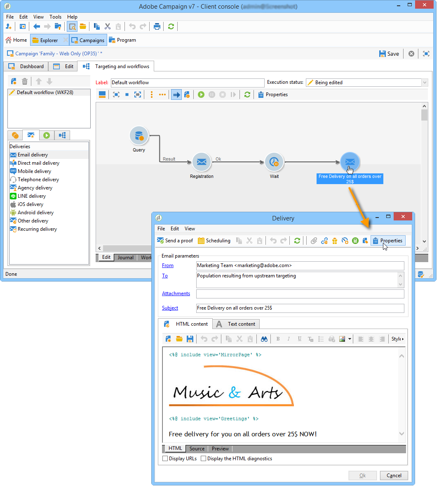
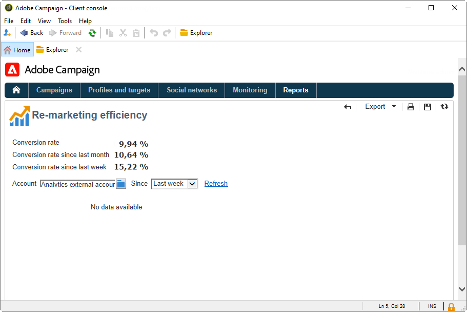

# Adobe Analytics Connector{#adobe-analytics-connector}

## Sobre a integração do Adobe Analytics Connector {#about-analytics-connector-integration}

O Adobe Analytics Connector permite que o Adobe Campaign e o Adobe Analytics interajam por meio do pacote **[!UICONTROL Web Analytics connectors]**. Ele encaminha dados para o Adobe Campaign na forma de segmentos relativos ao comportamento do usuário após uma campanha. Por outro lado, ele envia indicadores e atributos de campanhas de entregues pelo Adobe Campaign ao Adobe Analytics.

>[!CAUTION]
>
>* O Adobe Analytics Connector não é compatível com as mensagens transacionais (Centro de mensagens).
>
>* Antes de iniciar, verifique se o Adobe Identity Management System (IMS) está implementado no Campaign. [Saiba mais nesta página](../../integrations/using/about-adobe-id.md).

Usando o Adobe Analytics Connector, o Adobe Campaign tem uma forma de medir o público-alvo da Internet (Web Analytics). Graças a essas integrações, o Adobe Campaign pode recuperar dados do comportamento do visitante para um ou mais sites, após uma campanha de marketing, e (após a análise) executar campanhas de re-marketing com uma visualização para convertê-los em compradores. Por outro lado, as ferramentas do Web Analytics permitem que o Adobe Campaign encaminhe indicadores e atributos de campanha para suas plataformas.

Os campos de ação para cada ferramenta são os seguintes:

* Função do Web Analytics:

   1. marca as campanhas iniciadas com o Adobe Campaign,
   1. salva o comportamento do destinatário no site navegado depois de clicar na campanha no formato de segmentos. Os segmentos dizem respeito a produtos abandonados (visualizados, mas não adicionados ao carrinho ou comprados), compras ou abandonos de carrinho.

* Função do Adobe Campaign:

   1. envia os indicadores e os atributos da campanha para o conector, que, por sua vez, os encaminha para a ferramenta Web Analytics,
   1. recupera e analisa segmentos,
   1. e dispara uma campanha de re-marketing.

## Configuração da integração {#setting-up-the-integration}

>[!IMPORTANT]
>
> Para implementações híbridas e no local, siga as etapas de provisionamento detalhadas nesta [página](../../platform/using/adobe-analytics-provisioning.md).

Para configurar o Data Connector, você deve se conectar à instância do Adobe Campaign e executar as seguintes operações:

1. [Configurar as variáveis de conversão e os eventos bem-sucedidos](#configure-conversion-success)
1. [Configurar a conta externa no Adobe Campaign Classic](#external-account-classic)

<!--
### Create your Report suite in Adobe Analytics {#report-suite-analytics}

To set up the Adobe Analytics/Adobe Campaign Classic integration, you must connect to your [!DNL Adobe Analytics] instance and perform the following operations:

1. From [!DNL Adobe Analytics], select the **[!UICONTROL Admin tab]** then click **[!UICONTROL All admin]**.

   

1. Click **[!UICONTROL Report suites]**.

   

1. From the **[!UICONTROL Report suite manager]** page, click **[!UICONTROL Create new]** then **[!UICONTROL Report suite]**.

   For the detailed procedure on **[!UICONTROL Report suite]** creation, refer to this [section](https://experienceleague.adobe.com/docs/analytics/admin/manage-report-suites/new-report-suite/t-create-a-report-suite.html?lang=en#prerequisites).

   

1. Select a template. 

1. Configure your new report suite with the following information:

   * **[!UICONTROL Report Suite ID]**
   * **[!UICONTROL Site Title]**
   * **[!UICONTROL Time Zone]**
   * **[!UICONTROL Go Live Date]**
   * **[!UICONTROL Estimated Page Views Per Day]**

   

1. When configured, click **[!UICONTROL Create report suite]**.
-->

### Configurar as variáveis de conversão e os eventos bem-sucedidos {#configure-conversion-success}

Você precisa configurar suas **[!UICONTROL Conversion variables]** e **[!UICONTROL Success events]** da seguinte maneira:

1. Selecione o **[!UICONTROL Report suite]** que deseja vincular com o Adobe Campaign.

1. No botão **[!UICONTROL Edit settings]**, selecione **[!UICONTROL Conversion]** > **[!UICONTROL Conversion variables]**.

   

1. Clique em **[!UICONTROL Add new]** para criar os identificadores necessários para medir o impacto da campanha, ou seja, o nome da campanha interna (cid) e o ID da tabela iNmsBroadlog (lance).

   Para saber como editar as **[!UICONTROL Conversion variables]**, consulte esta [seção](https://experienceleague.adobe.com/docs/analytics/admin/admin-tools/conversion-variables/t-conversion-variables-admin.html?lang=pt-BR#admin-tools).

   

1. Clique em **[!UICONTROL Save]** ao concluir.

1. Em seguida, para criar **[!UICONTROL Success events]**, selecione **[!UICONTROL Conversion]** > **[!UICONTROL Success events]** no botão **[!UICONTROL Edit settings]**.

   

1. Clique em **[!UICONTROL Add new]** para configurar o seguinte **[!UICONTROL Success events]**:

   * **[!UICONTROL Clicked]**
   * **[!UICONTROL Opened]**
   * **[!UICONTROL Person clicks]**
   * **[!UICONTROL Processed]**
   * **[!UICONTROL Scheduled]**
   * **[!UICONTROL Sent]**
   * **[!UICONTROL Total bounces]**
   * **[!UICONTROL Unique Clicks]**
   * **[!UICONTROL Unique Opens]**
   * **[!UICONTROL Unsubscribed]**

   Para saber como configurar **[!UICONTROL Success events]**, consulte esta [seção](https://experienceleague.adobe.com/docs/analytics/admin/admin-tools/success-events/t-success-events.html?lang=pt-BR#admin-tools).

   >[!NOTE]
   >
   > Somente **[!UICONTROL Success events]** do tipo numérico são suportados.

   

1. Clique em **[!UICONTROL Save]** ao concluir.

Após configurar suas **[!UICONTROL Conversion variables]** e **[!UICONTROL Success events]**, verifique se as variáveis estão incluídas no **[!UICONTROL Product Profile]** criado para o Analytics Connector. Para obter mais informações, consulte [Criar um perfil de produto do Adobe Analytics](../../platform/using/adobe-analytics-provisioning.md#analytics-product-profile).

Em seguida, será necessário configurar as **[!UICONTROL External accounts]** no Adobe Campaign Classic.

### Configurar a conta externa no Adobe Campaign Classic {#external-account-classic}

>[!IMPORTANT]
>
> Para que essa integração funcione, é necessário instalar o pacote **[!UICONTROL Web Analytics connectors]** no Adobe Campaign.
>
>Para obter mais informações sobre a instalação de pacotes, consulte esta [página](../../installation/using/installing-campaign-standard-packages.md).

Agora é necessário configurar a conta externa do **[!UICONTROL Web Analytics]** no Adobe Campaign para habilitar a sincronização entre as duas soluções.

Observe que se um dos **[!UICONTROL Report suite]**, **[!UICONTROL Conversion variables]** ou **[!UICONTROL Success events]** não estiver visível ao configurar a conta externa, significa que você não tem uma permissão para esse componente recém-criado no **[!UICONTROL Product profile]** associado ao usuário.

Para obter mais informações, consulte a página [Perfis de produto do Adobe Analytics](https://experienceleague.adobe.com/docs/analytics/admin/admin-console/permissions/product-profile.html?lang=pt-BR#product-profile-admins).

1. Vá até a pasta **[!UICONTROL Administration]** > **[!UICONTROL Platform]** > **[!UICONTROL External accounts]** da árvore do Adobe Campaign e clique em **[!UICONTROL New]**.

   

1. Use a lista suspensa para selecionar o tipo **[!UICONTROL Web Analytics]** e **[!UICONTROL Adobe Analytics]** no menu suspenso **[!UICONTROL Integration]**.

   

1. Clique em **[!UICONTROL Configure]** próximo ao menu suspenso **[!UICONTROL Integration]**.

1. Na janela **[!UICONTROL Configure Analytics integration]**, mapeie a conta externa com seu conjunto de relatórios criado anteriormente fornecendo as seguintes informações:

   * **[!UICONTROL E-Mail]**
   * **[!UICONTROL IMS Org]**
   * **[!UICONTROL Analytics Company]**
   * **[!UICONTROL Report Suite]**

1. Na categoria **[!UICONTROL eVars]**, mapeie os dois **[!UICONTROL Conversion variables]** configurados em [!DNL Adobe Analytics].

   

1. Na categoria **[!UICONTROL Events]** , mapeie os dez **[!UICONTROL Success events]** configurados no [!DNL Adobe Analytics].

1. Clique em **[!UICONTROL Submit]** ao concluir. O Adobe Campaign criará uma **[!UICONTROL Data source]**, **[!UICONTROL Calculated metrics]**, **[!UICONTROL Remarketing segments]** e **[!UICONTROL Classifications]** no **[!UICONTROL Report Suite]** do Analytics mapeado.

   Quando essa sincronização entre [!DNL Adobe Analytics] e o Adobe Campaign for concluída, você poderá fechar a janela.

1. As configurações podem ser exibidas na guia **[!UICONTROL Data Settings]** da janela **[!UICONTROL Configure Analytics integration]**.

   O botão **[!UICONTROL Sync]**, [!DNL Adobe Campaign] sincronizará as alterações de nome feitas no [!DNL Adobe Analytics]. Se o componente for excluído no [!DNL Adobe Analytics], o componente será tachado no [!DNL Adobe Campaign] ou exibido com uma mensagem **não encontrada**.

   

1. Se necessário, você pode adicionar ou remover segmentos da guia **[!UICONTROL Update Segments]**.

1. Na **[!UICONTROL External account]**, clique no link **[!UICONTROL Enrich the formula...]** para alterar a fórmula de cálculo de URL para especificar as informações de integração da ferramenta de análise da Web (IDs de campanha) e os domínios dos sites cuja atividade deve ser rastreada.

   

1. Especifique o(s) nome(s) de domínio dos sites.

   

1. Clique em **[!UICONTROL Next]** e verifique se os nomes de domínio foram salvos.

   

1. Se necessário, você deve sobrecarregar a fórmula de cálculo. Para fazer isso, marque a caixa e edite a fórmula diretamente na janela.

   >[!IMPORTANT]
   >
   >Esse modo de configuração está reservado para usuários especialistas: qualquer erro nessa fórmula pode resultar na interrupção de entregas.

1. A guia **[!UICONTROL Advanced]** permite configurar ou modificar mais configurações técnicas.

   * **[!UICONTROL Lifespan]**: permite especificar o atraso (em dias_ após os eventos da Web recuperados no Adobe Campaign por workflows técnicos. Padrão: 180 dias.
   * **[!UICONTROL Persistence]**: permite definir o período durante o qual todos os eventos da Web (compras, por exemplo) podem ser atribuídos a uma campanha de remarketing. Padrão: 7 dias.

>[!NOTE]
>
>Se estiver usando várias ferramentas de medição de público, você pode selecionar **[!UICONTROL Other]** na lista suspensa **[!UICONTROL Partners]** ao criar a conta externa. Você só pode fazer referência a uma conta externa nas propriedades de entrega: será necessário adaptar a fórmula de URLs rastreadas adicionando os parâmetros esperados pela Adobe e todas as outras ferramentas de medição usadas.

### Fluxos de trabalho técnicos de processos de análise da Web {#technical-workflows-of-web-analytics-processes}

A troca de dados entre o Adobe Campaign e o Adobe Analytics é feita por quatro workflows técnicos que são executados como uma tarefa no plano de fundo.

Eles estão disponíveis na árvore do Adobe Campaign, na pasta **[!UICONTROL Administration]** > **[!UICONTROL Production]** > **[!UICONTROL Technical workflows]** > **[!UICONTROL Web analytics process]**.

* **[!UICONTROL Recovering of web events]**: a cada hora, esse workflow baixa segmentos sobre o comportamento dos usuários em determinado site, os inclui no banco de dados do Adobe Campaign e inicia o workflow de re-marketing.
* **[!UICONTROL Event purge]**: esse workflow permite que você exclua todos os eventos do banco de dados, dependendo do período configurado no campo **[!UICONTROL Lifespan]**. Para obter mais informações, consulte [Configurar a conta externa no Adobe Campaign Classic](#external-account-classic).
* **[!UICONTROL Identification of converted contacts]**: diretório dos visitantes que fizeram uma compra após uma campanha re-marketing. Os dados coletados por esse workflow podem ser acessados no relatório **[!UICONTROL Re-marketing efficiency]**, consulte esta [página](#creating-a-re-marketing-campaign).
* **[!UICONTROL Sending of indicators and campaign attributes]**: permite enviar indicadores de campanha por meio do Adobe Campaign para a Adobe Experience Cloud usando o Adobe Analytics Connector. Esse workflow é acionado às 4:00 AM todos os dias e pode levar 24 horas para que os dados sejam enviados ao Analytics.

   Observe que esse workflow não deve ser reiniciado ou todos os dados anteriores podem distorcer os resultados do Analytics.

   Os indicadores envolvidos são:

   * **[!UICONTROL Messages to deliver]** (@toDeliver)
   * **[!UICONTROL Processed]** (@processed)
   * **[!UICONTROL Success]** (@success)
   * **[!UICONTROL Total count of opens]** (@totalRecipientOpen)
   * **[!UICONTROL Recipients who have opened]** (@recipientOpen)
   * **[!UICONTROL Total number of recipients who clicked]** (@totalRecipientClick)
   * **[!UICONTROL People who clicked]** (@personClick)
   * **[!UICONTROL Number of distinct clicks]** (@recipientClick)
   * **[!UICONTROL Opt-Out]** (@optOut)
   * **[!UICONTROL Errors]** (@error)

   >[!NOTE]
   >
   >Os dados enviados são o delta baseado no último instantâneo que pode levar ao valor negativo nos dados de métrica.

   Os atributos enviados são os seguintes:

   * **[!UICONTROL Internal name]** (@internalName)
   * **[!UICONTROL Label]** (@label)
   * **[!UICONTROL Label]**(operation/@label): somente se o pacote do **Campaign** estiver instalado
   * **[!UICONTROL Nature]**(operation/@nature): somente se o pacote do **Campaign** estiver instalado
   * **[!UICONTROL Tag 1]** (webAnalytics/@tag1)
   * **[!UICONTROL Tag 2]** (webAnalytics/@tag2)
   * **[!UICONTROL Tag 3]** (webAnalytics/@tag3)
   * **[!UICONTROL Contact date]** (scheduling/@contactDate)

## Rastreamento de entregas no Adobe Campaign {#tracking-deliveries-in-adobe-campaign}

Para que a Adobe Experience Cloud possa rastrear a atividade nos sites, depois que o Adobe Campaign enviou a entrega, é necessário fazer referência ao conector correspondente nas propriedades de entrega. Para fazer isso, siga as etapas abaixo:

1. Abra a entrega da campanha a ser rastreada.

   

1. Abra as propriedades da entrega.
1. Acesse a guia **[!UICONTROL Web Analytics]** e selecione a conta externa criada anteriormente. Consulte [Configurar a conta externa no Adobe Campaign Classic](#external-account-classic).

   

1. Agora você pode enviar a entrega e acessar o respectivo relatório no Adobe Analytics.

## Criação de uma campanha de remarketing {#creating-a-re-marketing-campaign}

Para preparar sua campanha de re-marketing, basta criar templates de entrega para campanhas do tipo re-marketing. Em seguida, configure sua campanha de re-marketing e a vincule a um segmento. Cada segmento deve ter uma campanha de re-marketing diferente.

As campanhas re-marketing são iniciadas automaticamente quando o Adobe Campaign conclui a recuperação dos segmentos que analisam o comportamento das pessoas direcionadas pela campanha inicial. No caso de abandono do carrinho ou visualização do produto sem uma compra, uma entrega é enviada para os recipients relacionados para que o site navegue para o fim da compra.

O Adobe Campaign fornece templates de entrega personalizados que você pode usar ou o banco de dados para preparar campanhas.

1. No **[!UICONTROL Explorer]**, acesse a pasta **[!UICONTROL Resources]** > **[!UICONTROL Templates]** > **[!UICONTROL Delivery templates]** da árvore do Adobe Campaign.

1. Duplique o template **[!UICONTROL Email delivery (re-marketing)]** ou os exemplos de template de re-marketing oferecidos pelo Adobe Campaign.

   

1. Personalize o template para atender às suas necessidades e salve.

1. Crie uma nova campanha e selecione o template **[!UICONTROL Re-marketing campaign]** na lista suspensa.

   

1. Clique no link **[!UICONTROL Configure...]** para especificar o segmento e o template de entrega vinculados à campanha.

1. Selecione a conta externa configurada anteriormente.

   

1. Selecione o segmento relacionado.

   

1. Selecione o template de entrega a ser usado para essa campanha de re-marketing e clique em **[!UICONTROL Finish]** para fechar a janela.

   

1. Clique em **[!UICONTROL OK]** para fechar a janela do Campaign.

O relatório **[!UICONTROL Re-marketing efficiency]** é acessado por meio da página de relatórios globais. Ele permite que você visualize o número de contatos convertidos (isto é, quem comprou algo) em relação ao número de abandonos do carrinho após a campanha de re-marketing do Adobe Campaign. A taxa de conversão é calculada por semana, mês ou desde o início da sincronização entre o e o Adobe Campaign e as ferramentas do Web Analytics.

