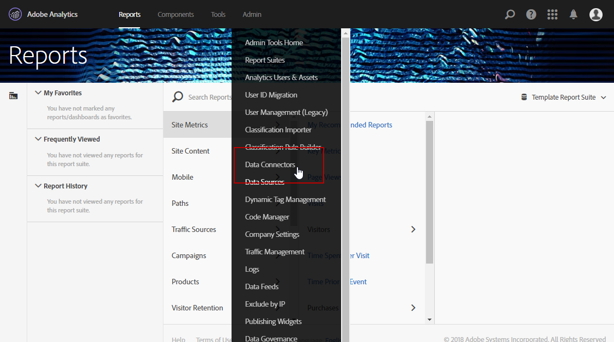
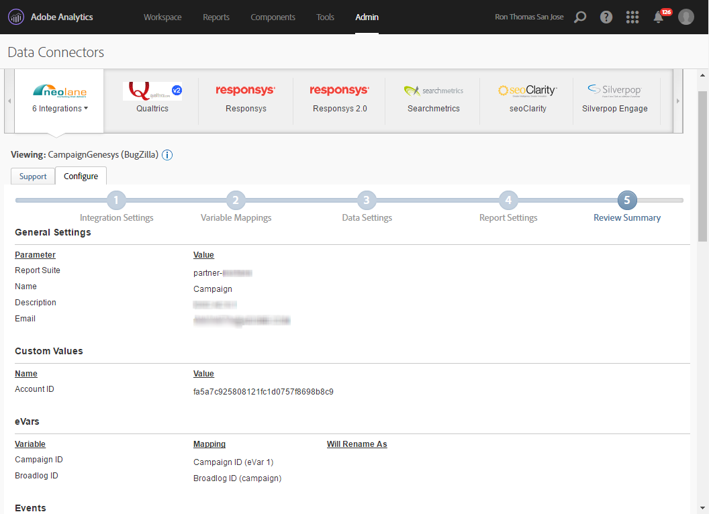
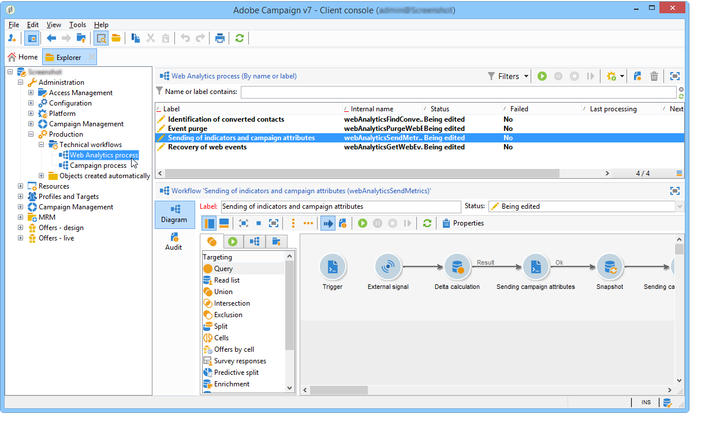

# Conector de dados do Adobe Analytics{#adobe-analytics-data-connector}

## Sobre a integração do conector de dados {#about-data-connector-integration}

>[!CAUTION]
>
>O Adobe Analytics Data Connector não é compatível com as mensagens transacionais (Centro de Mensagens).

O conector de dados (anteriormente conhecido como Adobe Genesis) permite que o Adobe Campaign e o Adobe Analytics interajam por meio do pacote **Web Analytics** connectors. Ele encaminha dados para o Adobe Campaign na forma de segmentos relativos ao comportamento do usuário após uma campanha de e-mail. Por outro lado, ele envia indicadores e atributos de campanhas de email entregues pelo Adobe Campaign para o Adobe Analytics – Data Connector.

Usando o Data Connector, o Adobe Campaign tem uma forma de medir o público da Internet (Web Analytics). Graças a essas integrações, o Adobe Campaign pode recuperar dados do comportamento do visitante para um ou mais sites, após uma campanha de marketing, e (após a análise) executar campanhas de re-marketing com uma visualização para convertê-los em compradores. Por outro lado, as ferramentas do Web Analytics permitem que o Adobe Campaign encaminhe indicadores e atributos de campanha para suas plataformas.

Para obter mais informações sobre a implementação da integração do Adobe Analytics com o Adobe Campaign, consulte esta [documentação](https://helpx.adobe.com/marketing-cloud/how-to/analytics-ac.html).

Os campos de ação para cada ferramenta são os seguintes:

* Função do Web Analytics:

   1. marca as campanhas de e-mail iniciadas com o Adobe Campaign,
   1. salva o comportamento do recipient, no site navegado depois de clicar no e-mail da campanha, no formato de segmentos. Os segmentos dizem respeito a produtos abandonados (visualizados, mas não adicionados ao carrinho ou comprados), compras ou abandonos de carrinho.

* Função do Adobe Campaign:

   1. envia os indicadores e os atributos da campanha para o conector, que, por sua vez, os encaminha para a ferramenta Web Analytics,
   1. recupera e analisa segmentos,
   1. e dispara uma campanha de re-marketing.

## Como configurar a integração {#setting-up-the-integration}

Para configurar o Data Connector, você deve se conectar à instância do Adobe Campaign e executar as seguintes operações:

* [Etapa 1: configurar integração no Analytics](#step-1--configure-integration-in-analytics)
* [Etapa 2: criar a conta externa no Campaign](#step-2--create-the-external-account-in-campaign)
* [Etapa 3: sincronizar o Adobe Campaign e o Adobe Analytics](#step-3--synchronize-adobe-campaign-and-adobe-analytics)

### Etapa 1: configurar integração no Analytics {#step-1--configure-integration-in-analytics}

As etapas a seguir detalham a configuração do Data Connector usando um assistente.

1. Faça login na Adobe Experience Cloud usando uma Adobe ID ou Enterprise ID.

   

1. Na lista de soluções da Experience Cloud, selecione **[!UICONTROL Analytics]**.

   

1. Na guia **[!UICONTROL Admin]**, selecione **[!UICONTROL Data Connectors]**.

   É necessário ter as seguintes permissões de ferramentas do Analytics para acessar o menu **[!UICONTROL Data Connectors]**. Para obter mais informações, consulte esta [página](https://docs.adobe.com/content/help/br/analytics/admin/admin-console/permissions/analytics-tools.html)
   * Integrações (Criar)
   * Integrações (Atualizar)
   * Integrações (Excluir)
   

1. Na lista de parceiros, selecione **[!UICONTROL Adobe Campaign Classic]**.

   

1. Na caixa de diálogo **[!UICONTROL Add integration]**, clique em **[!UICONTROL Activate]**.
1. Marque a opção **[!UICONTROL I accept these terms and conditions]** e selecione o link de **[!UICONTROL Report suite]** vinculado a essa integração e insira o rótulo do conector.

   Quando terminar, clique em **[!UICONTROL Create and configure this integration]**.

   

1. Insira o endereço de email que receberá as notificações em nome do conector e, em seguida, copie a **[!UICONTROL Account ID]** como aparece na conta externa do Adobe Campaign (para obter mais informações, consulte [Etapa 2: criar uma contar externa no Campaign](#step-2--create-the-external-account-in-campaign)).

   

1. Especifique os identificadores necessários para medir o impacto da campanha de email, ou seja, o nome da campanha interna (cid) e a ID da tabela iNmsBroadlog (bid). Você também deve especificar os indicadores para os eventos a serem coletados.
Verifique se os **[!UICONTROL Events]** são do tipo Numérico; caso contrário, não aparecerão no menu suspenso.

   

1. Se necessário, especifique os segmentos personalizados.

   

1. Em **[!UICONTROL Data collection]**, selecione um método para recuperar dados. Nesse caso, os identificadores **[!UICONTROL cid]** e **[!UICONTROL bid]** especificados na etapa 6.

   

1. Selecione as informações a serem exibidas no painel.

   

1. Verifique a configuração na página que soma as etapas anteriores.

   

1. Clique em **[!UICONTROL Activate Now]** para aprovar a configuração e ativar o conector.

   

   O Data Connector está configurado.

### Etapa 2: criar a conta externa no Campaign {#step-2--create-the-external-account-in-campaign}

A integração do Adobe Campaign nas plataformas do Analytics é realizada usando um conector. Para sincronizar os aplicativos, siga o processo abaixo:

1. Instale o pacote **Web Analytics connectors** no Adobe Campaign.
1. Vá até a pasta **[!UICONTROL Administration > Platform > External accounts]** da árvore do Adobe Campaign.
1. Clique com o botão direito do mouse na lista de contas externas e selecione **[!UICONTROL New]** no menu suspenso (ou clique no botão **[!UICONTROL New]** acima da lista de contas externas).
1. Use a lista suspensa para selecionar o tipo **[!UICONTROL Web Analytics]**.
1. Selecione o provedor do conector, nesse caso, o **[!UICONTROL Adobe Analytics - Data Connector]**.

   

1. Clique no link **[!UICONTROL Enrich the formula...]** para alterar a fórmula de cálculo do URL para especificar as informações de integração da ferramenta Web Analytics (IDs da campanha) e os domínios dos sites cuja atividade deve ser rastreada.
1. Especifique o(s) nome(s) de domínio dos sites.

   

1. Clique em **[!UICONTROL Next]** e verifique se os nomes de domínio foram salvos.

   

1. Se necessário, você deve sobrecarregar a fórmula de cálculo. Para fazer isso, marque a caixa e edite a fórmula diretamente na janela.

   

   >[!CAUTION]
   >
   >Esse modo de configuração está reservado para usuários especialistas: qualquer erro nessa fórmula pode resultar na interrupção dos deliveries de e-mail.

1. A guia **[!UICONTROL Advanced]** permite configurar ou modificar mais configurações técnicas.

   * **[!UICONTROL Lifespan]**: permite especificar o atraso (em dias_ após os eventos da Web recuperados no Adobe Campaign por workflows técnicos. Padrão: 180 dias.
   * **[!UICONTROL Persistence]**: permite o período durante o qual todos os eventos da Web (uma compra, por exemplo) podem ser atribuídos a uma campanha de re-marketing. Padrão: 7 dias.

>[!NOTE]
>
>Se estiver usando várias ferramentas de medição de público, você pode selecionar **[!UICONTROL Other]** na lista suspensa **[!UICONTROL Partners]** ao criar a conta externa. Você só pode fazer referência a uma conta externa nas propriedades de delivery: será necessário adaptar a fórmula de URLs controladas adicionando os parâmetros esperados pela Adobe e todas as outras ferramentas de medição usadas.

### Etapa 3: sincronizar o Adobe Campaign e o Adobe Analytics {#step-3--synchronize-adobe-campaign-and-adobe-analytics}

Depois de criar a conta externa, é necessário sincronizar os dois aplicativos.

1. Vá para a conta externa criada anteriormente.
1. Altere a conta **[!UICONTROL Label]** conforme necessário.
1. Altere o **[!UICONTROL Internal name]**, de forma que corresponda ao **[!UICONTROL Name]** escolhido durante a configuração do conector de dados.

   

1. Clique no link **[!UICONTROL Approve connection]**.

   

   Verifique se o **[!UICONTROL Internal name]** corresponde ao **[!UICONTROL Name]** especificado no assistente de configuração do conector de dados.

1. Insira o **[!UICONTROL Account ID]** no assistente de configuração do conector de dados.

   

1. Siga as etapas de acordo com o guia do assistente do conector de dados e retorne à conta externa do Adobe Campaign.
1. Clique em **[!UICONTROL Next]** para que a troca de dados ocorra entre o Adobe Campaign e o Adobe Analytics – Data Connector.

   A lista de segmentos é exibida após a conclusão da sincronização.

   

Quando a sincronização de dados entre o Adobe Campaign e o Adobe Analytics – Data Connector é eficaz, os três segmentos padrão definidos no assistente do Data Connector são recuperados pelo Adobe Campaign e ficam acessíveis na guia **[!UICONTROL Segments]** da conta externa do Adobe Campaign.

Se segmentos adicionais tiverem sido configurados no assistente do Data Connector, você poderá adicioná-los ao Adobe Campaign. Para fazer isso, clique no link **[!UICONTROL Update segment list]** e siga as etapas descritas no assistente de conta externa. Após a operação ser executada, os novos segmentos serão exibidos na lista.

### Workflows técnicos de processos do Web Analytics {#technical-workflows-of-web-analytics-processes}

A troca de dados entre o Adobe Campaign e o Adobe Analytics – Data Connector é realizada por quatro workflows técnicos que são executados como uma tarefa em segundo plano.

Eles estão disponíveis na árvore do Adobe Campaign, na pasta **[!UICONTROL Administration > Production > Technical workflows > Web analytics process]**.

* **[!UICONTROL Recovering of web events]**: a cada hora, esse workflow baixa segmentos sobre o comportamento dos usuários em determinado site, os inclui no banco de dados do Adobe Campaign e inicia o workflow de re-marketing.
* **[!UICONTROL Event purge]**: esse workflow permite que você exclua todos os eventos do banco de dados, dependendo do período configurado no campo **[!UICONTROL Lifespan]**. Para obter mais informações, consulte [Etapa 2: crie a conta externa no Campaign](#step-2--create-the-external-account-in-campaign).
* **[!UICONTROL Identification of converted contacts]**: diretório dos visitantes que fizeram uma compra após uma campanha re-marketing. Os dados coletados por esse workflow podem ser acessados no relatório **[!UICONTROL Re-marketing efficiency]**, consulte esta [página](#creating-a-re-marketing-campaign).
* **[!UICONTROL Sending of indicators and campaign attributes]**: permite que você envie indicadores de campanha por email para a Adobe Experience Cloud usando o Adobe Analytics - Conector de dados. Esse workflow é acionado às 4:00 AM todos os dias e pode levar 24 horas para que os dados sejam enviados ao Analytics.

   Observe que esse workflow não deve ser reiniciado ou todos os dados anteriores podem distorcer os resultados do Analytics.

   Os indicadores envolvidos são:

   * **[!UICONTROL Messages to deliver]** (@toDeliver)
   * **[!UICONTROL Processed]** (@processed)
   * **[!UICONTROL Success]** (@success)
   * **[!UICONTROL Total count of opens]** (@totalRecipientOpen)
   * **[!UICONTROL Recipients who have opened]** (@recipientOpen)
   * **[!UICONTROL Total number of recipients who clicked]** (@totalRecipientClick)
   * **[!UICONTROL People who clicked]** (@personClick)
   * **[!UICONTROL Number of distinct clicks]** (@recipientClick)
   * **[!UICONTROL Opt-Out]** (@optOut)
   * **[!UICONTROL Errors]** (@error)
   >[!NOTE]
   >
   >Os dados enviados são o delta baseado no último instantâneo que pode levar ao valor negativo nos dados de métrica.

   Os atributos enviados são os seguintes:

   * **[!UICONTROL Internal name]** (@internalName)
   * **[!UICONTROL Label]** (@label)
   * **[!UICONTROL Label]**(operation/@label): somente se o pacote do **Campaign** estiver instalado
   * **[!UICONTROL Nature]**(operation/@nature): somente se o pacote do **Campaign** estiver instalado
   * **[!UICONTROL Tag 1]** (webAnalytics/@tag1)
   * **[!UICONTROL Tag 2]** (webAnalytics/@tag2)
   * **[!UICONTROL Tag 3]** (webAnalytics/@tag3)
   * **[!UICONTROL Contact date]** (scheduling/@contactDate)

## Rastreamento de deliveries no Adobe Campaign {#tracking-deliveries-in-adobe-campaign}

Para que a Adobe Experience Cloud possa rastrear a atividade nos sites, depois que o Adobe Campaign enviou o delivery, é necessário fazer referência ao conector correspondente nas propriedades de delivery. Para fazer isso, siga as etapas abaixo:

1. Abra o delivery da campanha a ser rastreado.

   

1. Abra as propriedades de delivery.
1. Acesse a guia **[!UICONTROL Web Analytics]** e selecione a conta externa criada anteriormente. Consulte [Etapa 2 – Criar a conta externa no Campaign](#step-2--create-the-external-account-in-campaign).

   

1. Agora você pode enviar o delivery e acessar o relatório no Adobe Analytics.

## Criação de uma campanha de re-marketing {#creating-a-re-marketing-campaign}

Para preparar sua campanha de re-marketing, basta criar templates do delivery para campanhas do tipo re-marketing. Em seguida, configure sua campanha de re-marketing e a vincule a um segmento. Cada segmento deve ter uma campanha de re-marketing diferente.

As campanhas re-marketing são iniciadas automaticamente quando o Adobe Campaign conclui a recuperação dos segmentos que analisam o comportamento das pessoas direcionadas pela campanha inicial. No caso de abandono do carrinho ou visualização do produto sem uma compra, um delivery é enviado para os recipients relacionados para que o site navegue para o fim da compra.

O Adobe Campaign fornece templates do delivery personalizados que você pode usar ou o banco de dados para preparar campanhas.

1. No **[!UICONTROL Explorer]**, vá para a pasta **[!UICONTROL Resources > Templates > Delivery templates]** da árvore do Adobe Campaign.
1. Duplique o template **[!UICONTROL Email delivery (re-marketing)]** ou os exemplos de template de re-marketing oferecidos pelo Adobe Campaign.
1. Personalize o template para atender às suas necessidades e salve.

   

1. Crie uma nova campanha e selecione o template **[!UICONTROL Re-marketing campaign]** na lista suspensa.

   

1. Clique no link **[!UICONTROL Configure...]** para especificar o segmento e o template do delivery vinculados à campanha.
1. Selecione a conta externa configurada anteriormente.

   

1. Selecione o segmento relacionado.

   

1. Selecione o template do delivery a ser usado para essa campanha de re-marketing e clique em **[!UICONTROL Finish]** para fechar a janela.

   

1. Clique em **[!UICONTROL OK]** para fechar a janela do Campaign.

O relatório **[!UICONTROL Re-marketing efficiency]** é acessado por meio da página de relatórios globais. Ele permite que você visualize o número de contatos convertidos (isto é, quem comprou algo) em relação ao número de abandonos do carrinho após a campanha de re-marketing do Adobe Campaign. A taxa de conversão é calculada por semana, mês ou desde o início da sincronização entre o e o Adobe Campaign e as ferramentas do Web Analytics.

