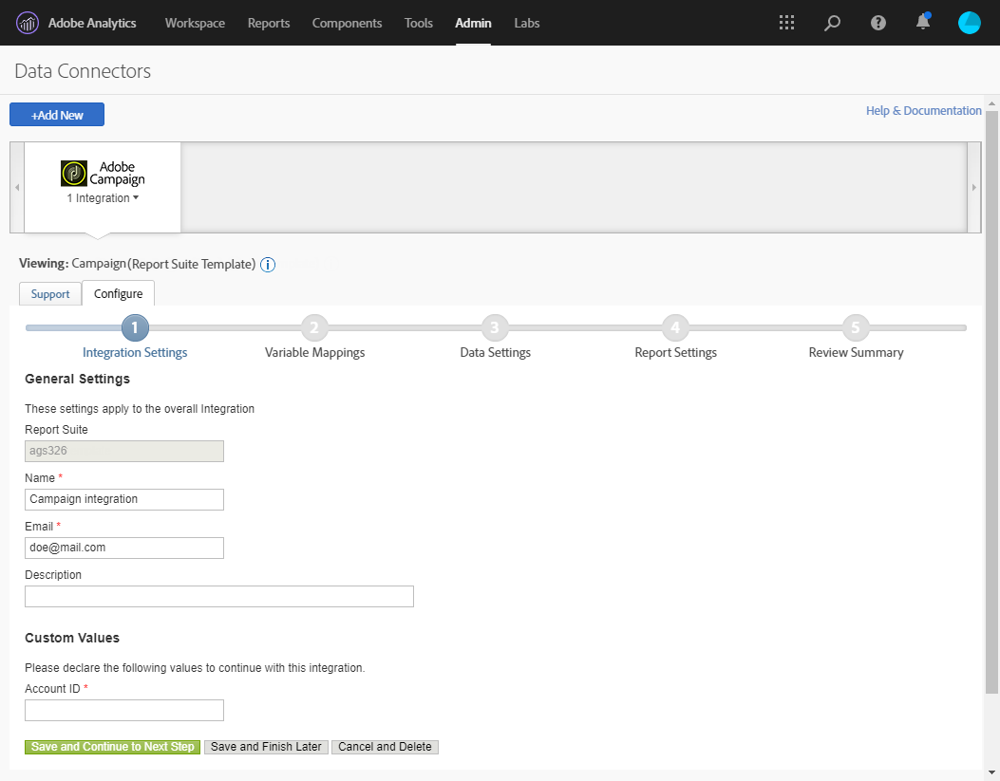
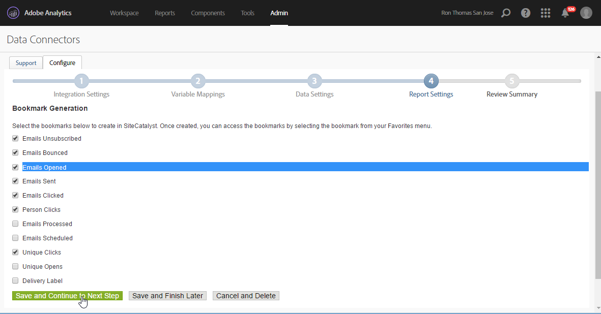

# Conector de dados do Adobe Analytics{#adobe-analytics-data-connector}

## Sobre a integração do conector de dados {#about-data-connector-integration}

>[!CAUTION]
>
>O Adobe Analytics Data Connector não é compatível 
                    com as mensagens transacionais (Centro de Mensagens).

O conector de dados (anteriormente conhecido como Adobe Genesis) permite que o Adobe Campaign e o Adobe Analytics interajam por meio do pacote **Web Analytics** connectors. Ele encaminha dados para o Adobe Campaign na forma de segmentos relativos ao comportamento do usuário após uma campanha de e-mail. Por outro lado, ele envia indicadores e atributos de campanhas de email entregues pelo Adobe Campaign para o Adobe Analytics – Data Connector.

Usando o Data Connector, o Adobe Campaign tem uma forma de medir o público da Internet (Web Analytics). Graças a essas integrações, o Adobe Campaign pode recuperar dados do comportamento do visitante para um ou mais sites, após uma campanha de marketing, e (após a análise) executar campanhas de re-marketing com uma visualização para convertê-los em compradores. Por outro lado, as ferramentas do Web Analytics permitem que o Adobe Campaign encaminhe indicadores e atributos de campanha para suas plataformas.

Para obter mais informações sobre a implementação da 
                integração do Adobe Analytics com o Adobe Campaign, consulte esta [documentação](https://helpx.adobe.com/marketing-cloud/how-to/analytics-ac.html).

Os campos de ação para cada ferramenta são os seguintes:

* Função do Web Analytics:

   1. marca as campanhas de e-mail iniciadas com o Adobe Campaign,
   1. salva o comportamento do recipient, no site navegado depois de clicar no e-mail da campanha, no formato de segmentos. Os segmentos dizem respeito a produtos abandonados (visualizados, mas não adicionados ao carrinho ou comprados), compras ou abandonos de carrinho.

* Função do Adobe Campaign:

   1. envia os indicadores e os atributos da campanha para o conector, que, por sua vez, os encaminha para a ferramenta Web Analytics,
   1. recupera e analisa segmentos,
   1. e dispara uma campanha de re-marketing.

## Como configurar a integração {#setting-up-the-integration}

Para configurar o Data Connector, você deve se conectar à instância do Adobe Campaign e executar as seguintes operações:

* [Etapa 1: Configurar integração no Analytics](#step-1--configure-integration-in-analytics)
* [Etapa 2: Criar a conta externa no Campaign](#step-2--create-the-external-account-in-campaign)
* [Etapa 3: Sincronizar o Adobe Campaign e o Adobe Analytics](#step-3--synchronize-adobe-campaign-and-adobe-analytics)

### Step 1: Configure integration in Analytics {#step-1--configure-integration-in-analytics}

As etapas a seguir detalham a configuração do Data Connector usando um assistente.

1. Faça login na Adobe Experience Cloud usando uma Adobe ID
                            ou Enterprise ID.

   

1. From the list of Experience Cloud solutions, select **[!UICONTROL Analytics]**.

   

1. Na **[!UICONTROL Admin]** guia, selecione **[!UICONTROL Data Connectors]**.

   É necessário ter as seguintes permissões de ferramentas do Analytics para acessar o **[!UICONTROL Data Connectors]** menu. Para obter mais informações, consulte esta [página](https://docs.adobe.com/content/help/en/analytics/admin/admin-console/permissions/analytics-tools.html)
   * Integrações (Criar)
   * Integrações (Atualização)
   * Integrações (Excluir)
   

1. Na lista de parceiros, selecione **[!UICONTROL Neolane - Enterprise Marketing Platform]**.

   

1. Na caixa de **[!UICONTROL Add integration]** diálogo, clique em **[!UICONTROL Activate]**.
1. Check **[!UICONTROL I accept these terms and conditions]** and select the **[!UICONTROL Report suite]** linked to this integration and enter the connector label.

   Quando terminar, clique em **[!UICONTROL Create and configure this integration]**.

   

1. Enter the email address that will receive the notifications on behalf of the connector, then copy the **[!UICONTROL Account ID]** as it appears in the external Adobe Campaign account (for more on this, refer to the [Step 2: Create the external account in Campaign](#step-2--create-the-external-account-in-campaign)).

   

1. Especifique os identificadores necessários para medir o impacto da campanha de e-mail, ou seja, o nome da campanha interna (cid) e o ID da tabela iNmsBroadlog (bid). Você também deve especificar os indicadores para os eventos a serem coletados.
Certifique-se de que **[!UICONTROL Events]** sejam do tipo Numérico; caso contrário, não aparecerão no menu suspenso.

   

1. Se necessário, especifique os segmentos personalizados.

   

1. In **[!UICONTROL Data collection]**, select a method for recovering data, in this case the **[!UICONTROL cid]** and **[!UICONTROL bid]** identifiers specified in step 6.

   

1. Selecione as informações a serem exibidas no painel.

   

1. Verifique a configuração na página que soma as etapas anteriores.

   

1. Click **[!UICONTROL Activate Now]** to approve configuration and activate the connector.

   

   O Data Connector está configurado.

### Step 2: Create the external account in Campaign {#step-2--create-the-external-account-in-campaign}

A integração do Adobe Campaign nas plataformas do Analytics 
                   é realizada usando um conector. Para sincronizar os aplicativos, siga o processo abaixo:

1. Instale o pacote **Web Analytics connectors** no Adobe Campaign.
1. Go to the **[!UICONTROL Administration > Platform > External accounts]** folder of the Adobe Campaign tree.
1. Right-click the list of external accounts and select **[!UICONTROL New]** in the drop-down menu (or click the **[!UICONTROL New]** button above the list of external accounts).
1. Use the drop-down list to select the **[!UICONTROL Web Analytics]** type.
1. Select the provider for the connector, i.e. **[!UICONTROL Adobe Analytics - Data Connector]** in this case.

   

1. Click the **[!UICONTROL Enrich the formula...]** link to change the URL calculation formula to specify the Web analytics tool integration information (campaign IDs) and the domains of the sites whose activity must be tracked.
1. Especifique o(s) nome(s) de domínio dos sites.

   

1. Click **[!UICONTROL Next]** and make sure the domain names have been saved.

   

1. Se necessário, você deve sobrecarregar a fórmula de cálculo. Para fazer isso, marque a caixa e edite a fórmula diretamente na janela.

   

   >[!CAUTION]
   >
   >Esse modo de configuração está reservado para usuários especialistas: qualquer erro nessa fórmula pode resultar na interrupção dos deliveries de e-mail.

1. The **[!UICONTROL Advanced]** tab lets you configure or modify more technical settings.

   * **[!UICONTROL Lifespan]**: permite que você especifique o atraso (em dias_ após o qual os eventos da Web foram recuperados no Adobe Campaign por fluxos de trabalho técnicos. Padrão: 180 dias.
   * **[!UICONTROL Persistence]**: permite o período durante o qual todos os eventos da Web (uma compra, por exemplo) podem ser atribuídos a uma campanha de remarketing, Padrão: 7 dias.

>[!NOTE]
>
>If you are using several audience measuring tools, you can select **[!UICONTROL Other]** in the **[!UICONTROL Partners]** drop-down list when creating the external account. Você só pode fazer referência a uma conta externa nas propriedades de delivery: será necessário adaptar a fórmula de URLs controladas adicionando os parâmetros esperados pela Adobe e todas as outras ferramentas de medição usadas.

### Step 3: Synchronize Adobe Campaign and Adobe Analytics {#step-3--synchronize-adobe-campaign-and-adobe-analytics}

Depois de criar a conta externa, é necessário sincronizar os dois aplicativos.

1. Vá para a conta externa criada anteriormente.
1. Change the account **[!UICONTROL Label]** as needed.
1. Change the **[!UICONTROL Internal name]** so that it matches the **[!UICONTROL Name]** chosen while configuring the Data Connector.

   

1. Clique no **[!UICONTROL Approve connection]** link.

   

   Make sure the **[!UICONTROL Internal name]** matches the **[!UICONTROL Name]** specified in the Data Connector configuration wizard.

1. Enter the **[!UICONTROL Account ID]** in the Data Connector configuration wizard.

   

1. Siga as etapas de acordo com o guia do assistente do conector de dados e retorne à conta externa do Adobe Campaign.
1. Click **[!UICONTROL Next]** in order for the data exchange to take place between Adobe Campaign and Adobe Analytics - Data connector.

   A lista de segmentos é exibida após a conclusão da sincronização.

   

When the synchronization of data between Adobe Campaign and Adobe Analytics - Data connector is effective, the three default segments defined in the Data Connector wizard are recovered by Adobe Campaign and become accessible in the **[!UICONTROL Segments]** tab of the Adobe Campaign external account.

Se segmentos adicionais tiverem sido configurados no assistente do Data Connector, você poderá adicioná-los ao Adobe Campaign. To do this, click the **[!UICONTROL Update segment list]** link and follow the steps outlined in the external account wizard. Após a operação ser executada, os novos segmentos serão exibidos na lista.

### Workflows técnicos de processos do Web Analytics {#technical-workflows-of-web-analytics-processes}

A troca de dados entre o Adobe Campaign e o Adobe Analytics – Data Connector é realizada por quatro workflows técnicos que são executados como uma tarefa em segundo plano.

Eles estão disponíveis na árvore do Adobe Campaign, abaixo da **[!UICONTROL Administration > Production > Technical workflows > Web analytics process]** pasta.

* **[!UICONTROL Recovering of web events]**: uma vez por hora, esse fluxo de trabalho baixa segmentos sobre o comportamento dos usuários em um determinado site, os inclui no banco de dados do Adobe Campaign e inicia o fluxo de trabalho de remarketing.
* **[!UICONTROL Event purge]**: esse fluxo de trabalho permite que você exclua todos os eventos do banco de dados, dependendo do período configurado no **[!UICONTROL Lifespan]** campo. Para obter mais informações, consulte a [Etapa 2: Crie a conta externa no Campaign](#step-2--create-the-external-account-in-campaign).
* **[!UICONTROL Identification of converted contacts]**: diretório dos visitantes que efetuaram uma compra após uma campanha de remarketing. The data collected by this workflow is accessible in the **[!UICONTROL Re-marketing efficiency]** report, refer to this [page](#creating-a-re-marketing-campaign).* **[!UICONTROL Sending of indicators and campaign attributes]**: lets you send email campaign indicators via Adobe Campaign to the Adobe Experience Cloud using Adobe Analytics - Data connector. Esse workflow é acionado às 4:00 AM todos os dias e pode 
                            levar 24 horas para que os dados sejam enviados ao Analytics.

   Observe que esse workflow não deve ser
                           reiniciado ou todos os dados anteriores podem distorcer os 
                           resultados do Analytics.

   Os indicadores envolvidos são:

   * **[!UICONTROL Messages to deliver]** (@toDeliver)
   * **[!UICONTROL Processed]** (@processed)
   * **[!UICONTROL Success]** (@success)
   * **[!UICONTROL Total count of opens]** (@totalRecipientOpen)
   * **[!UICONTROL Recipients who have opened]** (@recipientOpen)
   * **[!UICONTROL Total number of recipients who clicked]** (@totalRecipientClick)
   * **[!UICONTROL People who clicked]** (@personClick)
   * **[!UICONTROL Number of distinct clicks]** (@recipientClick)
   * **[!UICONTROL Opt-Out]** (@optOut)
   * **[!UICONTROL Errors]** (@error)
   >[!NOTE]
   >
   >Os dados enviados são o delta baseado no último 
                                instantâneo que pode levar ao valor negativo nos dados de métrica.

   Os atributos enviados são os seguintes:

   * **[!UICONTROL Internal name]** (@internalName)
   * **[!UICONTROL Label]** (@label)
   * **[!UICONTROL Label]** (operation/@label): somente se o pacote do **Campaign** estiver instalado
   * **[!UICONTROL Nature]** (operation/@nature): somente se o pacote do **Campaign** estiver instalado
   * **[!UICONTROL Tag 1]** (webAnalytics/@tag1)
   * **[!UICONTROL Tag 2]** (webAnalytics/@tag2)
   * **[!UICONTROL Tag 3]** (webAnalytics/@tag3)
   * **[!UICONTROL Contact date]** (agendamento/@contactDate)

* **Identification of converted contacts**: diretório dos visitantes que fizeram uma compra após uma campanha re-marketing. The data collected by this workflow is accessible in the **[!UICONTROL Re-marketing efficiency]** report (refer to this [page](../../platform/using/adobe-analytics-data-connector.md#creating-a-re-marketing-campaign)).

## Rastreamento de deliveries no Adobe Campaign {#tracking-deliveries-in-adobe-campaign}

Para que a Adobe Experience Cloud possa rastrear a atividade nos sites, depois que o Adobe Campaign enviou o delivery, é necessário fazer referência ao conector correspondente nas propriedades de delivery. Para fazer isso, siga as etapas abaixo:

1. Abra o delivery da campanha a ser rastreado.

   

1. Abra as propriedades de delivery.
1. Vá até a **[!UICONTROL Web Analytics]** guia e selecione a conta externa criada anteriormente. Consulte a [Etapa 2: Criar a conta externa no Campaign](#step-2--create-the-external-account-in-campaign)).

   

1. Agora você pode enviar o delivery e acessar o relatório no Adobe Analytics.

## Criação de uma campanha de re-marketing {#creating-a-re-marketing-campaign}

Para preparar sua campanha de re-marketing, basta criar templates do delivery para campanhas do tipo re-marketing. Em seguida, configure sua campanha de re-marketing e a vincule a um segmento. Cada segmento deve ter uma campanha de re-marketing diferente.

As campanhas re-marketing são iniciadas automaticamente quando o Adobe Campaign conclui a recuperação dos segmentos que analisam o comportamento das pessoas direcionadas pela campanha inicial. No caso de abandono do carrinho ou visualização do produto sem uma compra, um delivery é enviado para os recipients relacionados para que o site navegue para o fim da compra.

O Adobe Campaign fornece templates do delivery personalizados que você pode usar ou o banco de dados para preparar campanhas.

1. From the **[!UICONTROL Explorer]**, go to the **[!UICONTROL Resources > Templates > Delivery templates]** folder of the Adobe Campaign tree.
1. Duplicate the **[!UICONTROL Email delivery (re-marketing)]** template or the re-marketing template examples offered by Adobe Campaign.
1. Personalize o template para atender às suas necessidades e salve.

   

1. Create a new campaign and select the **[!UICONTROL Re-marketing campaign]** template from the drop-down list.

   

1. Click the **[!UICONTROL Configure...]** link to specify the segment and delivery template linked to the campaign.
1. Selecione a conta externa configurada anteriormente.

   

1. Selecione o segmento relacionado.

   

1. Select the delivery template to be used for this re-marketing campaign, then click **[!UICONTROL Finish]** to close the window.

   

1. Click **[!UICONTROL OK]** to close the campaign window.

The **[!UICONTROL Re-marketing efficiency]** report is accessed via the global reports page. Ele permite que você visualize o número de contatos convertidos (isto é, quem comprou algo) em relação ao número de abandonos do carrinho após a campanha de re-marketing do Adobe Campaign. A taxa de conversão é calculada por semana, mês ou desde o início da sincronização entre o e o Adobe Campaign e as ferramentas do Web Analytics.

